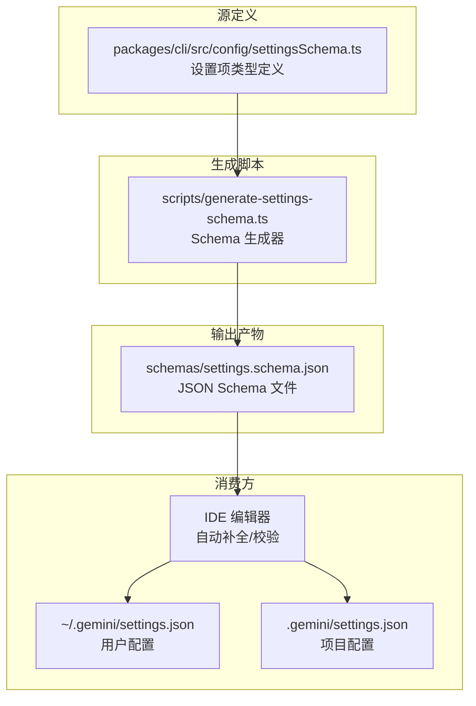
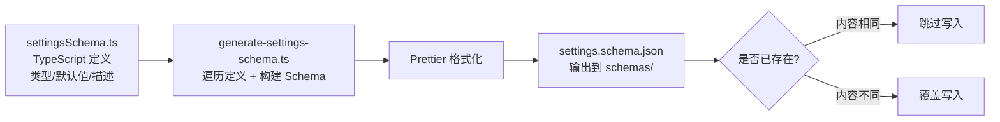

# schemas/

## 概述

`schemas/` 目录存放 Gemini CLI 的 JSON Schema 定义文件。目前仅包含一个核心文件 `settings.schema.json`，用于定义 `settings.json` 配置文件的结构和验证规则。该 Schema 遵循 JSON Schema Draft 2020-12 标准，支持 IDE 自动补全和配置校验。

**重要**: 该文件由 `scripts/generate-settings-schema.ts` 脚本自动生成，不应手动编辑。

## 目录结构

```
schemas/
└── settings.schema.json    # Gemini CLI 设置文件的 JSON Schema 定义（自动生成）
```

## 架构图



## 核心组件

### settings.schema.json

这是一个大型 JSON Schema 文件（约 194KB），定义了 Gemini CLI 所有配置项的结构、类型、默认值和描述信息。

#### Schema 元数据

| 字段 | 值 |
|------|-----|
| `$schema` | `https://json-schema.org/draft/2020-12/schema` |
| `$id` | `https://raw.githubusercontent.com/google-gemini/gemini-cli/main/schemas/settings.schema.json` |
| `title` | Gemini CLI Settings |
| `type` | object |
| `additionalProperties` | false |

#### 主要配置分类

| 顶级属性 | 类型 | 说明 |
|----------|------|------|
| `$schema` | string | Schema URL，用于编辑器识别 |
| `mcpServers` | object | MCP 服务器配置，key 为服务器名称 |
| `policyPaths` | string[] | 额外策略文件路径 |
| `adminPolicyPaths` | string[] | 管理员策略文件路径 |
| `general` | object | 通用设置（编辑器、Vim 模式、审批模式等） |
| `ui` | object | UI 设置（主题、字体等） |
| `auth` | object | 认证设置（API Key、OAuth 等） |
| `model` | object | 模型设置（默认模型、温度等） |
| `sandbox` | string/boolean | 沙箱配置 |
| `telemetry` | object | 遥测设置 |
| `extensions` | object | 扩展配置 |

#### 引用定义（$defs）

Schema 中使用 `$defs` 定义了可复用的子 Schema：

- **MCPServerConfig**: MCP 服务器配置结构，包含 `command`、`args`、`env`、`url` 等字段
- **StringOrStringArray**: 支持字符串或字符串数组的联合类型
- **BooleanOrString**: 支持布尔值或字符串的联合类型

#### 配置示例

```json
{
  "$schema": "https://raw.githubusercontent.com/google-gemini/gemini-cli/main/schemas/settings.schema.json",
  "mcpServers": {
    "github": {
      "command": "npx",
      "args": ["-y", "@modelcontextprotocol/server-github"]
    }
  },
  "general": {
    "vimMode": false,
    "defaultApprovalMode": "default"
  }
}
```

## 依赖关系

### 内部依赖

- **数据源**: `packages/cli/src/config/settingsSchema.ts` -- 设置项的 TypeScript 类型定义和默认值
- **生成器**: `scripts/generate-settings-schema.ts` -- 将 TypeScript 定义转换为 JSON Schema
- **定义常量**: `SETTINGS_SCHEMA_DEFINITIONS` -- 在 settingsSchema.ts 中定义的 `$defs` 子 Schema

### 被依赖方

- IDE 编辑器（VS Code、WebStorm 等）通过 `$schema` 引用提供自动补全
- 项目内部的设置验证逻辑

## 数据流

### Schema 生成流程



### 触发方式

| 命令 | 说明 |
|------|------|
| `npm run schema:settings` | 手动重新生成 Schema |
| `npm run schema:settings -- --check` | CI 模式：仅检查是否需要更新 |
| `npm run docs:settings` | 同时生成 Schema 和文档 |

当修改了 `packages/cli/src/config/settingsSchema.ts` 中的设置定义后，需要运行 `npm run schema:settings` 重新生成 Schema 文件，否则 CI 检查会失败。
