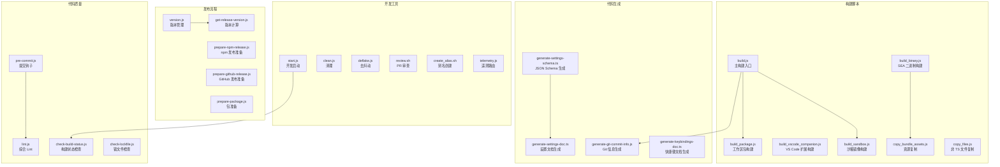
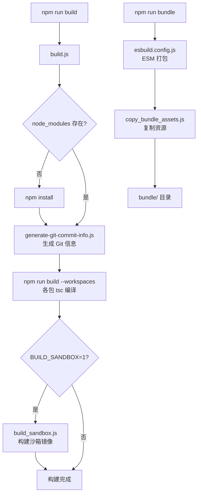
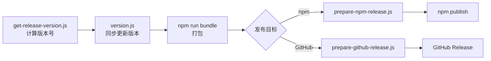

# scripts/

## 概述

`scripts/` 目录包含 Gemini CLI 项目的所有构建、测试、发布、代码规范检查和开发辅助脚本。这些脚本主要使用 JavaScript（ES Module）和 Shell 编写，通过 `package.json` 中的 npm scripts 入口调用，是项目 CI/CD 流水线和本地开发工作流的核心支撑。

## 目录结构

```
scripts/
├── build.js                    # 主构建脚本（编译所有工作区）
├── build_binary.js             # SEA 单可执行二进制构建
├── build_package.js            # 单个工作区包构建
├── build_sandbox.js            # Docker/Podman 沙箱容器镜像构建
├── build_vscode_companion.js   # VS Code 伴侣扩展构建
├── start.js                    # 开发模式启动脚本
├── clean.js                    # 清理所有构建产物
├── copy_bundle_assets.js       # 复制打包资源（沙箱/策略/文档/技能）
├── copy_files.js               # 复制非 TS 文件到 dist 目录
├── version.js                  # 版本号管理（全工作区同步）
├── generate-git-commit-info.js # 生成 Git 提交信息常量
├── generate-settings-schema.ts # 生成 settings.schema.json
├── generate-settings-doc.ts    # 生成设置项文档
├── generate-keybindings-doc.ts # 生成快捷键文档
├── lint.js                     # 综合代码规范检查（多 Linter）
├── check-build-status.js       # 构建状态检查（源码变更检测）
├── check-lockfile.js           # package-lock.json 完整性检查
├── pre-commit.js               # Git pre-commit 钩子
├── prepare-package.js          # 发布前准备（复制 README/LICENSE）
├── prepare-npm-release.js      # npm 发布准备
├── prepare-github-release.js   # GitHub 发布准备
├── get-release-version.js      # 发布版本号计算
├── sandbox_command.js          # 沙箱命令检测
├── telemetry.js                # 遥测数据入口路由
├── telemetry_gcp.js            # GCP 遥测数据处理
├── telemetry_genkit.js         # Genkit 遥测数据处理
├── telemetry_utils.js          # 遥测工具函数
├── local_telemetry.js          # 本地遥测数据查看
├── deflake.js                  # 测试去抖动（多次运行检测 flaky 测试）
├── aggregate_evals.js          # 评估报告聚合
├── changed_prompt.js           # 检测提示词/工具变更
├── sync_project_dry_run.js     # 项目同步试运行
├── close_duplicate_issues.js   # 关闭重复 Issue
├── review.sh                   # PR 自动化审查脚本
├── create_alias.sh             # 创建 gemini 命令别名
├── batch_triage.sh             # 批量 Issue 分类
├── harvest_api_reliability.sh  # API 可靠性数据采集
├── send_gemini_request.sh      # 发送 Gemini API 请求
├── relabel_issues.sh           # Issue 标签重新分类
├── entitlements.plist          # macOS 代码签名权限声明
├── test-windows-paths.js       # Windows 路径兼容性测试
├── releasing/                  # 发布自动化脚本
│   ├── create-patch-pr.js      # 创建补丁 PR
│   ├── patch-comment.js        # 补丁评论处理
│   ├── patch-create-comment.js # 创建补丁评论
│   └── patch-trigger.js        # 补丁触发器
├── tests/                      # 脚本自身的测试
│   ├── vitest.config.ts        # 测试配置
│   ├── test-setup.ts           # 测试环境设置
│   ├── autogen.test.ts         # 自动生成工具测试
│   ├── generate-settings-schema.test.ts
│   ├── generate-settings-doc.test.ts
│   ├── generate-keybindings-doc.test.ts
│   ├── get-release-version.test.js
│   ├── patch-create-comment.test.js
│   └── telemetry_gcp.test.ts
└── utils/
    └── autogen.ts              # 自动生成文档的工具函数
```

## 架构图



## 核心组件

### 构建类脚本

#### `build.js`
主构建入口脚本。执行流程：
1. 检查 `node_modules` 是否存在，不存在则自动 `npm install`
2. 运行 `npm run generate` 生成 Git 提交信息
3. 运行 `npm run build --workspaces` 编译所有工作区
4. 如果启用了沙箱（`BUILD_SANDBOX=1`），自动构建沙箱镜像

#### `build_binary.js`
构建 Node.js SEA（Single Executable Application）二进制文件的完整流程：
1. 清理 `dist/` 目录
2. 执行 `npm run clean && npm install && npm run bundle`
3. 暂存并签名原生模块（.node 文件）
4. 生成 SEA 配置和资产清单（manifest.json）
5. 使用 `node --experimental-sea-config` 生成 blob
6. 使用 `postject` 注入 blob 到 Node 二进制
7. macOS 使用 `codesign` 签名，Windows 使用 `signtool` 签名

#### `build_sandbox.js`
使用 Docker/Podman 构建沙箱容器镜像：
- 支持 `-s` 跳过安装和构建
- 支持自定义 Dockerfile 和镜像名
- 打包 CLI 和 Core 包为 tgz 后传入容器
- 支持 CI 输出文件写入

#### `build_vscode_companion.js`
构建 VS Code 伴侣扩展包（.vsix）。

#### `build_package.js`
单个工作区包的构建脚本：
1. `tsc --build` 编译 TypeScript
2. 对 core 包运行浏览器 MCP 打包
3. 调用 `copy_files.js` 复制非 TS 资源文件
4. 对 core 包复制文档目录

#### `copy_bundle_assets.js`
打包后资源复制，将以下内容复制到 `bundle/` 目录：
- 沙箱定义文件（.sb）
- 策略定义文件（.toml）
- 文档目录
- 内置技能
- DevTools 包
- Chrome DevTools MCP 打包产物

### 代码生成类脚本

#### `generate-git-commit-info.js`
生成包含 Git 短 hash 和 CLI 版本号的 TypeScript 常量文件，分别输出到 `packages/cli/src/generated/` 和 `packages/core/src/generated/`。

#### `generate-settings-schema.ts`
从 `settingsSchema.ts` 配置定义自动生成 JSON Schema 文件（`schemas/settings.schema.json`）。支持 `--check` 模式用于 CI 验证。

#### `generate-settings-doc.ts`
从设置定义自动生成设置项的 Markdown 文档，注入到 `docs/reference/configuration.md` 和 `docs/cli/settings.md` 中的特定标记区域。

#### `generate-keybindings-doc.ts`
从快捷键绑定定义自动生成快捷键文档，注入到 `docs/reference/keyboard-shortcuts.md`。

### 代码质量类脚本

#### `lint.js`
综合代码规范检查器，集成了以下工具：
- **ESLint**: TypeScript/JavaScript 代码规范
- **actionlint**: GitHub Actions 工作流检查（自动下载 v1.7.7）
- **shellcheck**: Shell 脚本检查（自动下载 v0.11.0）
- **yamllint**: YAML 文件检查（通过 Python venv 安装 v1.35.1）
- **Prettier**: 代码格式化检查
- **敏感关键词检查**: 检测模型名称泄露
- **tsconfig 检查**: 验证各包 tsconfig 的 exclude 配置
- **GitHub Actions Pinning 检查**: 确保所有 Actions 引用使用 SHA 而非标签

#### `check-build-status.js`
比较源码文件修改时间与最后构建时间，如发现源码比构建新则写入警告文件供 CLI 启动时显示。

#### `check-lockfile.js`
验证 `package-lock.json` 的完整性：
- 检查所有第三方依赖是否有 `resolved` 和 `integrity` 字段
- 检测 gaxios v7+ 版本（存在已知 stream 损坏 bug）

### 发布类脚本

#### `version.js`
版本号同步管理：
1. 对根 package.json 执行 `npm version`
2. 对所有工作区同步执行版本变更
3. 更新 `sandboxImageUri` 中的版本号
4. 更新 `package-lock.json`

#### `get-release-version.js`
根据发布类型（nightly/preview/stable/patch）计算下一个版本号。

#### `prepare-npm-release.js` / `prepare-github-release.js`
为 npm/GitHub 发布准备包：复制 bundle 到 `packages/cli/`，清理不必要的字段，设置正确的包名和文件列表。

### 开发辅助脚本

#### `start.js`
开发模式启动脚本：
1. 检查构建状态
2. 检测沙箱命令
3. 根据 DEBUG 环境变量设置 `--inspect-brk`
4. 以 `DEV=true` 模式启动 CLI

#### `sandbox_command.js`
检测可用的沙箱命令（docker/podman/sandbox-exec），从环境变量、settings.json 和 .env 文件中读取配置。

#### `review.sh`
PR 自动化审查脚本：
1. 验证 PR 是否存在
2. 在浏览器中打开 PR 页面
3. 使用 git worktree 检出 PR 代码
4. 安装依赖并构建
5. 启动 Gemini CLI 执行 `/review-frontend` 命令

#### `deflake.js`
测试去抖动脚本，多次运行指定测试命令以检测不稳定测试：
```bash
npm run deflake -- --command="npm run test:e2e" --runs=5
```

#### `telemetry.js`
遥测数据入口路由，根据配置或 `--target` 参数分发到 `local`/`gcp`/`genkit` 三种遥测后端。

## 依赖关系

### 内部依赖

| 脚本 | 依赖的内部模块 |
|------|----------------|
| `generate-settings-schema.ts` | `packages/cli/src/config/settingsSchema.ts` |
| `generate-settings-doc.ts` | `packages/cli/src/config/settingsSchema.ts` |
| `generate-keybindings-doc.ts` | `packages/cli/src/ui/key/keyBindings.ts` |
| `telemetry.js` | `@google/gemini-cli-core`（GEMINI_DIR 常量） |
| `sandbox_command.js` | `@google/gemini-cli-core`（GEMINI_DIR 常量） |
| `build_sandbox.js` | `packages/cli/package.json`（sandboxImageUri） |

### 外部依赖

| 依赖包 | 用途 |
|--------|------|
| `yargs` | 命令行参数解析 |
| `semver` | 语义化版本处理 |
| `glob` | 文件通配符匹配 |
| `lint-staged` | Git 暂存文件的 Lint 检查 |
| `dotenv` | 环境变量文件加载 |
| `strip-json-comments` | JSON 注释移除 |
| `prettier` | 代码格式化 |
| `@octokit/rest` | GitHub API 操作 |

## 数据流

### 完整构建流程



### 发布流程


