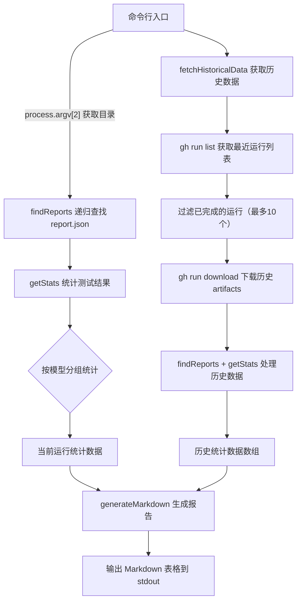
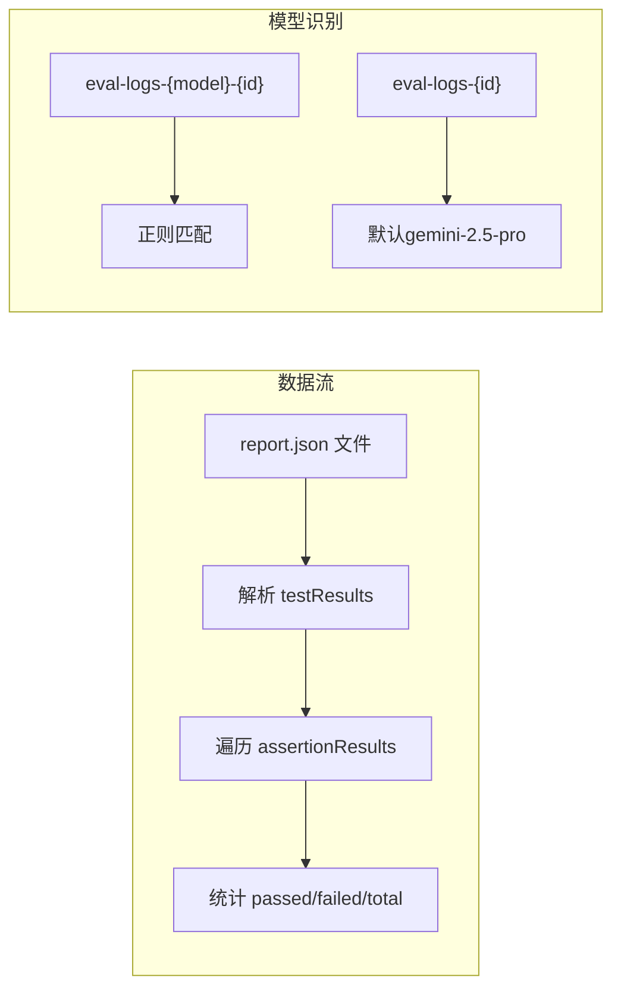

# aggregate_evals.js

## 概述

`scripts/aggregate_evals.js` 是一个 Node.js CLI 脚本，用于**聚合夜间评估（Evals Nightly）测试结果**并生成 Markdown 格式的汇总报告。它的核心职责包括：

1. 递归扫描指定目录下的所有 `report.json` 测试报告文件
2. 按模型（model）维度统计每个测试用例的通过/失败情况
3. 通过 GitHub CLI (`gh`) 拉取历史 CI 运行数据，实现趋势对比
4. 将当前运行结果与最近 N 次历史运行结果合并，输出结构化的 Markdown 表格

该脚本在 GitHub Actions 的 `evals-nightly.yml` 工作流中被调用，输出结果通常用于 PR 评论或 Issue 汇总。

## 架构图





## 核心组件

### 常量

| 常量名 | 值 | 说明 |
|--------|------|------|
| `artifactsDir` | `process.argv[2] \|\| '.'` | 测试报告根目录，默认为当前目录 |
| `MAX_HISTORY` | `10` | 最大历史运行记录数 |

### 函数

#### `findReports(dir): string[]`

递归查找指定目录下所有名为 `report.json` 的文件。

- **参数**: `dir` - 起始搜索目录
- **返回值**: 所有找到的 `report.json` 文件的完整路径数组
- **实现细节**: 使用 `fs.readdirSync` + `fs.statSync` 进行同步递归遍历，遇到目录则递归，遇到 `report.json` 则收集路径

#### `getModelFromPath(reportPath): string`

从报告文件路径中提取模型名称。

- **参数**: `reportPath` - report.json 的完整路径
- **返回值**: 模型名称字符串
- **解析规则**:
  - 路径中查找以 `eval-logs-` 开头的目录名
  - 匹配 `eval-logs-{model}-{id}` 格式 → 返回 `{model}`
  - 匹配 `eval-logs-{id}` 格式（旧格式） → 返回 `'gemini-2.5-pro'`（历史默认值）
  - 无法匹配 → 返回 `'unknown'`

#### `getStats(reports): Record<string, Record<string, {passed, failed, total}>>`

统计所有报告的测试结果，按模型分组。

- **参数**: `reports` - report.json 路径数组
- **返回值**: 嵌套对象 `{ [model]: { [testName]: { passed, failed, total } } }`
- **实现细节**:
  - 读取每个 report.json，解析其中的 `testResults[].assertionResults[]`
  - 根据 `assertion.status === 'passed'` 判断通过与否
  - 按模型名称和测试名称两级聚合统计

#### `fetchHistoricalData(): Array<{run, stats}>`

通过 GitHub CLI 获取历史夜间评估运行数据。

- **返回值**: 历史运行数据数组，每项包含 `run`（运行元信息）和 `stats`（按模型分组的统计）
- **实现流程**:
  1. 使用 `gh run list` 获取 `evals-nightly.yml` 工作流在 `main` 分支上最近 `MAX_HISTORY + 5` 次运行
  2. 过滤掉当前运行（通过 `GITHUB_RUN_ID` 环境变量识别）
  3. 仅保留 `status === 'completed'` 的运行，取前 `MAX_HISTORY` 个
  4. 对每个历史运行，在临时目录中下载匹配 `eval-logs-*` 模式的 artifacts
  5. 对下载的 artifacts 调用 `findReports` + `getStats` 统计
  6. 清理临时目录

#### `generateMarkdown(currentStatsByModel, history): void`

生成 Markdown 格式的汇总报告，输出到 stdout。

- **参数**:
  - `currentStatsByModel` - 当前运行的按模型分组统计
  - `history` - 历史运行数据数组
- **输出格式**:
  - 按模型分组显示
  - 每个模型一张表格，列为历史运行 + 当前运行
  - 行为各测试用例及通过率
  - 包含指向 GitHub 代码搜索的链接
  - 顶部有总体通过率（Overall Pass Rate）

### 主流程

```javascript
const currentReports = findReports(artifactsDir);
// 无报告则退出
const currentStats = getStats(currentReports);
const history = fetchHistoricalData();
generateMarkdown(currentStats, history);
```

## 依赖关系

### 内部依赖

无内部模块依赖。该脚本是独立的 CLI 工具。

### 外部依赖

| 依赖 | 类型 | 用途 |
|------|------|------|
| `node:fs` | Node.js 内置 | 文件系统操作：读取目录、读取文件、创建/删除临时目录 |
| `node:path` | Node.js 内置 | 路径拼接与解析 |
| `node:child_process` | Node.js 内置 | 执行 `gh` CLI 命令（`execSync`） |
| `node:os` | Node.js 内置 | 获取系统临时目录路径（`os.tmpdir()`） |
| `gh` (GitHub CLI) | 系统工具 | 列出工作流运行、下载 artifacts |

### 环境变量依赖

| 环境变量 | 用途 |
|----------|------|
| `GITHUB_RUN_ID` | 当前 CI 运行的 ID，用于在历史数据中排除当前运行 |

## 关键实现细节

1. **模型名称提取策略**: 通过路径中的目录名来识别模型。支持两种命名格式：新格式 `eval-logs-{model}-{runNumber}` 和旧格式 `eval-logs-{runNumber}`（默认为 `gemini-2.5-pro`）。

2. **历史数据获取的容错**: 每个历史运行的下载和处理都在 try-catch 中，单个运行失败不影响其他运行。临时目录在 `finally` 块中始终被清理。

3. **多模型支持**: 统计数据以模型为第一维度分组，生成报告时为每个模型单独输出一张表格，支持同一次 CI 运行中多个模型的评估结果。

4. **历史数据排序**: 历史数据先按时间倒序获取（最新在前），在生成 Markdown 时反转为最旧在前（`reversedHistory`），使表格从左到右呈现时间递增趋势，当前运行放在最右列。

5. **通过率计算**:
   - 单个测试通过率 = `(passed / total) * 100`，保留整数
   - 模型总体通过率 = 所有测试的 `passed` 之和 / 所有测试的 `total` 之和，保留一位小数

6. **GitHub 链接生成**: 表格中每个测试名称都链接到 GitHub 代码搜索页面，方便快速定位测试源码；历史运行列标题链接到对应的 GitHub Actions 运行页面。

7. **同步执行模式**: 整个脚本使用同步 I/O（`readdirSync`、`readFileSync`、`execSync`），适合 CI 环境中的一次性运行场景，简化了错误处理和控制流。
