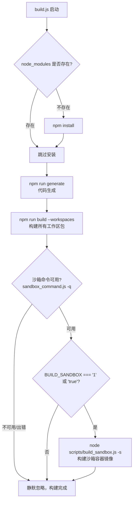
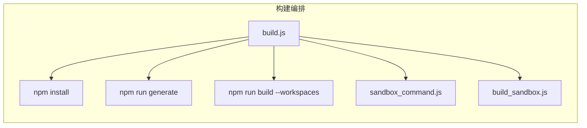

# build.js

## 概述

`scripts/build.js` 是 gemini-cli 项目的**主构建入口脚本**。它负责编排整个项目的完整构建流程，包括：

1. 自动检测并恢复 `node_modules`（如果缺失则自动执行 `npm install`）
2. 执行代码生成任务（`npm run generate`）
3. 构建所有 npm workspaces 包（`npm run build --workspaces`）
4. 可选地构建沙箱容器镜像（当 `BUILD_SANDBOX` 环境变量启用时）

该脚本是项目构建的统一入口，开发者和 CI 系统通过运行此脚本即可完成全部构建工作。

## 架构图





## 核心组件

### 常量

| 常量名 | 说明 |
|--------|------|
| `__dirname` | 当前脚本所在目录（ESM 兼容写法，通过 `import.meta.url` 计算） |
| `root` | 项目根目录（`__dirname` 的父目录） |

### 执行步骤

#### 步骤 1：依赖恢复

```javascript
if (!existsSync(join(root, 'node_modules'))) {
  execSync('npm install', { stdio: 'inherit', cwd: root });
}
```

检查项目根目录下是否存在 `node_modules` 目录。如果不存在（例如执行了 `npm run clean` 或 `scripts/clean.js` 后），自动运行 `npm install` 恢复依赖。

#### 步骤 2：代码生成

```javascript
execSync('npm run generate', { stdio: 'inherit', cwd: root });
```

执行项目的代码生成任务。通常包括 Protocol Buffers 编译、类型生成等自动化代码生成工作。

#### 步骤 3：工作区构建

```javascript
execSync('npm run build --workspaces', { stdio: 'inherit', cwd: root });
```

构建所有 npm workspaces 中的包。`--workspaces` 标志让 npm 依次在每个工作区中执行 `build` 脚本。

#### 步骤 4：沙箱容器构建（可选）

```javascript
execSync('node scripts/sandbox_command.js -q', { stdio: 'inherit', cwd: root });
if (process.env.BUILD_SANDBOX === '1' || process.env.BUILD_SANDBOX === 'true') {
  execSync('node scripts/build_sandbox.js -s', { stdio: 'inherit', cwd: root });
}
```

- 先运行 `sandbox_command.js -q`（quiet 模式）检查沙箱命令是否可用
- 如果环境变量 `BUILD_SANDBOX` 设置为 `'1'` 或 `'true'`，则调用 `build_sandbox.js -s` 构建沙箱容器镜像
- `-s` 标志表示跳过 npm install 和 build 步骤（因为前面已经执行过了）
- 整个沙箱构建步骤在 try-catch 中，失败时静默忽略

## 依赖关系

### 内部依赖

| 依赖脚本 | 用途 |
|----------|------|
| `scripts/sandbox_command.js` | 检测沙箱命令是否可用 |
| `scripts/build_sandbox.js` | 构建沙箱容器镜像 |

### 外部依赖

| 依赖 | 类型 | 用途 |
|------|------|------|
| `node:child_process` | Node.js 内置 | `execSync` 执行 shell 命令 |
| `node:fs` | Node.js 内置 | `existsSync` 检查文件/目录存在性 |
| `node:path` | Node.js 内置 | `dirname`、`join` 路径处理 |
| `node:url` | Node.js 内置 | `fileURLToPath` 将 ESM 的 `import.meta.url` 转换为文件路径 |

### 环境变量依赖

| 环境变量 | 用途 |
|----------|------|
| `BUILD_SANDBOX` | 设置为 `'1'` 或 `'true'` 时启用沙箱容器镜像构建 |

## 关键实现细节

1. **ESM 兼容的 `__dirname`**: 由于项目使用 ES Modules（`import` 语法），无法直接使用 CommonJS 的 `__dirname`。通过 `dirname(fileURLToPath(import.meta.url))` 模式手动计算。

2. **幂等性设计**: 脚本先检查 `node_modules` 是否存在再决定是否安装，避免重复安装带来的时间浪费。

3. **沙箱构建的条件触发**: 沙箱构建是可选步骤，通过环境变量控制。即使沙箱相关命令不可用（如缺少容器运行时），也不会中断主构建流程——整个沙箱相关逻辑在 try-catch 中。

4. **`stdio: 'inherit'`**: 所有子进程的标准输入/输出/错误都继承自父进程，使构建日志直接输出到终端，便于调试。

5. **构建顺序**: 严格按照 依赖恢复 → 代码生成 → 工作区构建 → 沙箱构建 的顺序执行，确保上游产物对下游可用。
