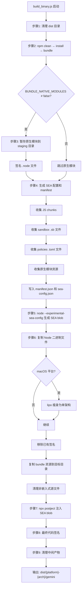
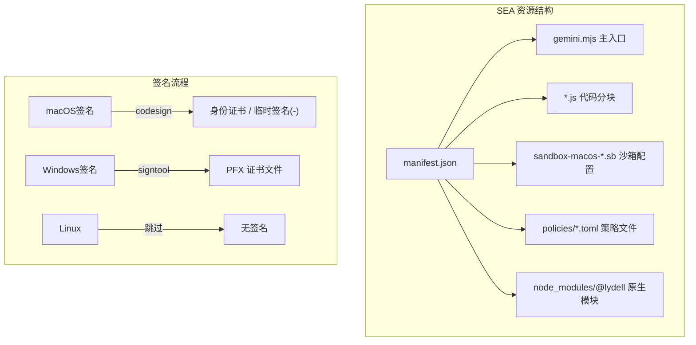

# build_binary.js

## 概述

`scripts/build_binary.js` 是 gemini-cli 项目的**独立二进制文件构建脚本**。它利用 Node.js 的 **Single Executable Application (SEA)** 技术，将整个 gemini-cli 应用打包成一个无需 Node.js 运行时即可分发的独立可执行文件。

核心职责包括：

1. 清理并准备构建目录
2. 执行完整的项目构建和打包（clean → install → bundle）
3. 暂存并签名原生模块（`.node` 文件）
4. 生成 SEA 配置和资源清单（manifest）
5. 生成 SEA blob 并注入到 Node.js 二进制文件中
6. 对最终可执行文件进行代码签名
7. 清理中间产物

最终输出为 `dist/{platform}-{arch}/gemini`（或 `gemini.exe`）。

## 架构图

## 核心组件

### 常量

| 常量名 | 值/说明 |
|--------|---------|
| `__dirname` | 当前脚本所在目录 |
| `root` | 项目根目录 |
| `distDir` | `{root}/dist` — 最终输出目录 |
| `bundleDir` | `{root}/bundle` — 打包产物目录 |
| `stagingDir` | `{root}/bundle/native_modules` — 原生模块暂存目录 |
| `seaConfigPath` | `{root}/sea-config.json` — SEA 配置文件路径 |
| `manifestPath` | `{root}/bundle/manifest.json` — 资源清单路径 |
| `entitlementsPath` | `{root}/scripts/entitlements.plist` — macOS 权限描述文件路径 |
| `sentinelFuse` | `'NODE_SEA_FUSE_fce680ab2cc467b6e072b8b5df1996b2'` — SEA 哨兵熔丝标识 |

### 函数

#### `runCommand(command, args, options?): SpawnSyncReturns`

安全执行命令的辅助函数。

- **参数**:
  - `command` — 要执行的命令
  - `args` — 命令参数数组
  - `options` — `spawnSync` 选项（可选）
- **特殊处理**: 在 Windows 上自动为 `npm`/`npx` 添加 `.cmd` 后缀并启用 shell 模式
- **错误处理**: 非零退出码时抛出异常

#### `removeSignature(filePath): void`

移除二进制文件上已有的数字签名。

- **参数**: `filePath` — 二进制文件路径
- **平台行为**:
  - macOS: 使用 `codesign --remove-signature`
  - Windows: 使用 `signtool remove /s`
  - Linux: 不执行操作
- **容错**: 失败时静默忽略

#### `signFile(filePath): void`

对二进制文件进行代码签名。

- **参数**: `filePath` — 要签名的文件路径
- **平台行为**:
  - **macOS**: 使用 `codesign` 签名，支持通过 `APPLE_IDENTITY` 环境变量指定签名身份（默认 `'-'` 即临时签名）；若存在 `entitlements.plist` 则附加权限；启用 `--timestamp` 和 `--options runtime`（Hardened Runtime）
  - **Windows**: 使用 `signtool sign`，支持通过 `WINDOWS_PFX_FILE` 和 `WINDOWS_PFX_PASSWORD` 环境变量指定 PFX 证书；使用 SHA256 摘要和 DigiCert 时间戳服务器；签名失败时密码信息会被脱敏
  - **Linux**: 跳过签名

#### `sha256(content): string`

计算内容的 SHA-256 哈希值。

- **参数**: `content` — Buffer 或字符串
- **返回值**: 十六进制哈希字符串

#### `addAssetsFromDir(baseDir, runtimePrefix): void`

递归将暂存目录中的文件添加到 SEA 资源映射和 manifest 中。

- **参数**:
  - `baseDir` — 相对于 `stagingDir` 的子目录路径
  - `runtimePrefix` — 运行时文件路径前缀
- **行为**: 使用 glob 遍历所有文件，计算哈希，注册到 `assets` 对象和 `manifest.files` 数组

### 主流程（9 个步骤）

| 步骤 | 说明 |
|------|------|
| 1. 清理 dist | 删除并重建 `dist/` 目录 |
| 2. 构建 Bundle | 依次执行 `npm run clean`、`npm install`、`npm run bundle` |
| 3. 暂存和签名原生模块 | 复制 `@lydell/node-pty` 到暂存目录，签名所有 `.node` 文件 |
| 4. 生成 SEA 配置和 Manifest | 收集所有资源（JS chunks、.sb 文件、策略文件、原生模块），生成 `sea-config.json` 和 `manifest.json` |
| 5. 生成 SEA Blob | 执行 `node --experimental-sea-config sea-config.json` 生成 `dist/sea-prep.blob` |
| 6. 准备目标二进制 | 复制当前 Node.js 二进制文件到 `dist/{platform}-{arch}/gemini`，macOS 上用 `lipo` 瘦身，移除已有签名 |
| 7. 注入 SEA Blob | 使用 `npx postject` 将 blob 注入到二进制文件的 `NODE_SEA_BLOB` 段（macOS 使用 `NODE_SEA` Mach-O 段） |
| 8. 最终签名 | 对完成注入的二进制文件进行代码签名 |
| 9. 清理中间产物 | 删除 blob 文件、SEA 配置、manifest、暂存目录 |

## 依赖关系

### 内部依赖

| 依赖 | 用途 |
|------|------|
| `package.json` | 读取项目版本号写入 manifest |
| `scripts/entitlements.plist` | macOS 代码签名的权限描述文件 |
| `bundle/` 目录 | 打包产物来源（JS、.sb 文件、策略文件） |
| `sea/sea-launch.cjs` | SEA 的启动入口点（main 字段） |

### 外部依赖

| 依赖 | 类型 | 用途 |
|------|------|------|
| `node:child_process` | Node.js 内置 | `spawnSync` 执行子进程 |
| `node:fs` | Node.js 内置 | 文件系统操作（复制、删除、读写） |
| `node:path` | Node.js 内置 | 路径处理 |
| `node:url` | Node.js 内置 | ESM URL 转文件路径 |
| `node:process` | Node.js 内置 | 平台检测、环境变量、退出 |
| `node:crypto` | Node.js 内置 | SHA-256 哈希计算 |
| `glob` | npm 包 | `globSync` 文件模式匹配 |
| `postject` | npx 工具 | 将 SEA blob 注入到 Node.js 二进制文件 |
| `codesign` | macOS 系统工具 | 代码签名和签名移除 |
| `signtool` | Windows SDK 工具 | Windows 代码签名 |
| `lipo` | macOS 系统工具 | Universal binary 瘦身 |

### 环境变量依赖

| 环境变量 | 用途 |
|----------|------|
| `BUNDLE_NATIVE_MODULES` | 设为 `'false'` 跳过原生模块打包 |
| `APPLE_IDENTITY` | macOS 代码签名身份（默认 `'-'` 临时签名） |
| `WINDOWS_PFX_FILE` | Windows PFX 证书文件路径 |
| `WINDOWS_PFX_PASSWORD` | Windows PFX 证书密码 |

## 关键实现细节

1. **Node.js SEA 技术**: 利用 Node.js 实验性的 Single Executable Application 功能，将应用代码和资源嵌入到 Node.js 二进制文件中。通过 `--experimental-sea-config` 生成 blob，再用 `postject` 注入到二进制的特定段中。

2. **资源清单系统**: `manifest.json` 记录了所有嵌入资源的路径和 SHA-256 哈希值，用于运行时的资源查找和完整性校验。主入口 `gemini.mjs` 的哈希值单独存储在 `mainHash` 字段。

3. **原生模块处理**: `@lydell/node-pty` 是项目依赖的原生模块（用于终端功能），需要作为单独的文件资源嵌入，因为 `.node` 二进制无法被打包到 JS bundle 中。通过 staging 目录暂存、签名后再注册到 SEA 资源中。

4. **跨平台签名**: 脚本完整支持 macOS（codesign）、Windows（signtool）和 Linux（跳过）三个平台的签名流程。macOS 签名支持 Hardened Runtime 和 entitlements。Windows 签名支持 PFX 证书，并对密码进行脱敏处理。

5. **macOS Universal Binary 瘦身**: 在 macOS 上，复制的 Node.js 二进制可能是 Universal Binary（同时包含 x86_64 和 arm64）。使用 `lipo -thin` 仅保留当前架构，减小最终文件体积。

6. **资源键名约定**: SEA assets 使用特殊的键名前缀来区分不同类型的资源：
   - 无前缀: JS 文件和主入口
   - `files:`: 原生模块文件
   - `policies:`: 策略配置文件

7. **清理策略**: 复制 bundle 目录到目标目录后，显式删除不需要的源文件（JS 源码、map 文件、manifest、native_modules 目录等），因为这些已经嵌入到 SEA blob 中，不需要以文件形式存在。

8. **Windows 兼容性**: 在 Windows 平台上，`npm` 和 `npx` 实际上是 `.cmd` 批处理文件，需要通过 shell 模式调用。`runCommand` 辅助函数自动处理了这个平台差异。
