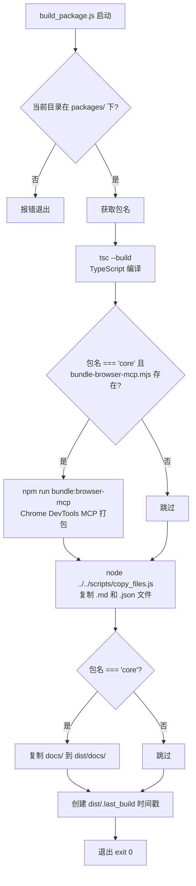
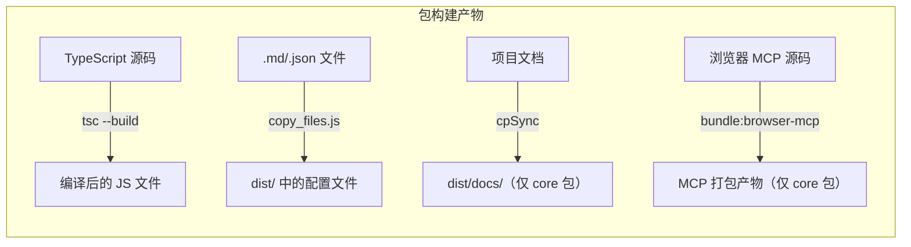

# build_package.js

## 概述

`scripts/build_package.js` 是一个**单包构建脚本**，用于构建 gemini-cli 项目中 `packages/` 目录下的单个子包。它必须从某个包目录内调用，负责以下工作：

1. TypeScript 编译（`tsc --build`）
2. 针对 `core` 包执行特定的浏览器 MCP 打包任务
3. 复制 Markdown 和 JSON 等非代码文件到 `dist/`
4. 针对 `core` 包复制项目文档到 `dist/docs/`
5. 创建构建时间戳文件 `dist/.last_build`

该脚本是 monorepo 中每个子包 `package.json` 的 `build` 脚本的实际执行入口。

## 架构图





## 核心组件

### 变量

| 变量名 | 说明 |
|--------|------|
| `packageName` | 当前包的名称，通过 `basename(process.cwd())` 获取（如 `core`、`cli` 等） |
| `bundleScript` | Chrome DevTools MCP 打包脚本的路径：`{cwd}/scripts/bundle-browser-mcp.mjs` |

### 执行步骤

#### 步骤 1：目录校验

```javascript
if (!process.cwd().includes('packages')) {
  console.error('must be invoked from a package directory');
  process.exit(1);
}
```

安全检查：确保脚本从 `packages/` 目录下的某个子包中调用。如果不是，输出错误并退出。

#### 步骤 2：TypeScript 编译

```javascript
execSync('tsc --build', { stdio: 'inherit' });
```

执行 TypeScript 项目编译。使用 `--build` 模式，支持项目引用（project references），能正确处理包之间的依赖关系。

#### 步骤 3：浏览器 MCP 打包（仅 core 包）

```javascript
if (packageName === 'core' && existsSync(bundleScript)) {
  execSync('npm run bundle:browser-mcp', { stdio: 'inherit' });
}
```

仅当构建 `core` 包且打包脚本 `scripts/bundle-browser-mcp.mjs` 存在时，执行 Chrome DevTools MCP 的打包任务。

#### 步骤 4：复制静态文件

```javascript
execSync('node ../../scripts/copy_files.js', { stdio: 'inherit' });
```

调用项目根目录的 `scripts/copy_files.js` 脚本，将 `.md` 和 `.json` 等非代码文件复制到 `dist/` 目录中，确保 npm 发布时包含必要的元数据文件。

#### 步骤 5：复制文档（仅 core 包）

```javascript
if (packageName === 'core') {
  const docsSource = join(process.cwd(), '..', '..', 'docs');
  const docsTarget = join(process.cwd(), 'dist', 'docs');
  if (existsSync(docsSource)) {
    cpSync(docsSource, docsTarget, { recursive: true, dereference: true });
  }
}
```

仅当构建 `core` 包时，将项目根目录的 `docs/` 文档目录复制到 `dist/docs/`。使用 `dereference: true` 选项跟随符号链接复制实际文件。

#### 步骤 6：创建构建时间戳

```javascript
writeFileSync(join(process.cwd(), 'dist', '.last_build'), '');
```

在 `dist/` 目录下创建一个空的 `.last_build` 文件，作为构建完成的标记。可用于增量构建时判断是否需要重新构建。

## 依赖关系

### 内部依赖

| 依赖 | 用途 |
|------|------|
| `scripts/copy_files.js` | 复制 `.md` 和 `.json` 文件到 `dist/` |
| `{package}/scripts/bundle-browser-mcp.mjs` | core 包的浏览器 MCP 打包脚本 |
| `docs/` 目录 | 项目文档（仅 core 包构建时复制） |
| `tsconfig.json`（各包内） | TypeScript 编译配置 |

### 外部依赖

| 依赖 | 类型 | 用途 |
|------|------|------|
| `node:child_process` | Node.js 内置 | `execSync` 执行 shell 命令 |
| `node:fs` | Node.js 内置 | `writeFileSync`、`existsSync`、`cpSync` 文件操作 |
| `node:path` | Node.js 内置 | `join`、`basename` 路径处理 |
| `typescript` (`tsc`) | npm 依赖 | TypeScript 编译器 |

## 关键实现细节

1. **工作目录约束**: 脚本通过检查 `process.cwd()` 是否包含 `'packages'` 来确保执行环境正确。这意味着它只能从 monorepo 的子包目录中调用。

2. **core 包的特殊处理**: `core` 包相比其他包有两个额外步骤：
   - 浏览器 MCP 打包（`bundle:browser-mcp`）：将 Chrome DevTools 的 MCP 功能打包为独立产物
   - 文档复制：将项目文档嵌入到发布包中

3. **构建标记文件**: `dist/.last_build` 是一个空文件，其修改时间戳表示上次成功构建的时间。其他脚本或工具可以通过检查此文件来实现增量构建逻辑。

4. **相对路径引用**: 脚本使用 `../../scripts/copy_files.js` 这样的相对路径引用项目根目录的工具脚本，这依赖于脚本始终从 `packages/{name}/` 目录调用的约束。

5. **`dereference: true`**: 复制文档时使用此选项，确保如果 `docs/` 目录中存在符号链接，会复制链接指向的实际文件内容而非链接本身，避免发布包中出现断开的符号链接。

6. **显式退出**: 脚本末尾调用 `process.exit(0)` 确保以成功状态退出，这在被 npm scripts 调用时尤其重要，因为 npm 会根据退出码判断脚本是否成功。
