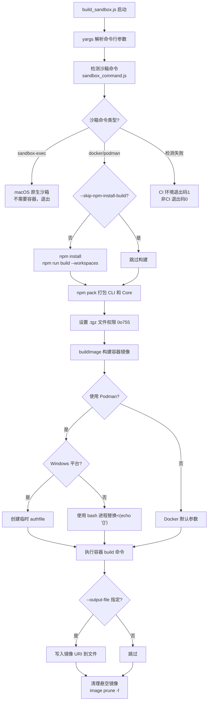
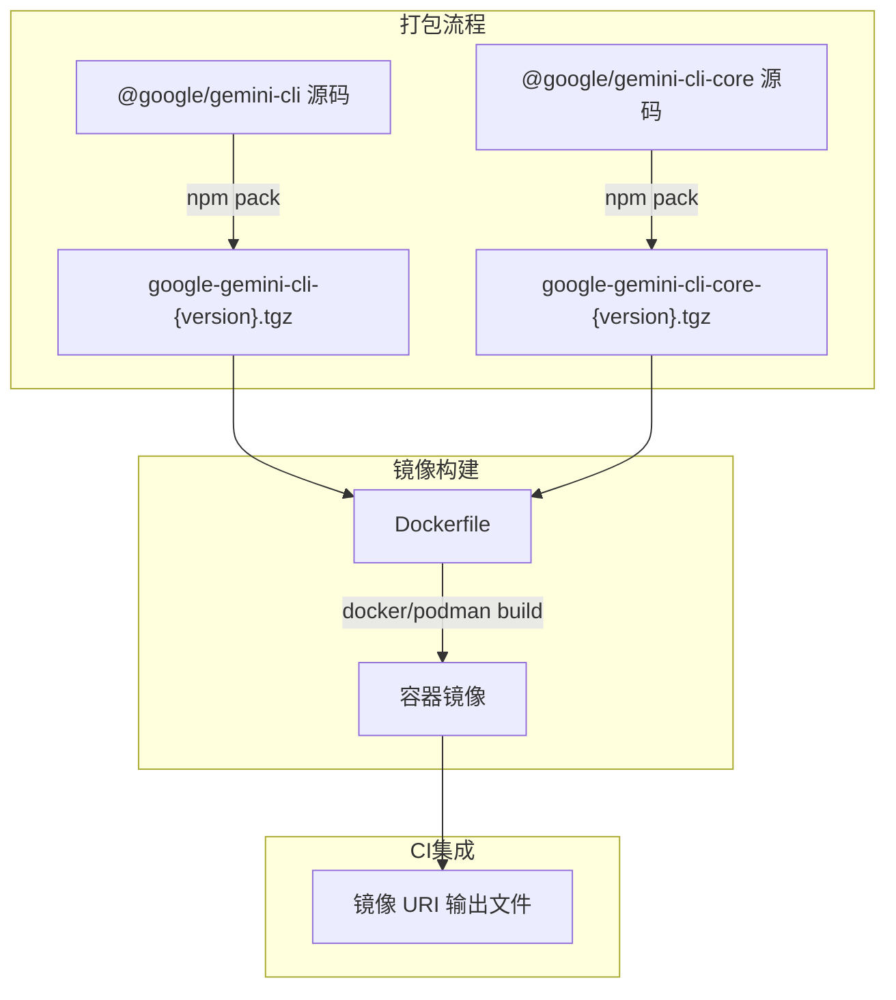

# build_sandbox.js

## 概述

`scripts/build_sandbox.js` 是 gemini-cli 项目的**沙箱容器镜像构建脚本**。它负责将 gemini-cli 打包为容器镜像（Docker/Podman），用于在隔离的沙箱环境中运行 CLI 工具。

核心职责包括：

1. 检测可用的容器化命令（docker/podman/sandbox-exec）
2. 可选地执行项目构建（npm install + build）
3. 将 `@google/gemini-cli` 和 `@google/gemini-cli-core` 打包为 `.tgz` 文件
4. 使用容器化命令构建镜像
5. 支持 CI/CD 集成，将最终镜像 URI 写入输出文件
6. 清理悬空镜像

该脚本支持 macOS、Linux 和 Windows 三个平台，并自动适配 Docker 和 Podman 两种容器运行时。

## 架构图

## 核心组件

### 命令行参数（yargs）

| 参数 | 别名 | 类型 | 默认值 | 说明 |
|------|------|------|--------|------|
| `-s` | `--skip-npm-install-build` | boolean | `false` | 跳过 npm install 和 build 步骤 |
| `-f` | `--dockerfile` | string | `'Dockerfile'` | 自定义 Dockerfile 路径 |
| `-i` | `--image` | string | `cliPkgJson.config.sandboxImageUri` | 自定义镜像名称 |
| `--output-file` | — | string | — | CI/CD 集成用，将最终镜像 URI 写入指定文件 |

### 变量

| 变量名 | 说明 |
|--------|------|
| `sandboxCommand` | 检测到的容器化命令（`docker`、`podman` 或 `sandbox-exec`） |
| `image` | 镜像名称，来自 `-i` 参数或 `packages/cli/package.json` 的 `config.sandboxImageUri` |
| `dockerFile` | Dockerfile 路径，来自 `-f` 参数 |
| `buildStdout` | 构建输出模式，`VERBOSE` 环境变量为真时为 `'inherit'`，否则为 `'ignore'` |
| `shellToUse` | 根据平台选择的 shell：Windows 用 `powershell.exe`，其他平台用 `/bin/bash` |

### 函数

#### `buildImage(imageName, dockerfile): void`

构建容器镜像的核心函数。

- **参数**:
  - `imageName` — 完整的镜像名称（含标签，如 `gemini-cli:latest`）
  - `dockerfile` — Dockerfile 文件路径
- **实现逻辑**:
  1. 如果使用 Podman 且在 Windows 上，创建临时空 JSON 文件作为 `--authfile`
  2. 如果使用 Podman 且在 Unix 上，使用 bash 进程替换 `<(echo '{}')` 作为 `--authfile`
  3. 通过 `GEMINI_SANDBOX_IMAGE_TAG` 环境变量或镜像名称中的标签确定最终标签
  4. 执行 `{sandboxCommand} build` 命令，传入 `CLI_VERSION_ARG` 构建参数
  5. 如果指定了 `--output-file`，将最终镜像 URI 写入文件（不覆盖已存在的文件）
  6. 在 `finally` 块中清理临时 authfile

### 主流程

| 阶段 | 说明 |
|------|------|
| 参数解析 | 使用 yargs 解析命令行参数 |
| 沙箱命令检测 | 调用 `scripts/sandbox_command.js` 检测可用的容器化工具 |
| 前置检查 | 如果是 `sandbox-exec`（macOS 原生沙箱），直接退出（不需要容器） |
| 项目构建 | 除非 `-s` 跳过，执行 `npm install` + `npm run build --workspaces` |
| 打包 CLI | `npm pack` 生成 `@google/gemini-cli` 和 `@google/gemini-cli-core` 的 `.tgz` |
| 权限设置 | 设置 `.tgz` 文件权限为 `0o755` |
| 镜像构建 | 调用 `buildImage()` 构建容器镜像 |
| 清理 | 执行 `image prune -f` 清理悬空镜像 |

## 依赖关系

### 内部依赖

| 依赖 | 用途 |
|------|------|
| `scripts/sandbox_command.js` | 检测可用的容器化命令（docker/podman/sandbox-exec） |
| `packages/cli/package.json` | 读取默认镜像 URI（`config.sandboxImageUri`） |
| `package.json`（根目录） | 读取项目版本号，用作 `CLI_VERSION_ARG` 构建参数和 `.tgz` 文件名 |
| `Dockerfile` | 容器镜像的构建定义文件 |

### 外部依赖

| 依赖 | 类型 | 用途 |
|------|------|------|
| `node:child_process` | Node.js 内置 | `execSync` 执行 shell 命令 |
| `node:fs` | Node.js 内置 | 文件读写、权限设置、删除 |
| `node:path` | Node.js 内置 | 路径拼接 |
| `node:os` | Node.js 内置 | 平台检测、临时目录 |
| `yargs` | npm 包 | 命令行参数解析 |
| `yargs/helpers` | npm 包 | `hideBin` 辅助函数 |
| `docker` 或 `podman` | 系统工具 | 容器镜像构建和管理 |

### 环境变量依赖

| 环境变量 | 用途 |
|----------|------|
| `CI` | CI 环境标识；在 CI 中沙箱命令检测失败时以退出码 1 退出 |
| `VERBOSE` | 为真时显示容器构建的详细输出 |
| `GEMINI_SANDBOX_IMAGE_TAG` | 覆盖默认的镜像标签 |
| `BUILD_SANDBOX_FLAGS` | 额外的容器构建标志（如 `--no-cache`） |

## 关键实现细节

1. **沙箱命令分级策略**: 脚本通过 `sandbox_command.js` 检测容器化工具。如果检测到 `sandbox-exec`（macOS 原生沙箱），说明不需要容器级别的隔离，脚本直接正常退出。只有检测到 `docker` 或 `podman` 时才继续构建容器镜像。

2. **Podman 的 authfile 处理**: Podman 在构建镜像时可能需要 `--authfile` 参数。脚本使用空 JSON `{}` 作为认证文件：
   - Unix/macOS: 使用 bash 进程替换 `<(echo '{}')` 创建临时文件描述符
   - Windows: 由于 PowerShell 不支持进程替换，显式创建临时文件，构建后在 `finally` 中清理

3. **镜像标签确定**: 最终镜像标签的确定遵循优先级：
   - `GEMINI_SANDBOX_IMAGE_TAG` 环境变量（最高优先级）
   - 镜像名称中 `:` 后面的部分（来自 CLI 参数或 package.json 配置）

4. **CI 环境的差异化退出**: 沙箱命令检测失败时，在 CI 环境（`process.env.CI` 为真）中以退出码 1 退出（视为构建失败），在本地开发环境中以退出码 0 退出（容错处理）。

5. **`.tgz` 权限设置**: 打包后的 `.tgz` 文件被设置为 `0o755`（可执行权限），这是因为在容器构建过程中 Dockerfile 可能需要直接执行或解压这些文件。

6. **悬空镜像清理**: 构建完成后自动执行 `image prune -f` 清理中间层产生的悬空镜像，避免磁盘空间浪费。

7. **CI/CD 集成**: 通过 `--output-file` 参数支持 CI/CD 流水线集成。脚本将最终镜像 URI 写入指定文件，供后续的发布步骤读取。为防止意外覆盖（例如构建多个镜像时），如果输出文件已存在则抛出错误。

8. **`--skip-npm-install-build` 优化**: 当从 `build.js` 主构建脚本调用时，使用 `-s` 标志跳过重复的 install 和 build 步骤，减少构建时间。

9. **JSON import 语法**: 使用 `import ... with { type: 'json' }` 直接导入 `package.json`，这是 Node.js 的 JSON 模块导入语法（Import Attributes），需要较新版本的 Node.js 支持。
