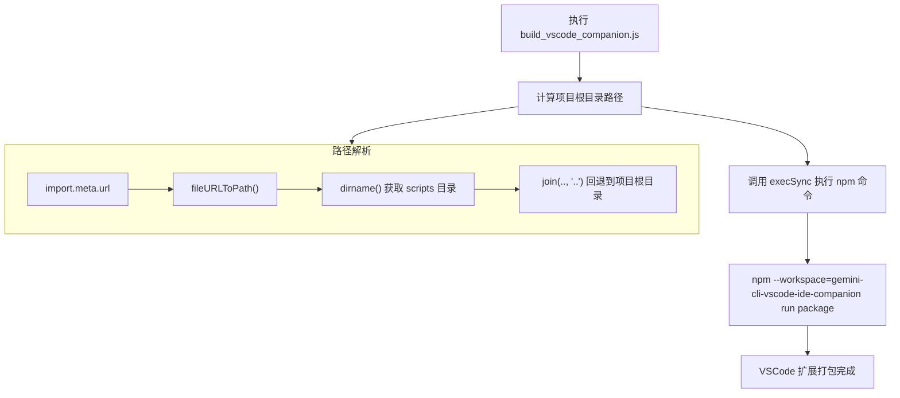
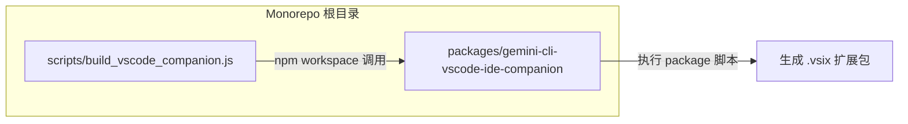

# build_vscode_companion.js

## 概述

该脚本是 **VSCode IDE Companion 扩展** 的构建入口脚本。它的唯一职责是在项目根目录下，通过 npm workspace 机制调用 `gemini-cli-vscode-ide-companion` 工作区的 `package` 命令，完成 VSCode 扩展的打包构建。

脚本采用 ES Module 格式编写，使用 `import.meta.url` 动态计算项目根目录路径，确保无论从哪个工作目录执行脚本，都能正确定位到 monorepo 根目录。

## 架构图





## 核心组件

### 常量

| 常量名 | 类型 | 描述 |
|--------|------|------|
| `__dirname` | `string` | 当前脚本文件所在目录的绝对路径（即 `scripts/` 目录）。由于 ES Module 不提供 `__dirname`，通过 `dirname(fileURLToPath(import.meta.url))` 手动实现。 |
| `root` | `string` | 项目 monorepo 根目录的绝对路径，由 `__dirname` 向上回退一级目录得到。 |

### 执行逻辑

脚本仅包含一个 `execSync` 调用：

```javascript
execSync('npm --workspace=gemini-cli-vscode-ide-companion run package', {
  stdio: 'inherit',
  cwd: root,
});
```

- **命令**: `npm --workspace=gemini-cli-vscode-ide-companion run package`
  - 使用 npm 的 `--workspace` 选项，指定只在 `gemini-cli-vscode-ide-companion` 工作区下运行 `package` 脚本。
- **选项**:
  - `stdio: 'inherit'`：子进程的标准输入/输出/错误流继承父进程，构建日志直接输出到终端。
  - `cwd: root`：将工作目录设置为 monorepo 根目录，确保 npm workspace 解析正确。

## 依赖关系

### 内部依赖

| 依赖 | 说明 |
|------|------|
| `gemini-cli-vscode-ide-companion` workspace | 该脚本的实际构建目标，通过 npm workspace 机制间接依赖该包的 `package` 脚本。 |

### 外部依赖

| 模块 | 来源 | 说明 |
|------|------|------|
| `node:child_process` | Node.js 内置模块 | 提供 `execSync` 函数，用于同步执行 shell 命令。 |
| `node:path` | Node.js 内置模块 | 提供 `dirname` 和 `join` 函数，用于路径操作。 |
| `node:url` | Node.js 内置模块 | 提供 `fileURLToPath` 函数，将 `file://` URL 转换为文件系统路径。 |

## 关键实现细节

1. **ES Module 兼容性处理**: 在 ES Module 中，Node.js 不提供传统的 `__dirname` 和 `__filename` 全局变量。脚本通过 `dirname(fileURLToPath(import.meta.url))` 模式手动重建 `__dirname`，这是 ESM 项目中的标准实践。

2. **同步执行**: 使用 `execSync` 而非异步的 `exec`，表明该脚本设计为构建流水线中的阻塞步骤——必须等待打包完成后才能继续后续操作。如果 `npm run package` 命令失败（非零退出码），`execSync` 会自动抛出异常，使脚本以错误状态退出。

3. **stdio 继承**: 通过 `stdio: 'inherit'`，构建过程中的所有输出（包括进度信息、警告和错误）都会实时显示在终端中，方便开发者观察构建状态。

4. **工作目录设置**: 将 `cwd` 显式设置为 monorepo 根目录，是 npm workspace 正确工作的关键。npm 的 `--workspace` 标志需要从包含 `package.json`（其中定义了 `workspaces` 字段）的根目录开始解析。

5. **许可证**: 文件头部声明了 Apache License 2.0 许可证，版权归属 Google LLC (2025)。
