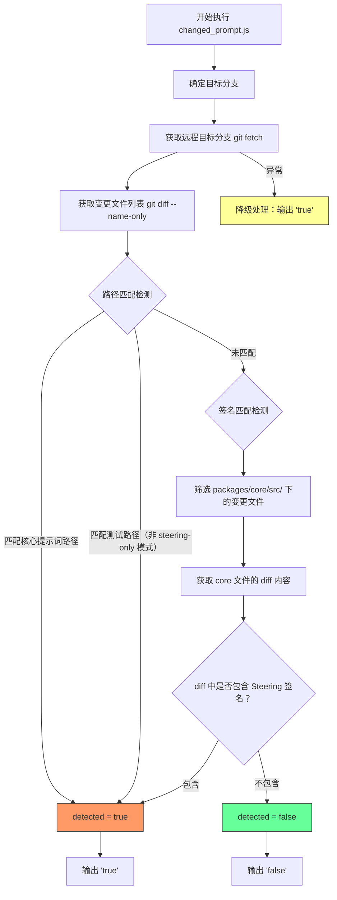
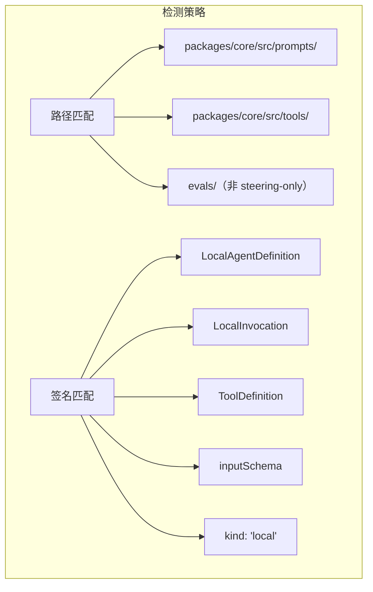

# changed_prompt.js

## 概述

该脚本是 CI/CD 流水线中的**变更检测器**，用于判断当前 Pull Request 是否修改了与"Prompt Steering"（提示词引导）相关的核心文件。它通过两种检测策略——**路径匹配**和**签名匹配**——分析 Git diff，最终输出 `true` 或 `false` 到标准输出，供后续 CI 步骤（如是否触发 evals 评估）做条件判断。

当检测失败（如无 Git 历史）时，脚本采用安全默认策略，输出 `true` 以确保评估流程不被跳过。

## 架构图

## 核心组件

### 常量

| 常量名 | 类型 | 描述 |
|--------|------|------|
| `CORE_STEERING_PATHS` | `string[]` | 核心提示词引导路径列表。包含 `packages/core/src/prompts/` 和 `packages/core/src/tools/`。任何匹配这些前缀的变更文件都会被视为提示词变更。 |
| `TEST_PATHS` | `string[]` | 测试路径列表，当前仅包含 `evals/`。在非 `--steering-only` 模式下，匹配这些路径的变更也会触发检测。 |
| `STEERING_SIGNATURES` | `string[]` | 代码签名列表，包含 5 个关键字符串。当 `packages/core/src/` 下的文件 diff 内容包含这些签名时，认为发生了提示词引导相关变更。 |

### 函数

#### `main()`

**签名**: `function main(): void`

主函数，包含完整的检测逻辑。无参数，无返回值。通过 `process.stdout.write` 输出结果。

**逻辑步骤**:
1. 确定目标分支（优先使用 `GITHUB_BASE_REF` 环境变量，回退到 `main`）
2. 解析命令行参数 `--verbose` 和 `--steering-only`
3. 构造远程 URL 并 `git fetch` 目标分支
4. 获取 `FETCH_HEAD...HEAD` 之间的变更文件列表
5. 执行路径匹配检测
6. 如未检测到或处于 verbose 模式，执行签名匹配检测
7. 输出检测结果

### 命令行参数

| 参数 | 描述 |
|------|------|
| `--verbose` | 详细模式。不会在第一次匹配时短路退出，而是收集所有匹配原因并输出到 stderr。 |
| `--steering-only` | 仅检测核心提示词路径的变更，忽略测试路径（`evals/`）的变更。 |

### 环境变量

| 变量名 | 描述 |
|--------|------|
| `GITHUB_BASE_REF` | GitHub Actions 中 PR 的目标分支名。未设置时回退为 `main`。 |
| `GITHUB_REPOSITORY` | GitHub 仓库的 `owner/repo` 格式标识。用于构造远程 URL。未设置时使用 `origin`。 |

## 依赖关系

### 内部依赖

无直接的项目内模块依赖。但脚本的检测逻辑与以下项目结构紧密耦合：

| 路径 | 说明 |
|------|------|
| `packages/core/src/prompts/` | 核心提示词定义目录 |
| `packages/core/src/tools/` | 核心工具定义目录 |
| `evals/` | 评估测试目录 |

### 外部依赖

| 模块 | 来源 | 说明 |
|------|------|------|
| `node:child_process` | Node.js 内置模块 | 提供 `execSync` 函数，用于执行 Git 命令。 |

## 关键实现细节

1. **双重检测策略**:
   - **路径匹配**: 快速判断变更文件是否位于已知的核心目录下。这是第一道检测线，效率最高。
   - **签名匹配**: 对 `packages/core/src/` 下的所有变更文件执行深度 diff 分析，检查 diff 内容中是否包含特定的 API 签名字符串（如 `ToolDefinition`、`inputSchema` 等）。即使文件不在核心目录中，只要修改了相关接口定义，也能被捕获。

2. **三点 diff 语法 (`FETCH_HEAD...HEAD`)**: 使用 Git 的三点 diff 语法而非两点语法。三点语法比较的是两个分支的最近公共祖先与 HEAD 之间的差异，能正确处理合并提交的情况，避免误报。

3. **短路优化**: 在非 verbose 模式下，一旦检测到第一个匹配就立即跳出循环（`if (!verbose) break`），避免不必要的文件遍历和 diff 解析。

4. **安全降级**: `try-catch` 包裹整个逻辑，任何异常（如 shallow clone 导致的 Git 历史不完整、网络问题导致 fetch 失败等）都会输出 `true`，确保在不确定的情况下不会遗漏必要的评估步骤。

5. **输出分离**: 检测结果输出到 `stdout`（供程序化消费），而调试信息和错误信息输出到 `stderr`（供人类阅读），遵循 Unix 约定。

6. **GitHub Actions 适配**: 通过 `GITHUB_REPOSITORY` 环境变量构造 HTTPS 远程 URL，而非直接使用 `origin`。这解决了 GitHub Actions 中 checkout 动作可能使用不同远程配置的问题。

7. **`-U0` diff 选项**: 在签名检测阶段使用 `git diff -U0`（零上下文行），仅获取实际变更的行，减少误匹配的可能性并提高性能。
