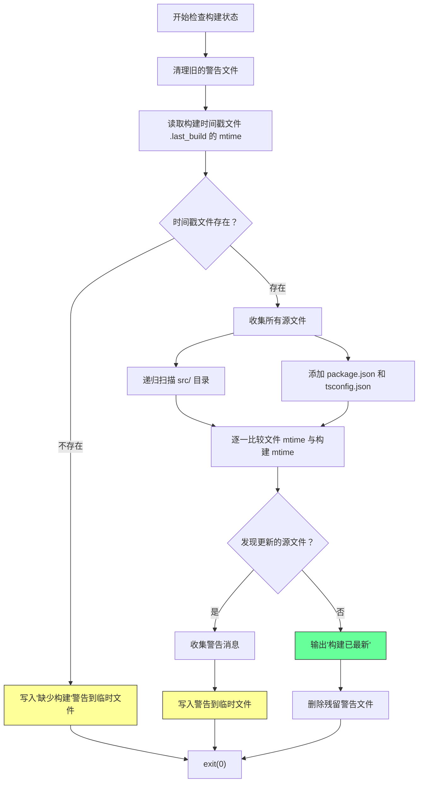
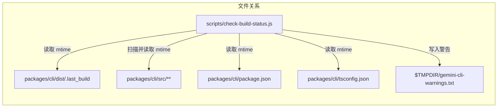

# check-build-status.js

## 概述

该脚本是一个**构建状态检查器**，用于在 CLI 应用启动前检测源代码文件是否比最近一次构建更新。它通过比较源文件的修改时间 (`mtime`) 与构建时间戳文件 (`.last_build`) 的修改时间来判断构建是否过期。

脚本的设计理念是**非阻塞式警告**：无论构建状态如何，脚本始终以退出码 `0` 退出，确保应用可以正常启动。如果检测到源码比构建更新，它会将警告信息写入系统临时目录中的一个文件，供应用启动后读取并展示给用户。

## 架构图

## 核心组件

### 常量 (配置)

| 常量名 | 类型 | 描述 |
|--------|------|------|
| `cliPackageDir` | `string` | CLI 包的基础目录，解析为 `packages/cli` 的绝对路径。 |
| `buildTimestampPath` | `string` | 构建时间戳文件的路径：`packages/cli/dist/.last_build`。该文件的修改时间代表最近一次构建的时间。 |
| `sourceDirs` | `string[]` | 需要递归扫描的源代码目录列表，当前仅包含 `packages/cli/src`。 |
| `filesToWatch` | `string[]` | 需要额外监控的特定文件列表，包含 `package.json` 和 `tsconfig.json`。 |
| `buildDir` | `string` | 构建输出目录 `packages/cli/dist`，在递归扫描时会被排除。 |
| `warningsFilePath` | `string` | 警告文件的路径，位于系统临时目录下：`$TMPDIR/gemini-cli-warnings.txt`。 |

### 函数

#### `getMtime(filePath)`

**签名**: `function getMtime(filePath: string): number | null`

获取指定文件的修改时间（毫秒精度）。

| 参数 | 类型 | 描述 |
|------|------|------|
| `filePath` | `string` | 文件的绝对路径 |

**返回值**:
- `number`: 文件的 `mtimeMs`（毫秒级修改时间戳）
- `null`: 文件不存在（`ENOENT`）

**异常处理**: 对于非 `ENOENT` 的错误（如权限问题），直接 `process.exit(1)` 退出。

#### `findSourceFiles(dir, allFiles)`

**签名**: `function findSourceFiles(dir: string, allFiles?: string[]): string[]`

递归遍历目录，收集所有文件路径。

| 参数 | 类型 | 描述 |
|------|------|------|
| `dir` | `string` | 要扫描的目录路径 |
| `allFiles` | `string[]` | 用于累积结果的数组（默认 `[]`） |

**返回值**: 包含所有文件绝对路径的字符串数组。

**过滤规则**: 跳过 `node_modules` 目录和构建输出目录 (`dist`)。

## 依赖关系

### 内部依赖

| 依赖 | 说明 |
|------|------|
| `packages/cli/dist/.last_build` | 构建时间戳标记文件，由构建脚本在成功构建后创建/更新。 |
| `packages/cli/src/` | CLI 包的源代码目录，脚本递归扫描其中所有文件。 |
| `packages/cli/package.json` | CLI 包的包描述文件，作为监控文件之一。 |
| `packages/cli/tsconfig.json` | CLI 包的 TypeScript 配置文件，作为监控文件之一。 |

### 外部依赖

| 模块 | 来源 | 说明 |
|------|------|------|
| `node:fs` | Node.js 内置模块 | 文件系统操作：`statSync`、`readdirSync`、`existsSync`、`writeFileSync`、`unlinkSync`。 |
| `node:path` | Node.js 内置模块 | 路径操作：`resolve`、`join`、`relative`。 |
| `node:os` | Node.js 内置模块 | 提供 `tmpdir()` 函数获取系统临时目录路径。 |

## 关键实现细节

1. **非阻塞设计**: 脚本始终以 `process.exit(0)` 退出，即使检测到构建过期或构建时间戳文件缺失。这确保了应用不会因为构建检查失败而无法启动。警告信息通过临时文件传递给应用，由应用自行决定如何展示。

2. **时间戳比较机制**: 使用 `fs.statSync().mtimeMs` 获取毫秒精度的修改时间，而非秒级的 `mtime`。这避免了在快速连续操作（如自动化构建流程）中因精度不足而产生误判。

3. **临时文件通信**: 脚本与主应用之间通过系统临时目录下的 `gemini-cli-warnings.txt` 文件进行通信。这是一种松耦合的进程间通信方式：
   - 脚本负责写入警告
   - 应用负责读取并展示警告
   - 每次检查前先清理旧文件，避免残留信息干扰

4. **递归文件扫描**: `findSourceFiles` 函数使用 `readdirSync` 配合 `withFileTypes: true` 选项进行高效的目录遍历。`withFileTypes` 避免了额外的 `stat` 调用，因为 `Dirent` 对象本身就包含类型信息。

5. **排除策略**: 递归扫描时明确排除 `node_modules` 和构建输出目录 (`dist`)，防止这些目录中的文件变更触发误报。

6. **监控范围**: 除了源代码目录外，还监控 `package.json` 和 `tsconfig.json`。这些配置文件的变更可能影响构建结果（如依赖变更、编译选项调整），因此也纳入检查范围。

7. **完整文件遍历**: 虽然代码中有一行被注释掉的 `break` 语句，但当前实现会遍历所有源文件并收集所有过期文件的警告信息。这提供了更完整的诊断信息，帮助开发者了解具体哪些文件发生了变更。

8. **警告文件清理**: 在构建最新的情况下，脚本会主动删除残留的警告文件，防止应用读取到过期的警告信息。
