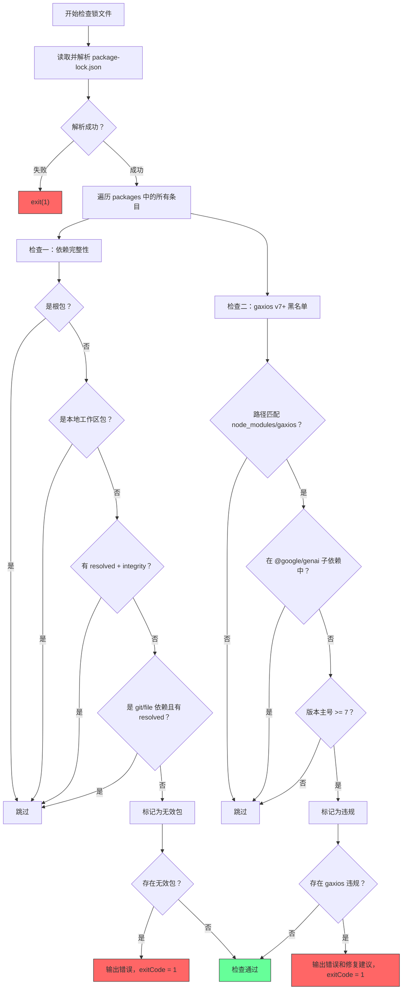
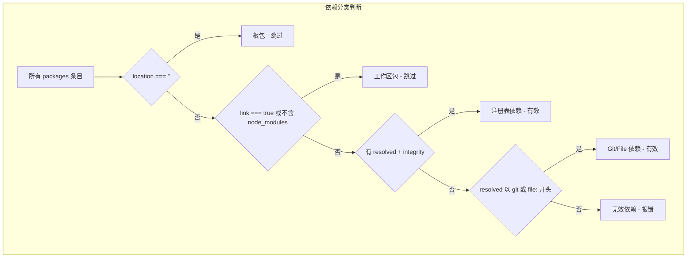

# check-lockfile.js

## 概述

该脚本是一个 **package-lock.json 完整性检查器**，用于在 CI 流水线中验证锁文件的健康状态。它执行两项关键检查：

1. **依赖完整性检查**: 验证所有第三方依赖都具有 `resolved` 和 `integrity` 字段，确保包来源可追溯、内容未被篡改。
2. **gaxios v7+ 黑名单检查**: 检测工作区 `node_modules` 中是否存在 gaxios v7 或更高版本，因为该版本存在一个流损坏 Bug，会导致 TCP 分块边界处的错误响应 JSON 被破坏。

脚本通过解析 `package-lock.json` 的 `packages` 字段完成所有检查，不依赖实际的 `node_modules` 目录结构。

## 架构图

## 核心组件

### 常量

| 常量名 | 类型 | 描述 |
|--------|------|------|
| `__dirname` | `string` | 当前脚本所在目录的绝对路径。 |
| `root` | `string` | 项目 monorepo 根目录的绝对路径。 |
| `lockfilePath` | `string` | `package-lock.json` 的绝对路径。 |

### 函数

#### `readJsonFile(filePath)`

**签名**: `function readJsonFile(filePath: string): object | null`

读取并解析 JSON 文件。

| 参数 | 类型 | 描述 |
|------|------|------|
| `filePath` | `string` | JSON 文件的绝对路径 |

**返回值**:
- `object`: 解析成功时返回的 JSON 对象
- `null`: 读取或解析失败时返回 null

### 主要变量

| 变量名 | 类型 | 描述 |
|--------|------|------|
| `packages` | `object` | 从锁文件中提取的 `packages` 字段，包含所有依赖的元数据。 |
| `invalidPackages` | `string[]` | 缺少 `resolved` 或 `integrity` 字段的无效依赖路径列表。 |
| `gaxiosViolations` | `string[]` | 检测到的 gaxios v7+ 违规条目列表，格式为 `"路径 (v版本号)"`。 |

## 依赖关系

### 内部依赖

| 依赖 | 说明 |
|------|------|
| `package-lock.json` | 项目根目录下的 npm 锁文件，是脚本唯一的数据源。 |

### 外部依赖

| 模块 | 来源 | 说明 |
|------|------|------|
| `node:fs` | Node.js 内置模块 | 提供 `readFileSync` 用于同步读取锁文件。 |
| `node:path` | Node.js 内置模块 | 提供 `dirname`、`join` 用于路径操作。 |
| `node:url` | Node.js 内置模块 | 提供 `fileURLToPath` 用于 ESM `__dirname` 兼容。 |

## 关键实现细节

1. **依赖分类逻辑**: 脚本将 `packages` 中的条目分为四类：
   - **根包** (`location === ''`)：直接跳过。
   - **工作区包** (`link === true` 或路径不包含 `node_modules`)：这些是 monorepo 内部的本地包，不需要 `resolved`/`integrity` 字段。工作区包在锁文件中有两种表现形式：作为 `node_modules` 中的符号链接（`link: true`），以及作为源路径定义（不在 `node_modules` 中）。
   - **注册表依赖**: 必须同时具有 `resolved`（包的下载 URL）和 `integrity`（SRI 哈希）字段。
   - **Git/File 依赖**: 以 `git` 或 `file:` 开头的 `resolved` 字段即可，不需要 `integrity`（因为 Git 依赖通过 commit hash 保证完整性，file 依赖是本地文件）。

2. **gaxios v7 黑名单**: 这是一个针对已知 Bug 的防护措施（参见 PR #21884）。gaxios v7.x 中的 `Array.toString()` 在拼接流式数据块时会插入逗号，导致在 TCP 分块边界处损坏 JSON 数据。检查逻辑：
   - 使用正则 `/(^|\/)node_modules\/gaxios$/` 匹配 gaxios 的安装路径。
   - **排除** `@google/genai/node_modules` 下的 gaxios（因为该路径下的 gaxios 可能是被锁定的特定版本）。
   - 解析主版本号，检查是否 >= 7。

3. **退出码策略**:
   - 锁文件解析失败：`process.exit(1)` 立即退出。
   - 完整性检查失败或 gaxios 违规：设置 `process.exitCode = 1` 但不立即退出，确保所有检查都能执行并输出完整的错误信息。
   - 所有检查通过：`process.exitCode = 0`。

4. **版本解析**: 使用 `parseInt(details.version.split('.')[0], 10)` 提取主版本号。这是一种简化的 SemVer 解析，仅关注主版本号的数值比较，对于此场景足够准确。

5. **可选链 (`?.`) 使用**: 在检查 `details.resolved?.startsWith(...)` 时使用可选链操作符，优雅处理 `resolved` 字段缺失的情况，避免抛出 `TypeError`。

6. **错误信息中的修复建议**: gaxios 违规检测不仅报告问题，还提供了明确的修复建议（"Do NOT upgrade @google/genai or google-auth-library until the gaxios v7 bug is fixed upstream"），帮助开发者理解问题根因和正确的应对方式。
