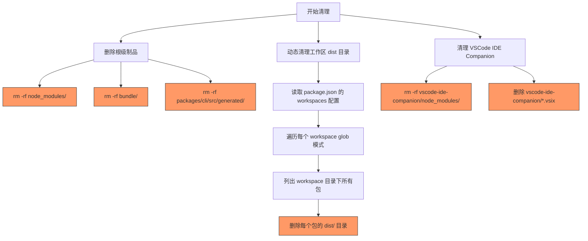
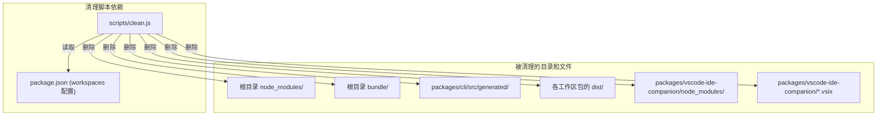

# clean.js

## 概述

该脚本是项目的**清理工具**，负责删除所有构建产物和安装缓存，将项目恢复到"干净"状态。它执行以下清理操作：

1. 删除根目录的 `node_modules` 目录
2. 删除根目录的 `bundle` 目录
3. 删除 CLI 包的自动生成代码目录
4. 动态遍历所有工作区包，删除每个包的 `dist` 目录
5. 清理 VSCode IDE Companion 包的 `node_modules` 和 `.vsix` 文件

该脚本是典型的 monorepo "clean" 命令实现，通常在需要全量重新安装和重新构建时使用。

## 架构图





## 核心组件

### 常量

| 常量名 | 类型 | 描述 |
|--------|------|------|
| `__dirname` | `string` | 当前脚本所在目录的绝对路径（`scripts/`）。通过 ESM 兼容方式获取。 |
| `root` | `string` | 项目 monorepo 根目录的绝对路径。 |
| `RMRF_OPTIONS` | `object` | `rmSync` 的通用选项对象：`{ recursive: true, force: true }`，等效于 `rm -rf`。 |
| `rootPackageJson` | `object` | 根目录 `package.json` 的解析结果，用于获取 `workspaces` 配置。 |
| `vscodeCompanionDir` | `string` | VSCode IDE Companion 包的绝对路径。 |

### 执行逻辑（脚本级，无函数封装）

该脚本采用顺序执行的脚本式编写，不包含独立函数定义。按执行顺序分为以下三个阶段：

#### 阶段一：删除根级制品

```javascript
rmSync(join(root, 'node_modules'), { recursive: true, force: true });
rmSync(join(root, 'bundle'), { recursive: true, force: true });
rmSync(join(root, 'packages/cli/src/generated/'), { recursive: true, force: true });
rmSync(join(root, 'bundle'), RMRF_OPTIONS); // 注意：bundle 被删除了两次
```

删除以下内容：
- **`node_modules/`**: npm 安装的所有依赖包
- **`bundle/`**: 项目打包输出（被删除两次，疑似代码冗余）
- **`packages/cli/src/generated/`**: CLI 包的自动生成代码（如 protobuf 或 GraphQL codegen 产物）

#### 阶段二：动态清理工作区 dist 目录

```javascript
const rootPackageJson = JSON.parse(readFileSync(join(root, 'package.json'), 'utf-8'));
for (const workspace of rootPackageJson.workspaces) {
  const workspaceDir = join(root, dirname(workspace));
  const packageDirs = readdirSync(workspaceDir);
  for (const pkg of packageDirs) {
    // 删除每个包的 dist/ 目录
  }
}
```

通过读取 `package.json` 的 `workspaces` 字段（如 `["packages/*"]`），动态发现所有工作区包，并删除每个包的 `dist/` 目录。

#### 阶段三：清理 VSCode IDE Companion

删除 VSCode Companion 包的 `node_modules` 目录，以及所有 `.vsix` 扩展包文件。

## 依赖关系

### 内部依赖

| 依赖 | 说明 |
|------|------|
| `package.json` | 根目录的包配置文件，脚本从中读取 `workspaces` 字段以动态发现所有工作区包。 |
| `packages/cli/src/generated/` | CLI 包的自动生成代码目录，作为清理目标。 |
| `packages/vscode-ide-companion/` | VSCode IDE Companion 包目录，作为清理目标。 |

### 外部依赖

| 模块 | 来源 | 说明 |
|------|------|------|
| `node:fs` | Node.js 内置模块 | 提供 `rmSync`（删除文件/目录）、`readFileSync`（读取文件）、`readdirSync`（读取目录列表）、`statSync`（获取文件/目录状态）。 |
| `node:path` | Node.js 内置模块 | 提供 `dirname`、`join` 用于路径操作。 |
| `node:url` | Node.js 内置模块 | 提供 `fileURLToPath` 用于 ESM `__dirname` 兼容。 |

## 关键实现细节

1. **`force: true` 选项**: 所有 `rmSync` 调用都使用了 `force: true`，这意味着如果目标文件/目录不存在，不会抛出错误（类似 `rm -f`）。这使脚本具有幂等性，可以多次运行而不会失败。

2. **动态工作区发现**: 脚本不硬编码工作区列表，而是从 `package.json` 的 `workspaces` 字段动态读取。这种方式在添加新工作区包时不需要修改清理脚本。但注意，代码中的注释明确指出这是一个简化的 glob 实现，仅支持 `"packages/*"` 这种简单模式（通过 `dirname(workspace)` 获取父目录）。

3. **`bundle` 目录重复删除**: 在代码中，`bundle` 目录被删除了两次：
   - 第 29 行：`rmSync(join(root, 'bundle'), { recursive: true, force: true })`
   - 第 35 行：`rmSync(join(root, 'bundle'), RMRF_OPTIONS)`

   这可能是代码重构过程中遗留的冗余。由于 `force: true` 的存在，第二次删除不会导致错误，但在逻辑上是不必要的。

4. **错误处理策略**:
   - 对于工作区目录遍历和 VSCode Companion 清理，使用 `try-catch` 捕获 `ENOENT` 错误（目录不存在），并静默忽略。
   - 对于非 `ENOENT` 的错误（如权限问题），会重新抛出，使脚本以错误状态退出。

5. **`.vsix` 文件清理**: 脚本专门扫描 VSCode IDE Companion 目录下的 `.vsix` 文件并逐一删除。这些文件是 VSCode 扩展的打包产物，可能有多个版本的 `.vsix` 文件需要清理。

6. **脚本式编写风格**: 与项目中其他脚本不同，此文件没有使用 `main()` 函数封装逻辑，而是直接在模块级别执行所有操作。这种风格在简单的"运行一次"脚本中很常见。

7. **VSCode Companion 的独立 node_modules**: `packages/vscode-ide-companion` 有自己独立的 `node_modules` 目录，与根目录的 `node_modules` 分开清理。这暗示该包可能不完全参与 npm workspace 的依赖提升（hoisting）机制，可能有独立的依赖安装流程。

8. **许可证**: Apache License 2.0，版权归属 Google LLC (2025)。
