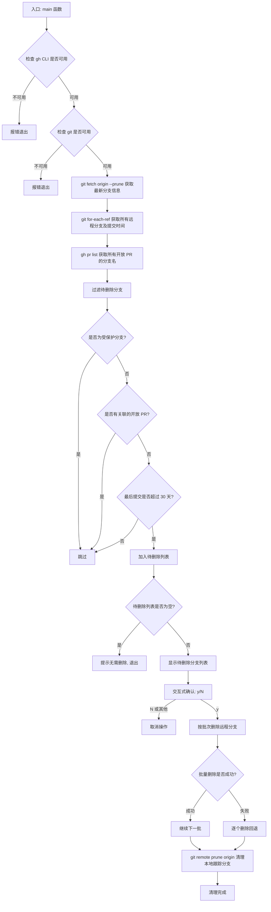

# cleanup-branches.ts

## 概述

`cleanup-branches.ts` 是一个 Git 远程分支自动清理脚本，用于批量删除满足以下条件的远程分支：
- 不是受保护分支（如 `main`、`master`、`release-*`、`hotfix-*` 等）
- 没有关联的 GitHub 开放 PR（Pull Request）
- 最后一次提交距今已超过 30 天

脚本通过交互式确认来防止误删，并支持批量删除和单个回退删除的容错策略。主要面向仓库维护者，用于定期清理过时的远程分支，保持仓库整洁。

## 架构图



## 核心组件

### 函数: `runCmd(cmd: string): string`

**职责**: 同步执行 shell 命令并返回去除首尾空白的标准输出结果。

**签名**:
```typescript
function runCmd(cmd: string): string
```

**实现细节**:
- 使用 `execSync` 同步执行命令
- 编码设为 `utf-8`
- stdio 配置为 `['pipe', 'pipe', 'ignore']`，即捕获 stdin/stdout，忽略 stderr
- 返回值经过 `.trim()` 去除首尾空白

### 函数: `main(): Promise<void>`

**职责**: 脚本主逻辑，负责完整的分支清理流程。

**签名**:
```typescript
async function main(): Promise<void>
```

**主要流程**:

1. **环境检查**: 验证 `gh` CLI 和 `git` 命令是否可用
2. **获取远程分支**: 执行 `git fetch origin --prune` 并通过 `git for-each-ref` 获取所有远程分支名称及最后提交的 Unix 时间戳
3. **获取开放 PR**: 通过 `gh pr list --state open --limit 5000 --json headRefName` 获取所有关联开放 PR 的分支名
4. **过滤逻辑**: 排除受保护分支、有开放 PR 的分支、最近 30 天内有提交的分支
5. **交互确认**: 使用 `readline` 接口向用户展示待删除列表并请求确认
6. **批量删除**: 以 50 个分支为一批执行 `git push origin --delete`，失败时回退为逐个删除
7. **本地清理**: 执行 `git remote prune origin` 清理本地过时的跟踪引用

### 常量

| 名称 | 值 | 说明 |
|------|-----|------|
| `THIRTY_DAYS_IN_SECONDS` | `30 * 24 * 60 * 60` (2,592,000) | 30 天的秒数，用于判断分支是否过期 |
| `batchSize` | `50` | 批量删除分支时的批次大小 |

### 受保护分支正则表达式

```typescript
const protectedPattern =
  /^(main|master|next|release[-/].*|hotfix[-/].*|v\d+.*|HEAD|gh-readonly-queue.*)$/;
```

匹配以下分支模式:
- `main` / `master` — 主分支
- `next` — 下一版本分支
- `release-*` / `release/*` — 发布分支
- `hotfix-*` / `hotfix/*` — 热修复分支
- `v<数字>*` — 版本标签分支
- `HEAD` — HEAD 引用
- `gh-readonly-queue*` — GitHub 合并队列分支

## 依赖关系

### 内部依赖

无内部模块依赖。此脚本为独立的工具脚本。

### 外部依赖

| 依赖 | 类型 | 说明 |
|------|------|------|
| `node:child_process` | Node.js 内置模块 | 提供 `execSync` 用于同步执行 shell 命令 |
| `node:readline/promises` | Node.js 内置模块 | 提供异步 readline 接口，用于交互式用户输入 |
| `node:process` | Node.js 内置模块 | 提供进程控制（`stdin`/`stdout`/`exit`） |
| `gh` CLI | 外部命令行工具 | GitHub CLI，用于查询开放的 Pull Request |
| `git` | 外部命令行工具 | Git 版本控制工具，用于获取分支信息和执行删除 |

## 关键实现细节

1. **批量删除与回退策略**: 分支删除采用两层容错机制。首先尝试将最多 50 个分支名拼接为一条 `git push origin --delete` 命令批量删除，以提高效率。若批量命令失败（可能因某个分支已不存在或权限问题），则自动回退为逐个删除模式，并且对 `remote ref does not exist` 错误进行了静默处理（分支已被别人删除的情况）。

2. **时间过滤精度**: 分支的最后提交时间通过 `git for-each-ref` 的 `%(committerdate:unix)` 格式获取，为 Unix 时间戳（秒），与 `Date.now() / 1000` 进行比较，精度为秒级。

3. **PR 查询上限**: `gh pr list` 的 `--limit` 设为 5000，适用于绝大多数项目规模。对于超大型仓库（开放 PR 超过 5000 个）可能存在遗漏风险。

4. **交互式确认**: 使用 `node:readline/promises` 模块创建异步读行接口，默认选项为 `N`（不删除），仅当用户明确输入 `y`（不区分大小写）时才执行删除操作。

5. **分支名称解析**: 使用 `git for-each-ref --format='%(refname:lstrip=3) %(committerdate:unix)'` 格式，`lstrip=3` 会去除 `refs/remotes/origin/` 前缀，直接得到分支名称。对于分支名中包含空格的情况，解析逻辑通过 `parts.pop()` 取最后一个部分作为日期、其余部分用空格拼接作为分支名来正确处理。

6. **本地跟踪分支清理**: 在远程分支删除完成后，执行 `git remote prune origin` 清理本地已过时的远程跟踪引用，保持本地仓库的一致性。
