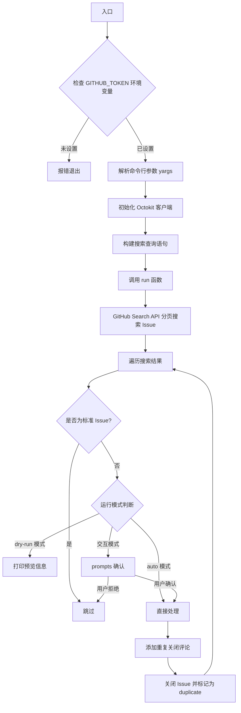
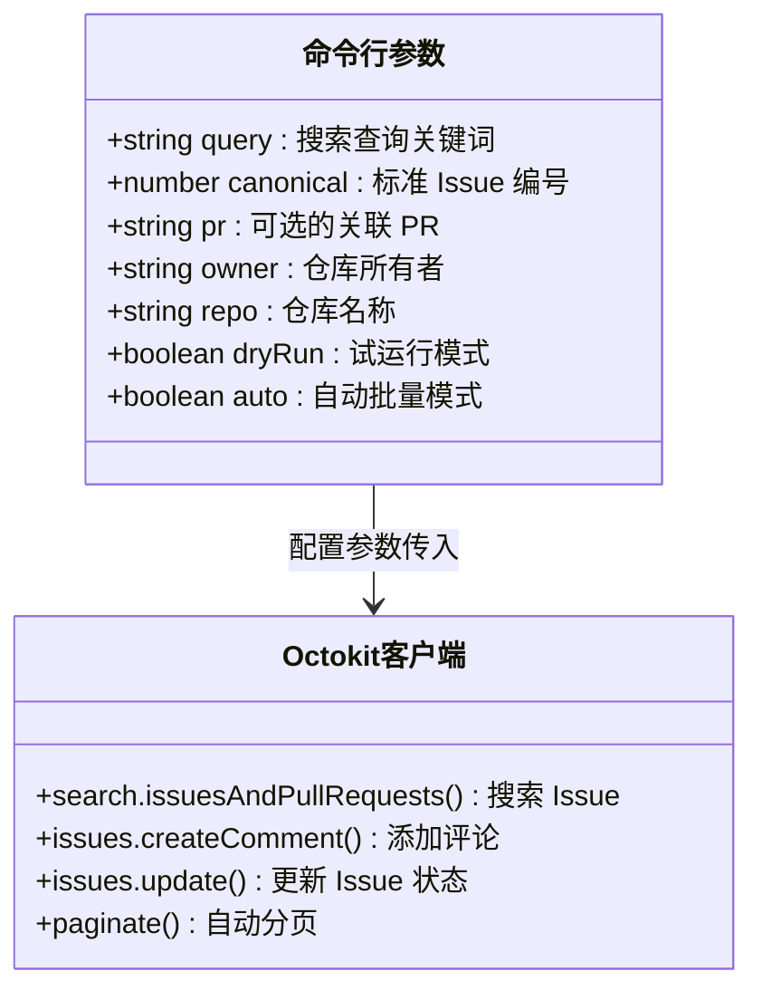

# close_duplicate_issues.js

## 概述

`close_duplicate_issues.js` 是一个 GitHub 重复 Issue 批量关闭工具。它通过 GitHub Search API 搜索匹配指定查询条件的开放 Issue，然后将它们标记为某个"标准 Issue"（canonical issue）的重复项并关闭。脚本支持 dry-run 模式（只读预览）、交互式逐个确认模式和全自动批量模式三种运行方式，为仓库维护者提供灵活的重复 Issue 清理能力。

## 架构图





## 核心组件

### 命令行参数定义

通过 `yargs` 定义以下命令行参数：

| 参数 | 别名 | 类型 | 必填 | 默认值 | 说明 |
|------|------|------|------|--------|------|
| `--query` | `-q` | `string` | 是 | - | 搜索重复 Issue 的查询关键词 |
| `--canonical` | `-c` | `number` | 是 | - | 标准 Issue 编号（其他 Issue 都将指向此 Issue） |
| `--pr` | - | `string` | 否 | - | 可选的关联 PR URL 或 ID，会在评论中提及 |
| `--owner` | - | `string` | 否 | `google-gemini` | 仓库所有者 |
| `--repo` | - | `string` | 否 | `gemini-cli` | 仓库名称 |
| `--dry-run` | `-d` | `boolean` | 否 | `false` | 试运行模式，仅打印操作不执行 |
| `--auto` | - | `boolean` | 否 | `false` | 自动批量模式，跳过逐个确认 |

### 函数: `run(): Promise<void>`

**职责**: 脚本主逻辑，执行搜索、过滤和关闭重复 Issue 的完整流程。

**签名**:
```javascript
async function run(): Promise<void>
```

**流程细节**:

1. **搜索 Issue**: 使用 `octokit.paginate` 自动分页调用 GitHub Search API，搜索查询格式为 `repo:{owner}/{repo} is:issue is:open {query}`
2. **遍历结果**: 对每个搜索结果进行处理
3. **跳过标准 Issue**: 如果 Issue 编号等于 `canonical`，则跳过
4. **确认逻辑**:
   - `dry-run` 模式：仅打印将执行的操作
   - `auto` 模式：直接执行，不询问
   - 默认模式：使用 `prompts` 库逐个询问确认
5. **关闭操作**: 先添加评论说明重复关系，再将 Issue 状态更新为 `closed`，关闭原因标记为 `duplicate`

### 评论模板

```
Closing this issue as a duplicate of #<canonical>.
```

若提供了 `--pr` 参数，则追加：

```
Please note that this issue should be resolved by PR <pr>.
```

## 依赖关系

### 内部依赖

无内部模块依赖。此脚本为独立的工具脚本。

### 外部依赖

| 依赖 | 类型 | 说明 |
|------|------|------|
| `@octokit/rest` | npm 第三方包 | GitHub REST API 官方 JavaScript 客户端，提供类型安全的 API 调用和自动分页能力 |
| `yargs` | npm 第三方包 | 命令行参数解析库，支持选项定义、别名、类型校验和帮助信息生成 |
| `yargs/helpers` | npm 第三方包 | yargs 辅助工具，提供 `hideBin` 函数用于处理 `process.argv` |
| `prompts` | npm 第三方包 | 轻量级交互式命令行提示库，用于逐个确认是否关闭 Issue |
| `GITHUB_TOKEN` | 环境变量 | GitHub Personal Access Token，用于 Octokit 认证，需具有 Issue 读写权限 |

## 关键实现细节

1. **搜索查询构建**: 查询语句通过拼接 `repo:{owner}/{repo} is:issue is:open` 前缀和用户提供的关键词构建，确保只搜索目标仓库的开放 Issue。这种方式利用了 GitHub Search API 的搜索限定符语法。

2. **自动分页**: 使用 `octokit.paginate()` 方法自动处理 GitHub API 的分页响应，无需手动管理 `page` 和 `per_page` 参数，确保获取所有匹配的搜索结果。

3. **三种运行模式**:
   - **交互模式**（默认）: 对每个 Issue 使用 `prompts` 库弹出 confirm 提示，默认值为 `true`（确认关闭），用户可逐个审核
   - **dry-run 模式**: 完全只读，不调用任何写入 API，仅打印将要执行的操作
   - **auto 模式**: 跳过所有确认提示，自动关闭所有匹配的非标准 Issue

4. **关闭原因标记**: 使用 GitHub Issues API 的 `state_reason: 'duplicate'` 参数，使关闭的 Issue 在 GitHub UI 上正确显示为"重复"标签，而非普通关闭。

5. **错误处理粒度**: 对单个 Issue 的处理失败采用 try-catch 捕获并打印错误信息，不影响后续 Issue 的处理；而搜索阶段的错误则导致整个脚本退出。

6. **标准 Issue 保护**: 搜索结果中可能包含标准 Issue 本身（因为它也匹配搜索关键词），脚本通过 `issue.number === canonical` 检查确保不会关闭标准 Issue。
