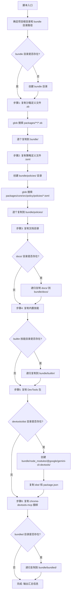
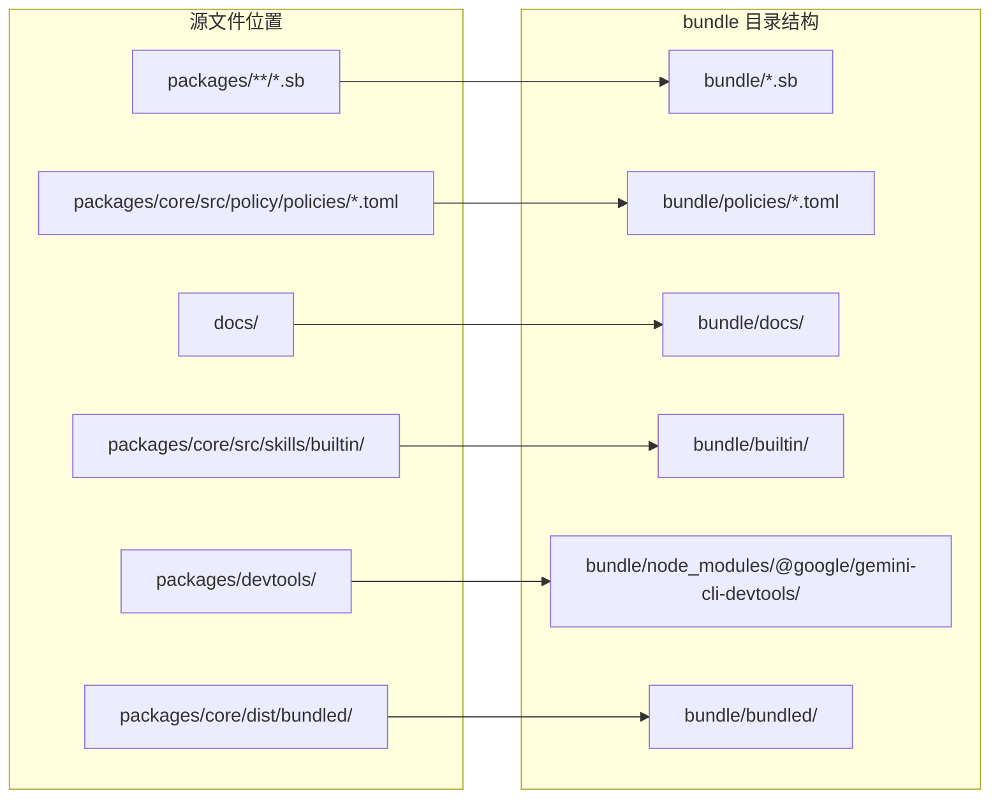

# copy_bundle_assets.js

## 概述

`copy_bundle_assets.js` 是一个构建辅助脚本，负责将项目中分散在各个包（packages）中的非 JavaScript 资源文件收集并复制到统一的 `bundle/` 目录中。这些资源包括沙箱定义文件（`.sb`）、策略配置文件（`.toml`）、文档目录、内置技能定义、DevTools 包以及 Chrome DevTools MCP 捆绑文件。该脚本是打包发布流程的一部分，确保最终发布产物包含所有运行时所需的非代码资源。

## 架构图





## 核心组件

### 路径常量

| 常量 | 值 | 说明 |
|------|-----|------|
| `__dirname` | 脚本文件所在目录 | 通过 `import.meta.url` + `fileURLToPath` 获取 ESM 模块的目录路径 |
| `root` | `__dirname/..` | 项目根目录（脚本位于 `scripts/` 下，上级即为根） |
| `bundleDir` | `root/bundle` | 资源输出目标目录 |

### 步骤 1: 复制沙箱定义文件（`.sb`）

```javascript
const sbFiles = glob.sync('packages/**/*.sb', { cwd: root });
```

- **源路径**: `packages/**/*.sb`（所有子包中的沙箱定义文件）
- **目标路径**: `bundle/<文件名>.sb`（扁平化复制，仅保留文件名）
- **操作**: 使用 `copyFileSync` 逐个复制

### 步骤 2: 复制策略定义文件（`.toml`）

```javascript
const policyFiles = glob.sync('packages/core/src/policy/policies/*.toml', { cwd: root });
```

- **源路径**: `packages/core/src/policy/policies/*.toml`（核心包中的策略文件）
- **目标路径**: `bundle/policies/<文件名>.toml`
- **操作**: 创建 `bundle/policies/` 目录后逐个复制

### 步骤 3: 复制文档目录

- **源路径**: `docs/`（项目根目录下的文档）
- **目标路径**: `bundle/docs/`
- **操作**: 使用 `cpSync` 递归复制，开启 `dereference: true` 解引用符号链接
- **条件**: 仅在源目录存在时执行

### 步骤 4: 复制内置技能

- **源路径**: `packages/core/src/skills/builtin/`
- **目标路径**: `bundle/builtin/`
- **操作**: 使用 `cpSync` 递归复制
- **条件**: 仅在源目录存在时执行

### 步骤 5: 复制 DevTools 包

- **源路径**: `packages/devtools/dist/` 和 `packages/devtools/package.json`
- **目标路径**: `bundle/node_modules/@google/gemini-cli-devtools/dist/` 和 `bundle/node_modules/@google/gemini-cli-devtools/package.json`
- **操作**: 创建嵌套的 `node_modules` 目录结构，复制构建产物和包描述文件
- **条件**: 仅在 `packages/devtools/dist/` 存在时执行
- **目的**: 使外部动态 `import()` 在运行时能正确解析 DevTools 包

### 步骤 6: 复制 Chrome DevTools MCP 捆绑

- **源路径**: `packages/core/dist/bundled/`
- **目标路径**: `bundle/bundled/`
- **操作**: 使用 `cpSync` 递归复制
- **条件**: 仅在源目录存在时执行

## 依赖关系

### 内部依赖

无直接的模块导入依赖，但脚本强依赖以下项目目录结构：

| 路径 | 说明 |
|------|------|
| `packages/**/*.sb` | 各子包中的沙箱定义文件 |
| `packages/core/src/policy/policies/*.toml` | 核心包中的策略配置文件 |
| `docs/` | 项目文档目录 |
| `packages/core/src/skills/builtin/` | 内置技能定义目录 |
| `packages/devtools/` | DevTools 包 |
| `packages/core/dist/bundled/` | Chrome DevTools MCP 构建产物 |

### 外部依赖

| 依赖 | 类型 | 说明 |
|------|------|------|
| `node:fs` | Node.js 内置模块 | 提供 `copyFileSync`、`existsSync`、`mkdirSync`、`cpSync` 文件系统操作 |
| `node:path` | Node.js 内置模块 | 提供 `dirname`、`join`、`basename` 路径操作 |
| `node:url` | Node.js 内置模块 | 提供 `fileURLToPath` 用于将 ESM 的 `import.meta.url` 转为文件路径 |
| `glob` | npm 第三方包 | 提供 glob 模式文件匹配功能 |

## 关键实现细节

1. **ESM 模块的 `__dirname` 模拟**: 由于 ESM 模块中没有 `__dirname` 全局变量，脚本通过 `dirname(fileURLToPath(import.meta.url))` 手动计算当前脚本的目录路径，这是 ESM 中获取目录路径的标准做法。

2. **扁平化复制策略**: 沙箱文件（`.sb`）从 `packages/**/*.sb` 的多层嵌套结构复制到 `bundle/` 的扁平结构，仅保留 `basename`。这意味着如果不同子包中存在同名的 `.sb` 文件，后复制的将覆盖先复制的。

3. **符号链接解引用**: 所有使用 `cpSync` 的递归复制操作都设置了 `dereference: true`，这意味着符号链接会被解引用为实际文件内容进行复制，而不是保持为符号链接。这对于在 monorepo 中使用符号链接管理包间依赖的场景很重要。

4. **存在性检查的防御性编程**: 步骤 3-6 都有 `existsSync` 检查，确保源目录不存在时不会报错。这使脚本在部分构建（例如仅构建核心包而未构建 DevTools）时也能正常运行。

5. **DevTools 包的 node_modules 模拟**: DevTools 包被复制到 `bundle/node_modules/@google/gemini-cli-devtools/` 路径下，模拟了 npm 包的标准目录结构。这样做是为了使运行时的动态 `import('@google/gemini-cli-devtools')` 能够通过 Node.js 的模块解析算法正确找到该包。

6. **同步操作**: 所有文件操作都使用同步版本（`copyFileSync`、`mkdirSync`、`cpSync`），因为这是一个构建时脚本，不需要异步并发带来的性能优势，同步操作使代码逻辑更简洁直观。
