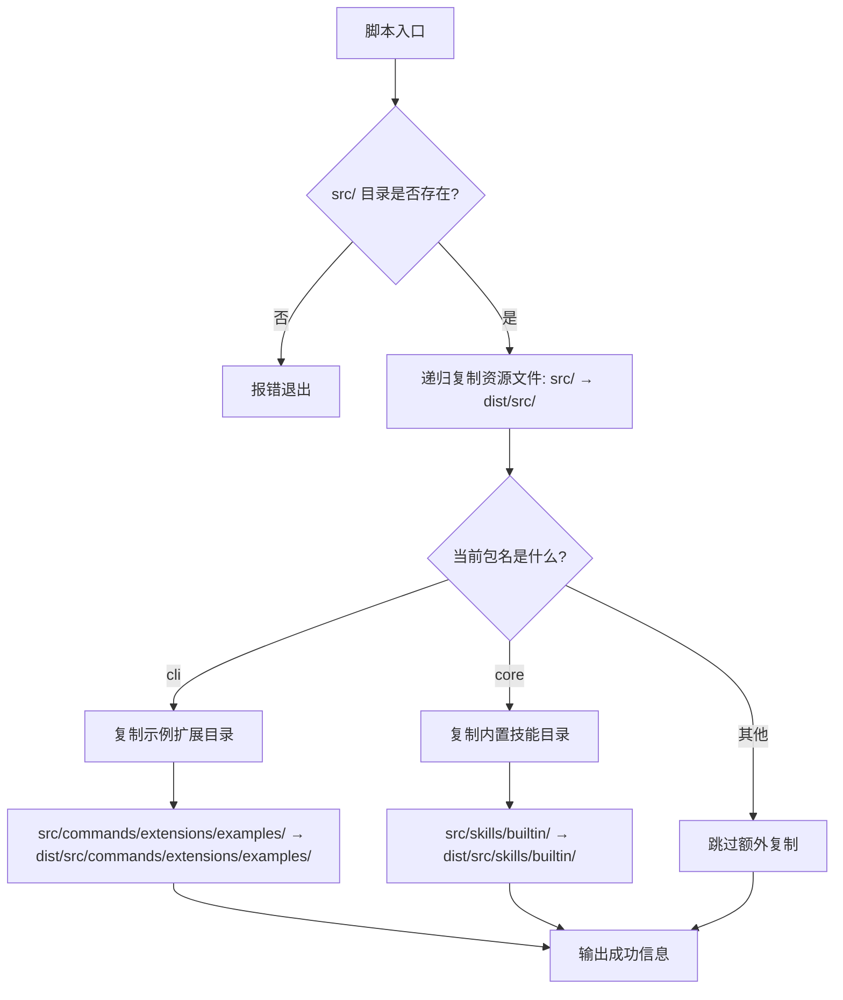
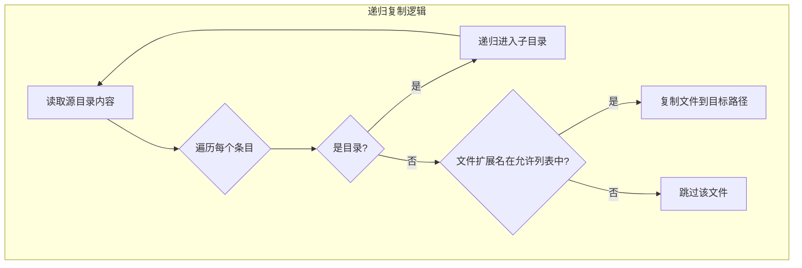

# copy_files.js

## 概述

`copy_files.js` 是一个构建后处理脚本（具有 `#!/usr/bin/env node` shebang，可直接执行），负责将 `src/` 目录中的非 TypeScript/JavaScript 资源文件（如 `.md`、`.json`、`.sb`、`.toml`、`.cs`、`.exe`）递归复制到 `dist/src/` 目录中。这是因为 TypeScript 编译器（tsc）只处理 `.ts`/`.js` 文件，不会自动复制其他类型的资源文件，而这些文件在运行时可能被需要。

此外，脚本会根据当前包名（`cli` 或 `core`）执行额外的包特定复制操作：为 CLI 包复制示例扩展，为 Core 包复制内置技能。

## 架构图






## 核心组件

### 常量

| 常量 | 值 | 说明 |
|------|-----|------|
| `sourceDir` | `src` | 源文件目录（相对路径，相对于当前工作目录） |
| `targetDir` | `dist/src` | 目标目录（TypeScript 编译输出下的对应位置） |
| `extensionsToCopy` | `['.md', '.json', '.sb', '.toml', '.cs', '.exe']` | 需要复制的文件扩展名白名单 |

### 函数: `copyFilesRecursive(source, target)`

**职责**: 递归遍历源目录，将匹配扩展名白名单的文件复制到目标目录，保持目录结构不变。

**签名**:
```javascript
function copyFilesRecursive(source: string, target: string): void
```

**参数**:
| 参数 | 类型 | 说明 |
|------|------|------|
| `source` | `string` | 源目录路径 |
| `target` | `string` | 目标目录路径 |

**逻辑**:
1. 检查目标目录是否存在，不存在则递归创建
2. 使用 `readdirSync` 读取源目录内容（`withFileTypes: true` 获取文件类型信息）
3. 遍历每个条目:
   - 如果是目录，递归调用自身
   - 如果是文件且扩展名在 `extensionsToCopy` 白名单中，使用 `copyFileSync` 复制

### 主流程

1. **源目录验证**: 检查 `src/` 是否存在，不存在则报错退出
2. **通用资源复制**: 调用 `copyFilesRecursive(sourceDir, targetDir)` 复制所有匹配的资源文件
3. **包特定复制**:
   - **CLI 包** (`packageName === 'cli'`): 复制 `src/commands/extensions/examples/` 目录下的所有文件到对应的 `dist/` 位置
   - **Core 包** (`packageName === 'core'`): 复制 `src/skills/builtin/` 目录下的所有文件到对应的 `dist/` 位置

### 包名检测逻辑

```javascript
const packageName = path.basename(process.cwd());
```

通过 `process.cwd()` 获取当前工作目录，然后取最后一级目录名作为包名。例如：
- 在 `packages/cli/` 下运行 → `packageName = 'cli'`
- 在 `packages/core/` 下运行 → `packageName = 'core'`

## 依赖关系

### 内部依赖

无直接的模块导入依赖，但脚本依赖以下项目目录结构：

| 路径 | 包 | 说明 |
|------|-----|------|
| `src/` | 通用 | 所有包的 TypeScript 源文件目录 |
| `src/commands/extensions/examples/` | cli | CLI 包的示例扩展目录 |
| `src/skills/builtin/` | core | 核心包的内置技能目录 |

### 外部依赖

| 依赖 | 类型 | 说明 |
|------|------|------|
| `node:fs` | Node.js 内置模块 | 提供 `existsSync`、`mkdirSync`、`readdirSync`、`copyFileSync`、`cpSync` 文件系统操作 |
| `node:path` | Node.js 内置模块 | 提供 `join`、`extname`、`basename` 路径操作 |

## 关键实现细节

1. **相对路径设计**: 与 `copy_bundle_assets.js` 不同，此脚本使用相对路径（`src` 和 `dist/src`），意味着它必须在正确的包目录下运行（如 `packages/cli/` 或 `packages/core/`）。这是 monorepo 中每个包各自运行构建脚本的典型模式。

2. **扩展名白名单机制**: 采用白名单策略（`extensionsToCopy`）而非黑名单，确保只有明确列出的文件类型会被复制。这些类型包含:
   - `.md` — Markdown 文档（如技能描述、README）
   - `.json` — JSON 配置文件
   - `.sb` — 沙箱定义文件（macOS App Sandbox 配置）
   - `.toml` — TOML 策略配置文件
   - `.cs` — C# 源文件（可能用于 Windows 集成）
   - `.exe` — Windows 可执行文件

3. **保持目录结构**: `copyFilesRecursive` 函数在目标路径中精确重建了源目录的层级结构，确保运行时代码中使用相对路径引用这些资源文件时仍然有效。

4. **包特定逻辑的条件复制**: 示例扩展和内置技能目录使用 `cpSync` 进行整目录复制（包含所有文件类型），而不受 `extensionsToCopy` 白名单限制。这是因为这些目录中可能包含任意类型的文件（如技能模板、配置等），都需要完整保留。

5. **Shebang 行**: 文件头部包含 `#!/usr/bin/env node`，表明此脚本可以直接作为可执行文件运行（在 Unix 系统中赋予执行权限后），也可通过 `node scripts/copy_files.js` 运行。

6. **与 TypeScript 构建流程的配合**: 此脚本通常在 `tsc` 编译完成后运行。TypeScript 编译器将 `.ts` 文件编译为 `.js` 并输出到 `dist/` 目录，但不会处理非 TS 文件。此脚本填补了这一空白，将必要的资源文件复制到 `dist/` 中对应的位置。
