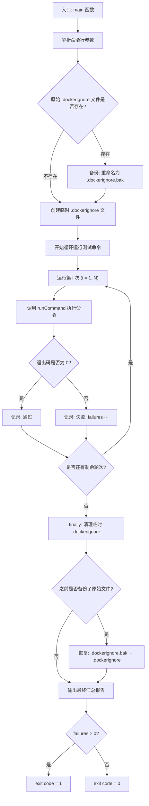
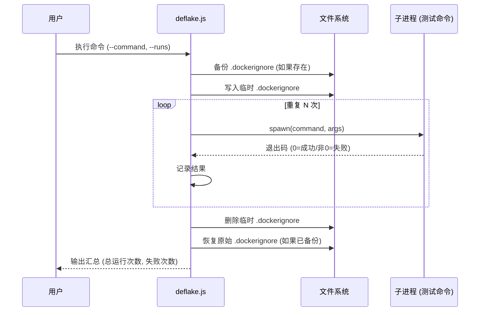

# deflake.js

## 概述

`deflake.js` 是一个测试去抖动（deflake）工具脚本，用于检测和验证测试的稳定性。它通过将指定的测试命令重复运行多次（默认 5 次），统计失败次数，从而帮助开发者识别不稳定的"片状测试"（flaky tests）。

脚本在运行前会临时创建一个特殊的 `.dockerignore` 文件（内容为 `.integration-tests`），以排除集成测试目录被 Docker 上下文包含，运行结束后恢复原始的 `.dockerignore`（如果存在）。

典型用法:
```bash
npm run deflake -- --command="npm run test:e2e -- --test-name-pattern 'extension'" --runs=3
```

## 架构图





## 核心组件

### 常量

| 常量 | 值 | 说明 |
|------|-----|------|
| `__dirname` | 脚本所在目录 | 通过 `import.meta.url` + `fileURLToPath` 获取 |
| `projectRoot` | `__dirname/..` | 项目根目录 |
| `dockerIgnorePath` | `projectRoot/.dockerignore` | `.dockerignore` 文件路径 |
| `DOCKERIGNORE_CONTENT` | `.integration-tests` | 临时 `.dockerignore` 文件内容，排除集成测试目录 |

### 命令行参数

通过 `yargs` 定义以下命令行参数:

| 参数 | 类型 | 必填 | 默认值 | 说明 |
|------|------|------|--------|------|
| `--command` | `string` | 是 | - | 要运行的测试命令 |
| `--runs` | `number` | 否 | `5` | 重复运行的次数 |
| `_` (位置参数) | `array` | 否 | `[]` | 传递给命令的额外参数 |

### 函数: `runCommand(cmd, args): Promise<number>`

**职责**: 运行一个 shell 命令并将其输出流式传输到控制台，返回进程退出码。

**签名**:
```javascript
function runCommand(cmd: string, args?: string[]): Promise<number>
```

**参数**:
| 参数 | 类型 | 默认值 | 说明 |
|------|------|--------|------|
| `cmd` | `string` | - | 要执行的命令字符串 |
| `args` | `string[]` | `[]` | 传递给命令的参数数组 |

**返回值**: `Promise<number>` — 进程退出码，0 表示成功，非 0 表示失败

**实现细节**:
- 使用 `spawn` 而非 `exec`，支持长时间运行的命令且不受缓冲区限制
- 设置 `shell: true` 允许使用 shell 语法（如管道、重定向）
- 设置 `stdio: 'inherit'` 将子进程的输入/输出/错误流直接继承到父进程
- 继承完整的 `process.env` 环境变量
- 如果命令为空/假值，直接返回退出码 1
- 如果子进程被杀死（`code` 为 `null`），返回退出码 1

### 函数: `main(): Promise<void>`

**职责**: 脚本主逻辑，管理整个 deflake 测试流程。

**签名**:
```javascript
async function main(): Promise<void>
```

**流程**:

1. **参数解析**: 使用 yargs 解析 `--command` 和 `--runs`
2. **Docker ignore 管理**:
   - 备份现有的 `.dockerignore`（重命名为 `.dockerignore.bak`）
   - 创建临时 `.dockerignore`，内容为 `.integration-tests`
3. **循环测试**: 执行 `--runs` 次指定命令，统计失败次数
4. **清理恢复**（finally 块，确保执行）:
   - 删除临时 `.dockerignore`
   - 如果之前备份了原始 `.dockerignore`，则恢复
5. **汇总输出**: 打印总运行次数和失败次数
6. **退出码**: 有失败则 `exit(1)`，全部通过则 `exit(0)`

## 依赖关系

### 内部依赖

无内部模块依赖。此脚本为独立的工具脚本。

### 外部依赖

| 依赖 | 类型 | 说明 |
|------|------|------|
| `node:child_process` | Node.js 内置模块 | 提供 `spawn` 用于异步创建子进程 |
| `node:fs/promises` | Node.js 内置模块 | 提供异步文件系统操作（`rename`、`writeFile`、`unlink`） |
| `node:path` | Node.js 内置模块 | 提供 `dirname`、`resolve`、`join` 路径操作 |
| `node:url` | Node.js 内置模块 | 提供 `fileURLToPath` 将 ESM 模块 URL 转为文件路径 |
| `yargs` | npm 第三方包 | 命令行参数解析库 |
| `yargs/helpers` | npm 第三方包 | yargs 辅助工具，提供 `hideBin` 函数 |

## 关键实现细节

1. **`.dockerignore` 临时替换与恢复**: 脚本在运行测试前临时创建一个只包含 `.integration-tests` 的 `.dockerignore` 文件。这是为了在 Docker 构建上下文中排除集成测试数据目录，避免不必要的文件被包含到 Docker 镜像中。原始 `.dockerignore` 通过重命名为 `.dockerignore.bak` 进行备份，在 `finally` 块中恢复，确保即使测试过程中出错也能正确恢复。

2. **`finally` 块的双重安全保障**: 清理逻辑放在 `finally` 块中，保证无论测试是成功、失败还是抛出异常，都能执行文件恢复操作。恢复操作本身也被 try-catch 包裹，避免恢复失败导致更严重的错误。

3. **`spawn` 替代 `exec` 的设计选择**: 使用 `spawn` 而非 `exec` 是因为:
   - `exec` 将所有输出缓冲在内存中，对于长时间运行的测试可能导致缓冲区溢出
   - `spawn` 通过 `stdio: 'inherit'` 将输出直接流式传输到终端，实时可见
   - `spawn` 更适合运行时间不确定的子进程

4. **退出码语义**: 脚本的退出码直接反映测试稳定性——退出码 0 意味着所有轮次全部通过（测试稳定），退出码 1 意味着至少有一次失败（测试不稳定），这可以方便地集成到 CI/CD 流水线中。

5. **位置参数透传**: `argv._` 中的位置参数会作为 `args` 传递给 `runCommand`，允许用户在 `--` 分隔符之后传递额外的命令参数，例如 `--command="npm test" -- --verbose` 中的 `--verbose` 会被透传到测试命令。

6. **ENOENT 错误的静默处理**: 在备份 `.dockerignore` 时，如果文件不存在（`ENOENT` 错误），脚本会静默忽略。但对于其他类型的文件系统错误（如权限问题），则会重新抛出。这种精确的错误处理保证了在没有 `.dockerignore` 文件的环境中也能正常运行。
