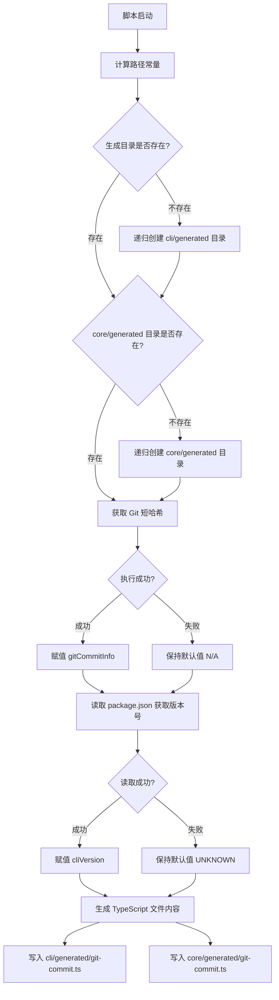
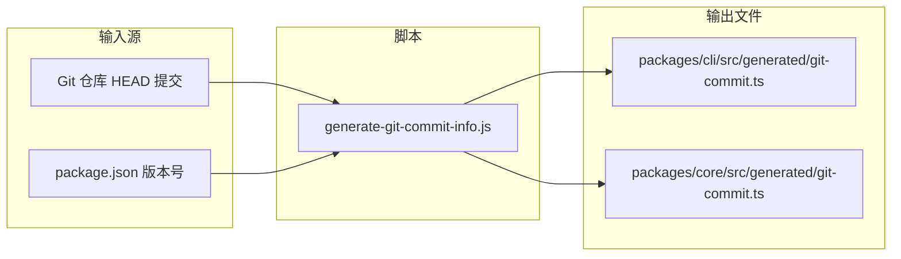

# generate-git-commit-info.js

## 概述

`scripts/generate-git-commit-info.js` 是一个构建时代码生成脚本，负责在构建阶段自动获取当前 Git 提交的短哈希值以及 CLI 包的版本号，并将这些信息写入到 `packages/cli/src/generated/git-commit.ts` 和 `packages/core/src/generated/git-commit.ts` 两个自动生成的 TypeScript 文件中。这些生成的文件会导出 `GIT_COMMIT_INFO` 和 `CLI_VERSION` 两个常量，供运行时代码引用，用于版本标识、日志记录和调试追踪等场景。

## 架构图

## 核心组件

### 路径常量

| 常量名 | 类型 | 描述 |
|--------|------|------|
| `__dirname` | `string` | 当前脚本所在目录的绝对路径（通过 `import.meta.url` 计算） |
| `root` | `string` | 项目根目录路径（脚本目录的上级目录） |
| `scriptPath` | `string` | 脚本相对于项目根目录的相对路径，用于写入生成文件的注释 |
| `generatedCliDir` | `string` | CLI 包生成文件目录：`packages/cli/src/generated` |
| `cliGitCommitFile` | `string` | CLI 包生成文件完整路径：`packages/cli/src/generated/git-commit.ts` |
| `generatedCoreDir` | `string` | Core 包生成文件目录：`packages/core/src/generated` |
| `coreGitCommitFile` | `string` | Core 包生成文件完整路径：`packages/core/src/generated/git-commit.ts` |

### 运行时变量

| 变量名 | 默认值 | 描述 |
|--------|--------|------|
| `gitCommitInfo` | `'N/A'` | Git 提交短哈希值，获取失败时保持默认值 |
| `cliVersion` | `'UNKNOWN'` | CLI 版本号，从最近的 `package.json` 读取，失败时保持默认值 |

### 生成文件导出的常量

| 导出常量 | 类型 | 描述 |
|----------|------|------|
| `GIT_COMMIT_INFO` | `string` | 当前 Git 提交的短哈希值（如 `'a1b2c3d'`），或 `'N/A'` |
| `CLI_VERSION` | `string` | CLI 的语义化版本号（如 `'0.35.2'`），或 `'UNKNOWN'` |

## 依赖关系

### 内部依赖

- **`packages/cli/src/generated/`** -- 该脚本向此目录写入 `git-commit.ts` 文件
- **`packages/core/src/generated/`** -- 该脚本向此目录写入 `git-commit.ts` 文件
- **项目根目录的 `package.json`** -- 通过 `readPackageUp()` 向上查找最近的 `package.json` 以获取版本号

### 外部依赖

| 依赖包 | 来源 | 用途 |
|--------|------|------|
| `node:child_process` | Node.js 内置 | `execSync` 同步执行 `git rev-parse --short HEAD` 命令 |
| `node:fs` | Node.js 内置 | `existsSync` 检查目录、`mkdirSync` 创建目录、`writeFileSync` 写入文件 |
| `node:path` | Node.js 内置 | `dirname`、`join`、`relative` 路径处理工具 |
| `node:url` | Node.js 内置 | `fileURLToPath` 将 `import.meta.url` 转为文件路径 |
| `read-package-up` | npm 第三方包 | 向上遍历目录树查找并读取最近的 `package.json` |

## 关键实现细节

1. **ESM 模块下的 `__dirname` 模拟**：由于该脚本使用 ES Module 格式（`import` 语法），Node.js 不提供 `__dirname` 全局变量。脚本通过 `dirname(fileURLToPath(import.meta.url))` 手动计算出等价值。

2. **目录安全创建**：在写入生成文件之前，脚本会检查 `generated` 目录是否存在，若不存在则使用 `mkdirSync({ recursive: true })` 递归创建，确保首次构建时不会因目录缺失而报错。

3. **优雅降级策略**：Git 信息和版本号的获取都被 `try-catch` 包裹。即使在非 Git 仓库环境（如从 tarball 解压的源码）或 `package.json` 缺失的场景下，脚本也不会崩溃，而是使用默认值 `'N/A'` 和 `'UNKNOWN'`。

4. **双份写入**：生成的文件内容完全相同，但分别写入 `cli` 和 `core` 两个包的 `generated` 目录。这使得两个包都可以独立引用版本信息，不需要跨包依赖。

5. **自动生成版权年份**：生成文件头部的版权声明使用 `new Date().getUTCFullYear()` 动态获取当前 UTC 年份，确保版权年份始终是最新的。

6. **脚本路径自引用**：生成文件的注释中包含 `scriptPath`（脚本相对路径），方便开发者追溯该文件由哪个脚本生成，明确标注"不要手动编辑"。

7. **顶层 await**：脚本使用顶层 `await` 调用 `readPackageUp()`，这要求 Node.js 以 ESM 模式执行该脚本（`.js` 扩展名配合 `"type": "module"` 或使用 `.mjs` 扩展名）。
