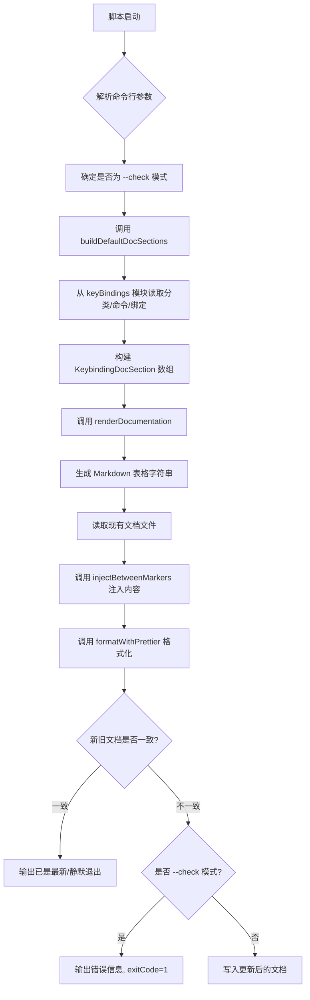
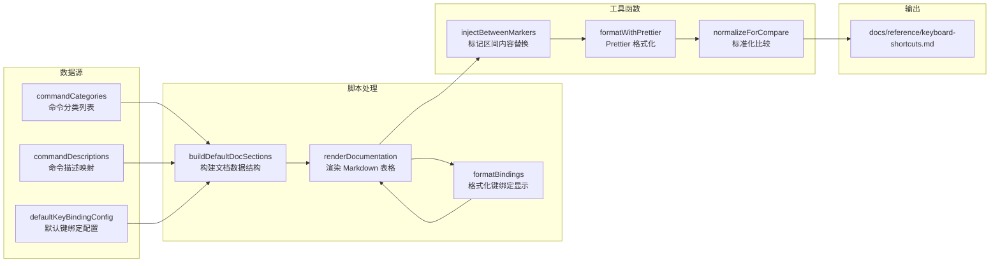

# generate-keybindings-doc.ts

## 概述

`scripts/generate-keybindings-doc.ts` 是一个文档自动生成脚本，负责从代码中定义的键盘快捷键配置（`defaultKeyBindingConfig`、`commandCategories`、`commandDescriptions`）中提取数据，生成 Markdown 格式的快捷键参考文档表格，并将生成的内容注入到 `docs/reference/keyboard-shortcuts.md` 文件中由特定标记（`<!-- KEYBINDINGS-AUTOGEN:START -->` 和 `<!-- KEYBINDINGS-AUTOGEN:END -->`）界定的区域内。

该脚本支持两种运行模式：
- **生成模式**（默认）：读取当前文档，注入最新生成的快捷键表格，用 Prettier 格式化后写回文件。
- **检查模式**（`--check` 参数）：仅对比现有文档与最新生成内容是否一致，不一致时输出错误信息并以非零退出码退出，适用于 CI 流水线。

## 架构图





## 核心组件

### 接口定义

#### `KeybindingDocCommand`

```typescript
export interface KeybindingDocCommand {
  command: string;        // 命令标识符
  description: string;    // 命令的人类可读描述
  bindings: readonly KeyBinding[];  // 该命令绑定的快捷键列表
}
```

表示一个具体命令的文档数据，包含命令名、描述和所有关联的键绑定。

#### `KeybindingDocSection`

```typescript
export interface KeybindingDocSection {
  title: string;                           // 分类标题
  commands: readonly KeybindingDocCommand[]; // 该分类下的所有命令
}
```

表示一个命令分类的文档段落，包含分类标题和该分类下所有命令列表。

### 导出函数

#### `main(argv?)`

```typescript
export async function main(argv = process.argv.slice(2)): Promise<void>
```

脚本主入口函数。执行完整的文档生成或检查流程：
1. 解析 `--check` 参数决定运行模式
2. 构建文档数据结构
3. 渲染 Markdown 内容
4. 读取现有文档文件
5. 使用标记注入新内容
6. 用 Prettier 格式化
7. 比较新旧文档是否一致
8. 根据模式决定写入文件或报告错误

#### `buildDefaultDocSections()`

```typescript
export function buildDefaultDocSections(): readonly KeybindingDocSection[]
```

从 `keyBindings.js` 模块读取 `commandCategories`，将每个分类映射为 `KeybindingDocSection` 结构。对于每个命令，从 `commandDescriptions` 获取描述，从 `defaultKeyBindingConfig` 获取默认键绑定。

#### `renderDocumentation(sections)`

```typescript
export function renderDocumentation(
  sections: readonly KeybindingDocSection[]
): string
```

将 `KeybindingDocSection` 数组渲染为 Markdown 字符串。每个分类生成一个四级标题（`####`）和一个三列表格（Command / Action / Keys）。多个键绑定在同一单元格中使用 `<br />` 分隔显示。

### 内部函数

#### `formatBindings(bindings)`

```typescript
function formatBindings(bindings: readonly KeyBinding[]): string[]
```

将键绑定数组格式化为显示用的字符串数组。使用 `formatKeyBinding` 工具函数将每个绑定转为人类可读的标签，并通过 `Set` 去重，每个标签包裹在反引号中。

### 常量

| 常量名 | 值 | 描述 |
|--------|-----|------|
| `START_MARKER` | `'<!-- KEYBINDINGS-AUTOGEN:START -->'` | 自动生成内容的起始标记 |
| `END_MARKER` | `'<!-- KEYBINDINGS-AUTOGEN:END -->'` | 自动生成内容的结束标记 |
| `OUTPUT_RELATIVE_PATH` | `['docs', 'reference', 'keyboard-shortcuts.md']` | 输出文档相对于项目根目录的路径段数组 |

## 依赖关系

### 内部依赖

| 模块路径 | 导入内容 | 用途 |
|----------|----------|------|
| `packages/cli/src/ui/key/keyBindings.js` | `KeyBinding` (类型)、`commandCategories`、`commandDescriptions`、`defaultKeyBindingConfig` | 提供快捷键配置的原始数据 |
| `packages/cli/src/ui/key/keybindingUtils.js` | `formatKeyBinding` | 将 `KeyBinding` 对象格式化为可读的快捷键标签字符串 |
| `scripts/utils/autogen.js` | `formatWithPrettier`、`injectBetweenMarkers`、`normalizeForCompare` | 文档生成的通用工具函数 |

### 外部依赖

| 依赖包 | 来源 | 用途 |
|--------|------|------|
| `node:path` | Node.js 内置 | 路径拼接和解析 |
| `node:url` | Node.js 内置 | `fileURLToPath` / `pathToFileURL` 转换 |
| `node:fs/promises` | Node.js 内置 | 异步文件读写（`readFile` / `writeFile`） |
| `prettier` | npm 第三方包（间接，通过 `autogen.ts`） | 格式化生成的 Markdown 文档 |

## 关键实现细节

1. **标记注入机制**：脚本不会替换整个文档文件，而是仅替换 `START_MARKER` 和 `END_MARKER` 之间的内容。这使得文档的其他手写部分（如介绍文本、配置说明等）不受影响，实现手写内容与自动生成内容的和平共存。

2. **幂等性设计**：如果当前文档内容已经是最新的（经过 `normalizeForCompare` 标准化比较后一致），脚本不会重新写入文件。这避免了不必要的文件修改时间戳变更和 Git 差异。

3. **CI 检查模式**：`--check` 参数使脚本仅验证文档是否最新，不执行任何写入操作。当文档过时时，设置 `process.exitCode = 1`（而非直接 `process.exit(1)`），这是更优雅的退出方式，允许 Node.js 完成异步清理。

4. **去重键绑定显示**：`formatBindings` 使用 `Set` 对格式化后的键标签去重，避免同一快捷键在文档中重复出现（可能因为同一快捷键有不同的内部表示方式）。

5. **自执行保护**：脚本底部通过比较 `process.argv[1]` 对应的 URL 与 `import.meta.url` 判断是否为直接执行（而非被其他模块 import）。只有直接执行时才调用 `main()`，这使得脚本的导出函数可以被测试代码单独引用。

6. **Prettier 格式化**：生成的文档在写入前会经过 Prettier 格式化，确保输出风格与项目的 Prettier 配置一致，避免格式不一致导致的 CI 检查失败。

7. **生成的表格结构**：每个命令分类渲染为一个独立的 Markdown 表格，表头为 `| Command | Action | Keys |`。命令名显示为代码格式（反引号包裹），多个快捷键在同一单元格中用 `<br />` HTML 标签换行显示。
