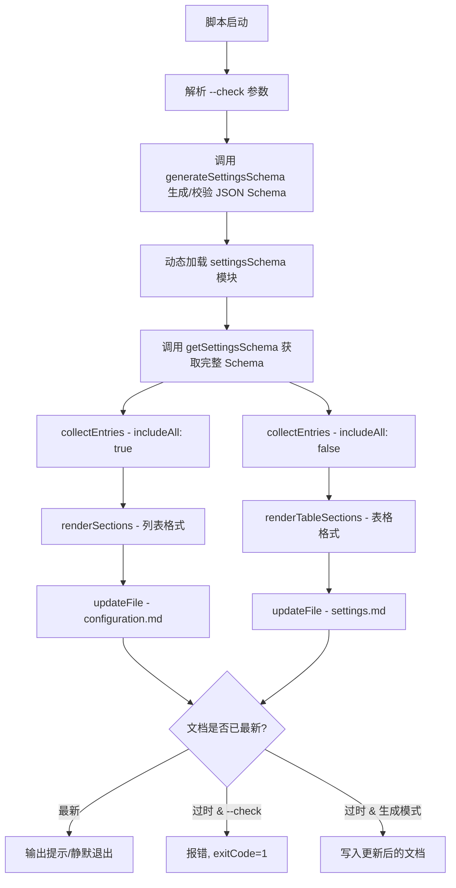
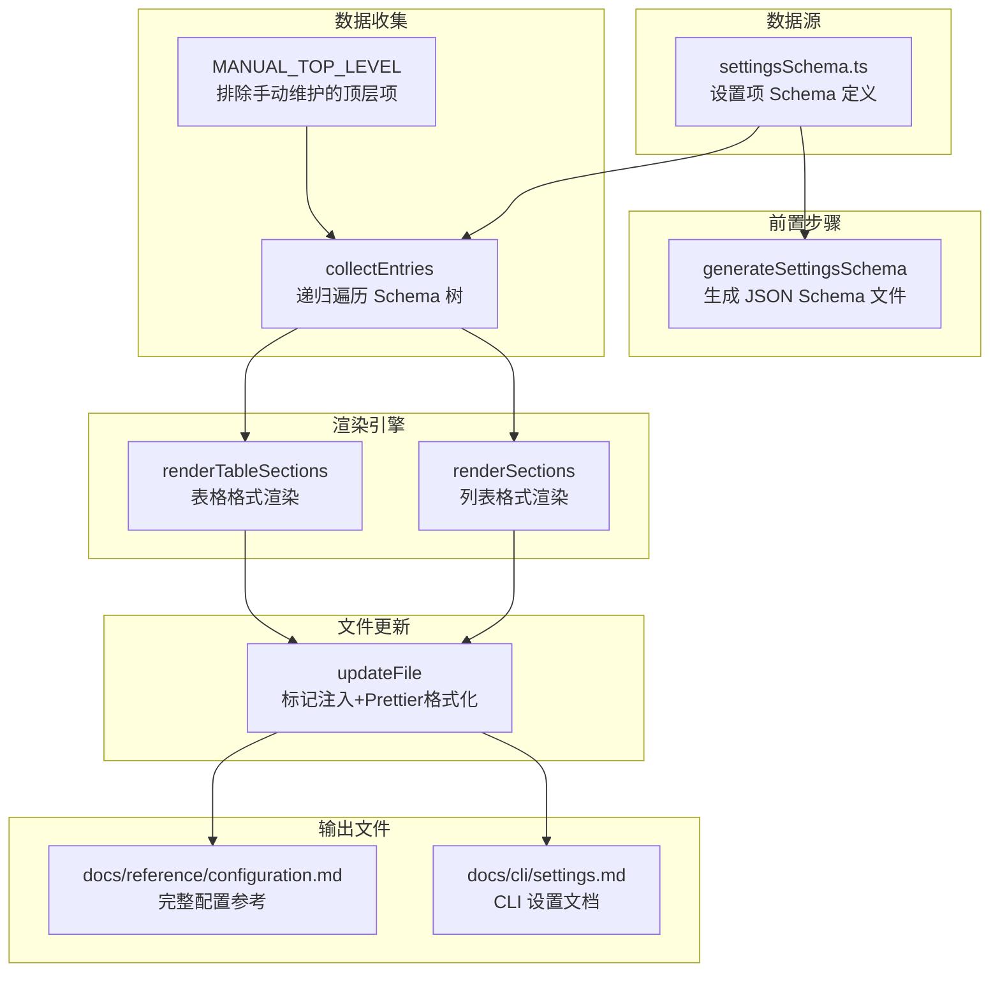

# generate-settings-doc.ts

## 概述

`scripts/generate-settings-doc.ts` 是设置项文档的自动生成脚本，负责从项目内部定义的设置 Schema（`settingsSchema.ts`）中提取所有配置项信息，生成两种不同格式的 Markdown 文档内容，并分别注入到两个目标文档文件中：

1. **`docs/reference/configuration.md`** -- 完整的配置参考文档，使用列表格式（bullet list），包含所有设置项（除手动维护的顶层项外）。
2. **`docs/cli/settings.md`** -- 精简的 CLI 设置文档，使用表格格式，仅包含标记为 `showInDialog` 的设置项。

脚本在生成文档之前，会先调用 `generateSettingsSchema` 确保 JSON Schema 文件也是最新的。与其他自动生成脚本类似，支持 `--check` 模式用于 CI 检查。

## 架构图





## 核心组件

### 接口定义

#### `DocEntry`

```typescript
interface DocEntry {
  path: string;              // 设置项的点分路径，如 "editor.fontSize"
  type: string;              // 设置项的类型描述，如 "string"、"boolean"、"string | string[]"
  label: string;             // 设置项的 UI 标签
  category: string;          // 设置项所属分类
  description: string;       // 设置项的描述文本
  defaultValue: string;      // 格式化后的默认值字符串
  requiresRestart: boolean;  // 是否需要重启才能生效
  enumValues?: string[];     // 可选的枚举值列表
}
```

表示一个设置项在文档中的结构化数据。

### 导出函数

#### `main(argv?)`

```typescript
export async function main(argv = process.argv.slice(2)): Promise<void>
```

脚本主入口。执行流程：
1. 解析 `--check` 参数
2. 调用 `generateSettingsSchema({ checkOnly })` 确保 JSON Schema 最新
3. 动态加载 `settingsSchema` 模块获取 Schema 数据
4. 分别以 `includeAll: true` 和 `includeAll: false` 收集设置项
5. 使用两种渲染器生成不同格式的 Markdown
6. 更新两个目标文档文件

### 内部函数

#### `updateFile(filePath, newContent, checkOnly)`

```typescript
async function updateFile(filePath: string, newContent: string, checkOnly: boolean): Promise<void>
```

通用的文件更新函数。读取现有文档 -> 标记注入 -> Prettier 格式化 -> 比较差异 -> 决定写入或报告。

#### `loadSettingsSchemaModule()`

```typescript
async function loadSettingsSchemaModule(): Promise<{ getSettingsSchema: () => SettingsSchemaType }>
```

动态导入 `settingsSchema.ts` 模块，返回包含 `getSettingsSchema` 函数的模块对象。使用动态 `import()` 而非静态导入，以便在 Schema 生成之后再加载最新版本。

#### `collectEntries(schema, options?)`

```typescript
function collectEntries(
  schema: SettingsSchemaType,
  options: { includeAll?: boolean }
): Map<string, DocEntry[]>
```

递归遍历 Settings Schema 树，收集叶子节点（无子属性的设置项）信息。返回以顶层分类名为键、`DocEntry` 数组为值的 `Map`。

关键行为：
- 跳过 `MANUAL_TOP_LEVEL` 集合中的顶层键（`mcpServers`、`telemetry`、`extensions`）
- 跳过标记了 `ignoreInDocs` 的设置项
- 当 `includeAll` 为 `false` 时，仅包含标记了 `showInDialog` 的设置项
- 对象类型的设置项会递归处理其 `properties`

#### `formatDescription(definition)`

```typescript
function formatDescription(definition: SettingDefinition): string
```

提取设置项的描述文本，去除首尾空白。若描述为空则返回 `'Description not provided.'`。

#### `formatType(definition)`

```typescript
function formatType(definition: SettingDefinition): string
```

格式化设置项的类型显示。针对特殊的 `ref` 值进行映射：
- `'StringOrStringArray'` -> `'string | string[]'`
- `'BooleanOrString'` -> `'boolean | string'`
- 其他情况直接返回 `definition.type`

#### `renderSections(sections)`

```typescript
function renderSections(sections: Map<string, DocEntry[]>): string
```

将设置项按分类渲染为 Markdown 列表格式。每个分类生成一个四级标题，每个设置项渲染为嵌套列表，包含：
- 设置项路径和类型
- Description 描述
- Default 默认值（多行值使用 JSON 代码块）
- Values 枚举值列表（如有）
- Requires restart 重启提示（如需要）

#### `renderTableSections(sections)`

```typescript
function renderTableSections(sections: Map<string, DocEntry[]>): string
```

将设置项按分类渲染为 Markdown 表格格式。每个分类生成一个三级标题和四列表格（UI Label / Setting / Description / Default）。标题有特殊大小写处理（`ui` -> `UI`，`ide` -> `IDE`）。

### 常量

| 常量名 | 值 | 描述 |
|--------|-----|------|
| `START_MARKER` | `'<!-- SETTINGS-AUTOGEN:START -->'` | 自动生成内容的起始标记 |
| `END_MARKER` | `'<!-- SETTINGS-AUTOGEN:END -->'` | 自动生成内容的结束标记 |
| `MANUAL_TOP_LEVEL` | `Set{'mcpServers', 'telemetry', 'extensions'}` | 手动维护文档的顶层配置项，脚本跳过不处理 |

## 依赖关系

### 内部依赖

| 模块路径 | 导入内容 | 用途 |
|----------|----------|------|
| `scripts/generate-settings-schema.js` | `generateSettingsSchema` | 在生成文档前先生成/校验 JSON Schema 文件 |
| `scripts/utils/autogen.js` | `escapeBackticks`、`formatDefaultValue`、`formatWithPrettier`、`injectBetweenMarkers`、`normalizeForCompare` | 文档生成的通用工具函数 |
| `packages/cli/src/config/settingsSchema.ts` | `SettingDefinition` (类型)、`SettingsSchema` (类型)、`SettingsSchemaType` (类型)、`getSettingsSchema` (运行时动态加载) | 设置项 Schema 的类型定义和数据源 |

### 外部依赖

| 依赖包 | 来源 | 用途 |
|--------|------|------|
| `node:path` | Node.js 内置 | 路径处理 |
| `node:url` | Node.js 内置 | URL 与文件路径转换 |
| `node:fs/promises` | Node.js 内置 | 异步文件读写 |
| `prettier` | npm 第三方包（间接，通过 `autogen.ts`） | 文档格式化 |

## 关键实现细节

1. **双文件输出策略**：脚本生成两种不同格式的文档内容，分别写入不同的目标文件。`configuration.md` 作为完整参考包含所有设置项，`settings.md` 作为用户友好的 CLI 指南仅包含可在对话框中展示的设置项。

2. **Schema 前置生成**：`main` 函数的第一步是调用 `generateSettingsSchema`，确保 JSON Schema 文件在文档生成之前已经是最新的。这保证了文档始终与 Schema 文件一致。

3. **手动维护项排除**：`MANUAL_TOP_LEVEL` 集合中的顶层配置项（`mcpServers`、`telemetry`、`extensions`）在自动遍历时被跳过。这些配置项结构复杂或有特殊文档需求，由人工手动编写文档。

4. **递归遍历与分类归属**：`collectEntries` 使用递归 `visit` 函数深度遍历 Schema 树。顶层键名作为分类标识（`sectionKey`），所有嵌套的子设置项都归入其顶层父级的分类下。

5. **类型引用展开**：`formatType` 函数将 Schema 中的 `ref` 引用（如 `StringOrStringArray`）展开为人类可读的 TypeScript 联合类型字符串，提升文档可读性。

6. **多行默认值处理**：`renderSections` 对含有换行的默认值（通常是 JSON 对象或数组）使用 JSON 代码块格式化，而单行值使用行内代码格式。

7. **标题大小写规范化**：`renderTableSections` 对分类标题进行特殊处理，将首字母大写，并对缩写词（`ui` -> `UI`、`ide` -> `IDE`）做专门的大写转换。

8. **动态模块加载**：`loadSettingsSchemaModule` 使用动态 `import()` 加载 Schema 模块，而非在文件顶部静态导入。这确保了在 `generateSettingsSchema` 执行完毕后，能加载到最新生成的模块内容。
