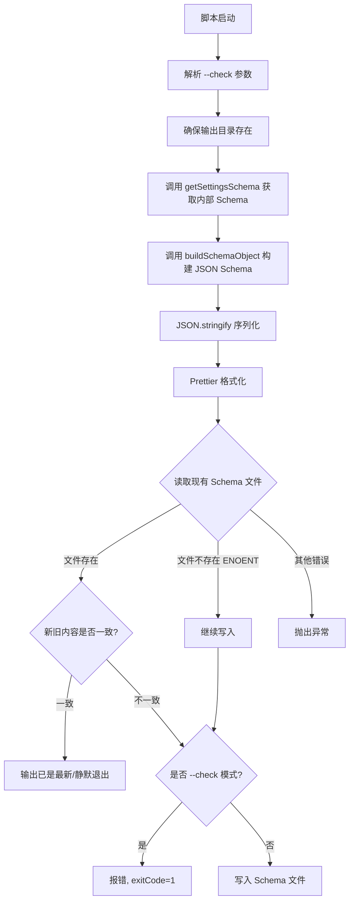
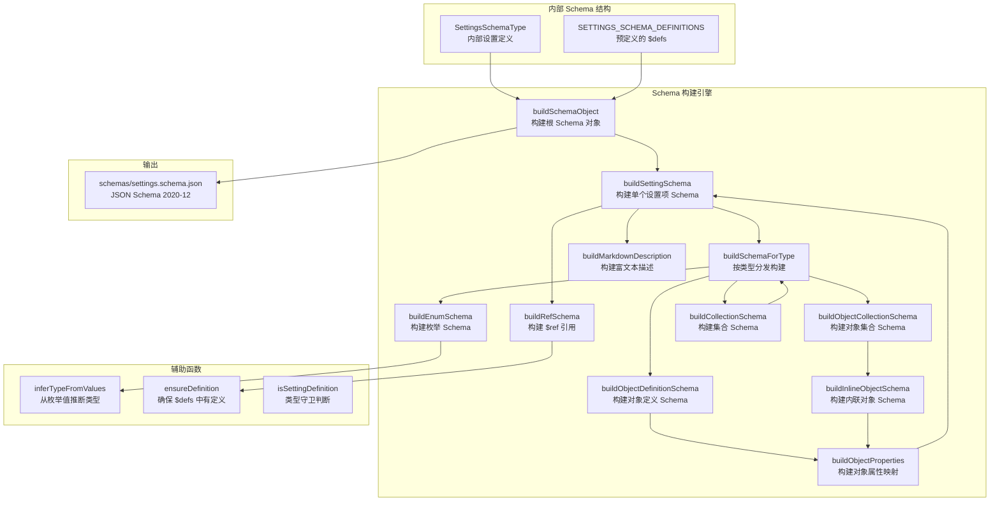
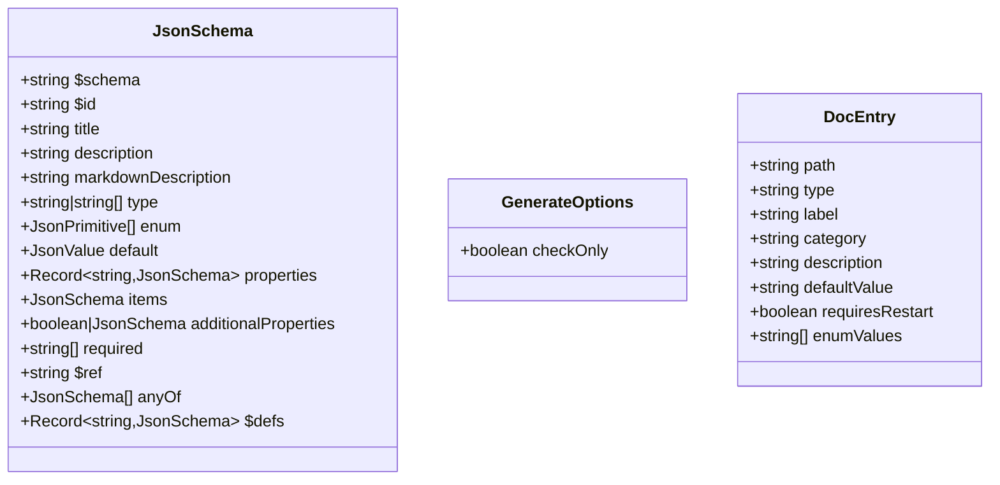

# generate-settings-schema.ts

## 概述

`scripts/generate-settings-schema.ts` 是一个 JSON Schema 自动生成脚本，负责从项目内部定义的设置 Schema（`settingsSchema.ts` 中的 `getSettingsSchema()` 函数返回的数据结构）转换为标准的 [JSON Schema Draft 2020-12](https://json-schema.org/draft/2020-12/schema) 格式文件，输出到 `schemas/settings.schema.json`。

该 JSON Schema 文件的主要用途是为 IDE（如 VS Code）提供 `settings.json` 配置文件的验证和自动补全支持。Schema 文件会发布到 GitHub 仓库，供用户通过 `$schema` 引用。

与其他自动生成脚本一样，支持 `--check` 模式用于 CI 校验。此脚本同时也被 `generate-settings-doc.ts` 作为前置步骤调用。

## 架构图







## 核心组件

### 类型定义

#### `JsonPrimitive`

```typescript
type JsonPrimitive = string | number | boolean | null;
```

JSON 基本类型的联合类型。

#### `JsonValue`

```typescript
type JsonValue = JsonPrimitive | JsonValue[] | { [key: string]: JsonValue };
```

递归定义的完整 JSON 值类型。

#### `JsonSchema`

```typescript
interface JsonSchema {
  $schema?: string;
  $id?: string;
  title?: string;
  description?: string;
  markdownDescription?: string;
  type?: string | string[];
  enum?: JsonPrimitive[];
  default?: JsonValue;
  properties?: Record<string, JsonSchema>;
  items?: JsonSchema;
  additionalProperties?: boolean | JsonSchema;
  required?: string[];
  $ref?: string;
  anyOf?: JsonSchema[];
  [key: string]: JsonValue | JsonSchema | JsonSchema[] | undefined;
}
```

JSON Schema 文档的 TypeScript 表示。包含 JSON Schema Draft 2020-12 标准的关键字以及 VS Code 扩展的 `markdownDescription` 字段。

#### `GenerateOptions`

```typescript
interface GenerateOptions {
  checkOnly: boolean;
}
```

控制生成行为的选项接口。

### 导出函数

#### `generateSettingsSchema(options)`

```typescript
export async function generateSettingsSchema(options: GenerateOptions): Promise<void>
```

核心导出函数，执行完整的 Schema 生成流程：
1. 计算项目根目录和输出路径
2. 确保输出目录存在（`mkdir -p`）
3. 从内部 Schema 构建 JSON Schema 对象
4. 序列化并用 Prettier 格式化
5. 与现有文件比较，决定是写入还是报告

该函数同时被 `generate-settings-doc.ts` 调用，作为文档生成的前置步骤。

#### `main(argv?)`

```typescript
export async function main(argv = process.argv.slice(2)): Promise<void>
```

脚本直接执行时的入口，解析 `--check` 参数后委托给 `generateSettingsSchema`。

### 内部函数

#### `buildSchemaObject(schema)`

```typescript
function buildSchemaObject(schema: SettingsSchemaType): JsonSchema
```

构建完整的 JSON Schema 根对象。流程：
1. 从 `SETTINGS_SCHEMA_DEFINITIONS` 初始化 `$defs` Map
2. 创建根 Schema，设置 `$schema`、`$id`、`title`、`description`、`type: 'object'`、`additionalProperties: false`
3. 添加 `$schema` 属性定义（允许用户在 settings.json 中指定 schema URL）
4. 遍历内部 Schema 的所有顶层键，递归构建每个设置项的 JSON Schema
5. 如果有 `$defs` 被引用，将其附加到根 Schema

#### `buildSettingSchema(definition, pathSegments, defs)`

```typescript
function buildSettingSchema(
  definition: SettingDefinition,
  pathSegments: string[],
  defs: Map<string, JsonSchema>
): JsonSchema
```

构建单个设置项的 JSON Schema。组合基础元数据（`title`、`description`、`markdownDescription`、`default`）与类型特定的 Schema 结构（通过 `buildRefSchema` 或 `buildSchemaForType`）。

#### `buildSchemaForType(source, pathSegments, defs)`

```typescript
function buildSchemaForType(
  source: SettingDefinition | SettingCollectionDefinition,
  pathSegments: string[],
  defs: Map<string, JsonSchema>
): JsonSchema
```

根据设置项的 `type` 字段分发构建：
- `boolean` / `string` / `number` -- 直接返回 `{ type: "..." }`
- `enum` -- 调用 `buildEnumSchema`
- `array` -- 构建数组 Schema，递归处理 `items`
- `object` -- 根据是 `SettingDefinition` 还是 `SettingCollectionDefinition` 分发到不同的构建函数

#### `buildEnumSchema(options)`

```typescript
function buildEnumSchema(options): JsonSchema
```

从选项列表提取枚举值，并通过 `inferTypeFromValues` 推断类型（全是字符串则 `type: "string"`，全是数字则 `type: "number"`）。

#### `buildObjectDefinitionSchema(definition, pathSegments, defs)`

```typescript
function buildObjectDefinitionSchema(
  definition: SettingDefinition,
  pathSegments: string[],
  defs: Map<string, JsonSchema>
): JsonSchema
```

构建对象类型设置项的 Schema。处理三种情况：
- 有 `additionalProperties` 定义 -- 递归构建 `additionalProperties` Schema
- 无 `properties` 也无 `additionalProperties` -- 设置 `additionalProperties: true`（开放式对象）
- 有 `properties` -- 设置 `additionalProperties: false`（严格对象）

#### `buildRefSchema(ref, defs)`

```typescript
function buildRefSchema(ref: string, defs: Map<string, JsonSchema>): JsonSchema
```

构建 `$ref` 引用 Schema。调用 `ensureDefinition` 确保引用的定义存在于 `$defs` 中，然后返回 `{ $ref: "#/$defs/<ref>" }`。

#### `buildMarkdownDescription(definition)`

```typescript
function buildMarkdownDescription(definition: SettingDefinition): string
```

构建 IDE 友好的 Markdown 格式描述。包含：
- 设置项描述文本
- Category 分类信息
- Requires restart 是否需要重启
- Default 默认值

#### `inferTypeFromValues(values)`

```typescript
function inferTypeFromValues(values: Array<string | number>): string | undefined
```

从枚举值数组推断 JSON Schema 类型。全为字符串返回 `'string'`，全为数字返回 `'number'`，混合类型返回 `undefined`。

#### `ensureDefinition(ref, defs)`

```typescript
function ensureDefinition(ref: string, defs: Map<string, JsonSchema>): void
```

确保 `$defs` Map 中包含指定引用的定义。优先从 `SETTINGS_SCHEMA_DEFINITIONS` 中查找预定义的 Schema，找不到时创建一个占位定义。

#### `isSettingDefinition(source)`

```typescript
function isSettingDefinition(source): source is SettingDefinition
```

TypeScript 类型守卫函数，通过检查 `'label' in source` 区分 `SettingDefinition` 和 `SettingCollectionDefinition`。

### 常量

| 常量名 | 值 | 描述 |
|--------|-----|------|
| `OUTPUT_RELATIVE_PATH` | `['schemas', 'settings.schema.json']` | 输出文件相对于项目根目录的路径段 |
| `SCHEMA_ID` | `'https://raw.githubusercontent.com/.../settings.schema.json'` | JSON Schema 的 `$id`，指向 GitHub 上的原始文件 URL |

## 依赖关系

### 内部依赖

| 模块路径 | 导入内容 | 用途 |
|----------|----------|------|
| `packages/cli/src/config/settingsSchema.js` | `getSettingsSchema`、`SettingCollectionDefinition` (类型)、`SettingDefinition` (类型)、`SettingsSchema` (类型)、`SettingsSchemaType` (类型)、`SETTINGS_SCHEMA_DEFINITIONS`、`SettingsJsonSchemaDefinition` (类型) | 提供内部设置 Schema 的数据结构和预定义定义 |
| `scripts/utils/autogen.js` | `formatDefaultValue`、`formatWithPrettier`、`normalizeForCompare` | 值格式化、Prettier 格式化、内容比较 |

### 外部依赖

| 依赖包 | 来源 | 用途 |
|--------|------|------|
| `node:path` | Node.js 内置 | 路径处理 |
| `node:url` | Node.js 内置 | URL 与文件路径转换 |
| `node:fs/promises` | Node.js 内置 | 异步目录创建、文件读写 |
| `prettier` | npm 第三方包（间接，通过 `autogen.ts`） | 格式化 JSON 输出 |

## 关键实现细节

1. **内部 Schema 到 JSON Schema 的转换**：项目内部使用自定义的 `SettingsSchemaType` 数据结构描述设置项（包含 UI 元数据如 `label`、`category`、`showInDialog` 等），该脚本负责将其转换为标准 JSON Schema 格式。转换过程会丢弃 UI 特有的字段，保留纯 JSON Schema 语义的字段。

2. **`$defs` 引用机制**：内部 Schema 中的 `ref` 字段（如 `StringOrStringArray`）被转换为 JSON Schema 的 `$ref` 引用（如 `#/$defs/StringOrStringArray`）。预定义的定义存储在 `SETTINGS_SCHEMA_DEFINITIONS` 中，在构建过程中被收集到根 Schema 的 `$defs` 段。这避免了复杂类型定义的重复，提升 Schema 的可维护性。

3. **`markdownDescription` 扩展字段**：除了标准的 `description` 字段，每个设置项还生成 `markdownDescription` 字段。这是 VS Code JSON Schema 扩展支持的字段，在编辑器中显示为富文本提示，包含分类、重启需求、默认值等元信息。

4. **`additionalProperties` 的三种策略**：
   - 有明确的 `additionalProperties` 定义 -- 递归构建其 Schema
   - 无 `properties` 且无 `additionalProperties` -- 设为 `true`（允许任意属性的开放对象）
   - 有 `properties` 但无 `additionalProperties` -- 设为 `false`（严格模式，不允许额外属性）

5. **`$schema` 属性自引用**：生成的 JSON Schema 在 `properties` 中定义了 `$schema` 属性，允许用户在 `settings.json` 中写 `"$schema": "..."` 来引用该 Schema，从而获得 IDE 验证和自动补全。

6. **类型推断**：`inferTypeFromValues` 函数从枚举值反向推断 JSON Schema 的 `type` 字段。如果所有枚举值类型一致（全为字符串或全为数字），则设置对应的 `type`；否则不设置 `type`，仅依赖 `enum` 约束。

7. **ENOENT 容错**：首次运行时输出文件可能不存在，`readFile` 会抛出 `ENOENT` 错误。脚本捕获此特定错误并视为"文件不存在需要生成"，其他类型的文件读取错误则正常抛出。

8. **幂等性与 Prettier 一致性**：生成的 JSON 经过 Prettier 格式化后再与现有文件比较，确保比较结果不受格式差异影响。只有内容真正发生变化时才写入文件。
