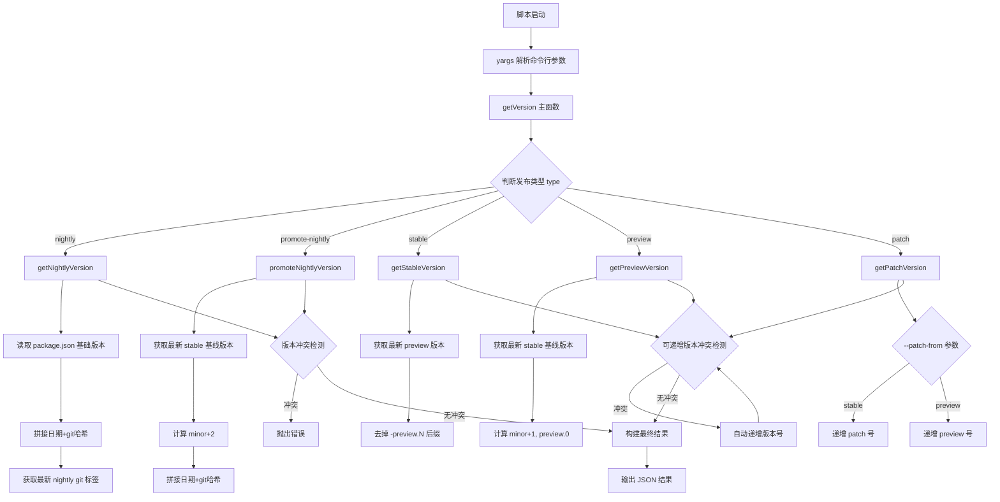
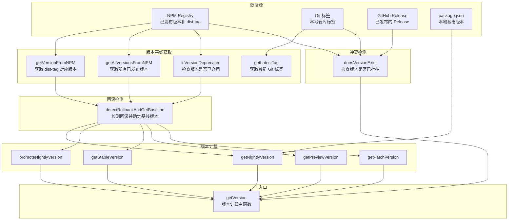
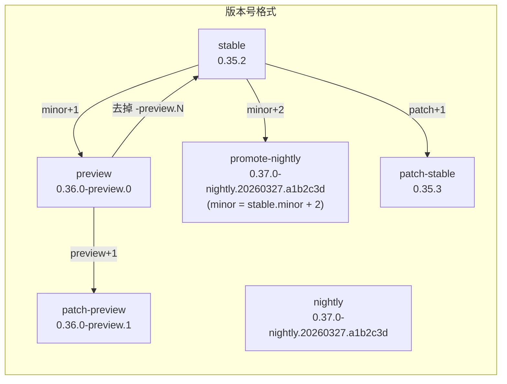

# get-release-version.js

## 概述

`scripts/get-release-version.js` 是一个发布版本号计算脚本，负责根据指定的发布类型（nightly、promote-nightly、stable、preview、patch）自动计算出下一个发布版本号。脚本综合考虑了 NPM 上已发布的版本、Git 标签、GitHub Release 等多个数据源，实现了完整的版本冲突检测、回滚场景处理、已弃用版本跳过，以及版本号自动递增等功能。

该脚本是 CI/CD 发布流水线中的核心组件，其输出（JSON 格式的版本信息）会被后续的发布步骤消费。

支持的发布类型：
- **nightly** -- 每日构建版本，格式：`X.Y.0-nightly.YYYYMMDD.githash`
- **promote-nightly** -- 提升的 nightly 版本，基于最新 stable 版本计算 minor+2
- **stable** -- 正式发布版本，从最新 preview 版本去掉预发布标识
- **preview** -- 预览版本，格式：`X.Y.0-preview.N`
- **patch** -- 补丁版本，在 stable 或 preview 基础上递增 patch/preview 号

## 架构图







## 核心组件

### 常量

| 常量名 | 值 | 描述 |
|--------|-----|------|
| `TAG_LATEST` | `'latest'` | NPM stable 发布的 dist-tag |
| `TAG_NIGHTLY` | `'nightly'` | NPM nightly 发布的 dist-tag |
| `TAG_PREVIEW` | `'preview'` | NPM preview 发布的 dist-tag |

### 导出函数

#### `getVersion(options?)`

```typescript
export function getVersion(options = {}): {
  releaseTag: string;
  releaseVersion: string;
  npmTag: string;
  previousReleaseTag: string;
}
```

核心导出函数，根据发布类型计算下一个版本号。合并命令行参数和传入的 `options` 对象，根据 `type` 参数分发到对应的版本计算函数。对于 nightly 和 promote-nightly 类型，检测到版本冲突会直接抛出错误；对于 stable、preview、patch 类型，检测到冲突会自动递增版本号直到找到未使用的版本。

返回值包含：
- `releaseTag` -- 带 `v` 前缀的 Git 标签名，如 `'v0.35.2'`
- `releaseVersion` -- 纯版本号字符串，如 `'0.35.2'`
- `npmTag` -- NPM dist-tag，如 `'latest'`、`'nightly'`、`'preview'`
- `previousReleaseTag` -- 上一个同类型发布的 Git 标签

### 内部函数

#### `getArgs()`

```typescript
function getArgs(): object
```

使用 yargs 解析命令行参数。支持的参数：
- `--type` -- 发布类型（默认 `nightly`），可选值：`nightly`、`promote-nightly`、`stable`、`preview`、`patch`
- `--patch-from` -- patch 类型的源分支，可选值：`stable`、`preview`
- `--stable_version_override` -- 覆盖计算出的 stable 版本号
- `--cli-package-name` -- NPM 包的全限定名（默认 `@google/gemini-cli`）
- `--preview_version_override` -- 覆盖计算出的 preview 版本号
- `--stable-base-version` -- 用于计算 preview/nightly 的基础 stable 版本

#### `readJson(filePath)`

```typescript
function readJson(filePath: string): object
```

同步读取并解析 JSON 文件。

#### `getLatestTag(pattern)`

```typescript
function getLatestTag(pattern: string): string
```

使用 `git tag -l` 获取匹配 glob 模式的所有 Git 标签，按语义化版本降序排序后返回最新的标签（带 `v` 前缀）。失败时返回空字符串。

#### `getVersionFromNPM({ args, npmDistTag })`

```typescript
function getVersionFromNPM({ args, npmDistTag }): string
```

通过 `npm view` 获取指定 dist-tag 对应的版本号。

#### `getAllVersionsFromNPM({ args })`

```typescript
function getAllVersionsFromNPM({ args }): string[]
```

通过 `npm view --json` 获取包的所有已发布版本列表。

#### `isVersionDeprecated({ args, version })`

```typescript
function isVersionDeprecated({ args, version }): boolean
```

检查指定版本是否已被弃用（`npm view <pkg>@<version> deprecated`）。返回 `true` 表示已弃用。出错时默认返回 `false` 以避免阻断发布。

#### `detectRollbackAndGetBaseline({ args, npmDistTag })`

```typescript
function detectRollbackAndGetBaseline({ args, npmDistTag }): {
  baseline: string;
  isRollback: boolean;
  distTagVersion?: string;
  highestExistingVersion?: string;
}
```

检测是否处于回滚场景（即 NPM dist-tag 指向的版本低于实际已发布的最高版本），并确定用于计算下一个版本号的基线版本。

核心逻辑：
1. 获取 dist-tag 当前指向的版本
2. 获取所有已发布版本，按类型过滤
3. 按语义化版本降序排列，找到最高的未弃用版本
4. 如果最高未弃用版本 > dist-tag 版本，判定为回滚场景
5. 回滚时使用最高未弃用版本作为基线，否则使用 dist-tag 版本

#### `doesVersionExist({ args, version })`

```typescript
function doesVersionExist({ args, version }): boolean
```

三重检查版本是否已存在：
1. NPM Registry -- `npm view <pkg>@<version> version`
2. Git 标签 -- `git tag -l 'v<version>'`
3. GitHub Release -- `gh release view "v<version>"`

任一渠道存在即返回 `true`。

#### `getAndVerifyTags({ npmDistTag, args })`

```typescript
function getAndVerifyTags({ npmDistTag, args }): {
  latestVersion: string;
  latestTag: string;
}
```

获取并验证指定 dist-tag 的基线版本信息。整合了回滚检测逻辑，如检测到回滚会输出警告但不会失败。

#### `getStableBaseVersion(args)`

```typescript
function getStableBaseVersion(args): string
```

获取 stable 基础版本。优先使用 `--stable-base-version` 参数，若未提供则从 NPM `latest` dist-tag 获取。

#### `getNightlyVersion()`

```typescript
function getNightlyVersion(): { releaseVersion: string; npmTag: string; previousReleaseTag: string }
```

计算 nightly 版本号。读取 `package.json` 中的基础版本（去掉预发布标识），拼接日期（`YYYYMMDD`）和 Git 短哈希。

#### `promoteNightlyVersion({ args })`

```typescript
function promoteNightlyVersion({ args }): { releaseVersion: string; npmTag: string; previousReleaseTag: string }
```

计算 promote-nightly 版本号。基于最新 stable 版本的 minor + 2 计算新版本号（跳过 preview 占用的 minor+1）。

#### `getStableVersion(args)`

```typescript
function getStableVersion(args): { releaseVersion: string; npmTag: string; previousReleaseTag: string }
```

计算 stable 版本号。默认从最新 preview 版本去掉 `-preview.N` 后缀。支持 `--stable_version_override` 覆盖。

#### `getPreviewVersion(args)`

```typescript
function getPreviewVersion(args): { releaseVersion: string; npmTag: string; previousReleaseTag: string }
```

计算 preview 版本号。基于最新 stable 版本的 minor+1，起始 preview 号为 0。支持 `--preview_version_override` 覆盖。

#### `getPatchVersion(args)`

```typescript
function getPatchVersion(args): { releaseVersion: string; npmTag: string; previousReleaseTag: string }
```

计算 patch 版本号。根据 `--patch-from` 参数决定基于 stable（递增 patch 号）还是 preview（递增 preview 号）。

#### `validateVersion(version, format, name)`

```typescript
function validateVersion(version: string, format: string, name: string): void
```

校验版本号是否匹配指定格式（`X.Y.Z` 或 `X.Y.Z-preview.N`）。不匹配时抛出错误。

## 依赖关系

### 内部依赖

| 文件 | 用途 |
|------|------|
| `package.json`（项目根目录） | `getNightlyVersion` 读取 `version` 字段作为 nightly 构建的基础版本 |

### 外部依赖

| 依赖包 | 来源 | 用途 |
|--------|------|------|
| `node:child_process` | Node.js 内置 | `execSync` 执行 git、npm、gh 命令 |
| `node:url` | Node.js 内置 | `fileURLToPath` 用于自执行检测 |
| `node:fs` | Node.js 内置 | `readFileSync` 读取 package.json |
| `semver` | npm 第三方包 | 语义化版本解析、比较、排序（`valid`、`major`、`minor`、`rcompare`、`gt`、`prerelease`） |
| `yargs` | npm 第三方包 | 命令行参数解析框架 |
| `yargs/helpers` | npm 第三方包 | `hideBin` 辅助函数，隐藏 `process.argv` 中的前两个元素 |

### 外部命令行工具

| 工具 | 用途 |
|------|------|
| `git` | 获取 Git 标签（`git tag -l`）、提交哈希（`git rev-parse --short HEAD`） |
| `npm` | 查询 NPM Registry 的版本信息和 dist-tag |
| `gh` | 查询 GitHub Release 是否存在 |

## 关键实现细节

1. **版本号命名约定**：
   - Nightly：`X.Y.0-nightly.YYYYMMDD.githash`，Y 值为 stable.minor + 2（promote-nightly）或来自 package.json
   - Preview：`X.Y.0-preview.N`，Y 值为 stable.minor + 1
   - Stable：`X.Y.Z`，从 preview 版本去掉预发布标识
   - Patch-stable：`X.Y.(Z+1)`
   - Patch-preview：`X.Y.0-preview.(N+1)`

2. **回滚检测机制**：`detectRollbackAndGetBaseline` 实现了一个复杂的回滚检测逻辑。在回滚场景中（例如通过 `npm dist-tag` 将 latest 指向了一个旧版本），dist-tag 指向的版本会低于实际已发布的最高版本。此时脚本使用最高未弃用版本作为基线，确保新版本号不会与已有版本冲突。

3. **三重版本冲突检测**：`doesVersionExist` 同时检查 NPM Registry、Git 标签和 GitHub Release 三个渠道。这是因为发布流程可能在任一步骤失败，导致版本在某些渠道存在而在其他渠道不存在。

4. **自动版本递增**：对于 stable、preview 和 patch 类型，检测到版本冲突时不会立即失败，而是在 `while` 循环中自动递增版本号（patch 号或 preview 号），直到找到未使用的版本。这提供了对部分失败发布的自动恢复能力。

5. **Nightly 冲突处理差异**：Nightly 版本包含 Git 哈希，理论上冲突极不可能。因此 nightly 和 promote-nightly 类型在检测到冲突时直接抛出错误而非自动递增，因为冲突意味着有更根本的问题需要调查。

6. **已弃用版本过滤**：在确定基线版本时，脚本会跳过已弃用的版本（通过 `npm view <pkg>@<version> deprecated` 检查）。这确保新版本号基于仍在使用的版本计算，而非可能有问题的已弃用版本。

7. **Minor 版本间距策略**：Preview 版本使用 stable.minor + 1，而 promote-nightly 使用 stable.minor + 2。这种间距策略确保三种通道的版本号空间不会重叠：stable 占 N，preview 占 N+1，nightly 占 N+2。

8. **Shebang 行**：文件首行的 `#!/usr/bin/env node` 表明该脚本可以直接作为可执行文件运行（`./scripts/get-release-version.js`），前提是文件有执行权限。

9. **JSON 输出**：脚本直接执行时，通过 `console.log(JSON.stringify(...))` 输出 JSON 格式的版本信息，便于 CI 脚本解析和消费（如通过 `jq` 提取字段）。

10. **版本覆盖机制**：`--stable_version_override` 和 `--preview_version_override` 参数允许手动指定版本号，绕过自动计算逻辑。这些覆盖值会经过格式校验（`validateVersion`），防止无效版本号进入发布流程。覆盖时会自动去掉可能的 `v` 前缀。
