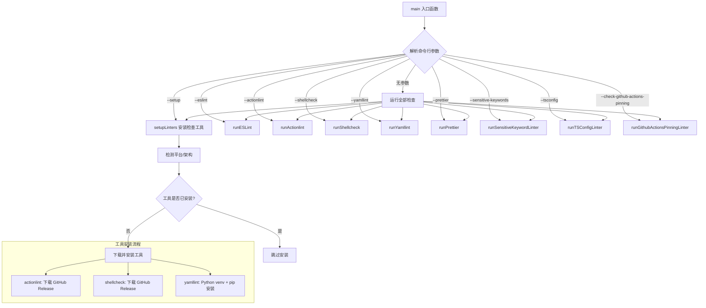
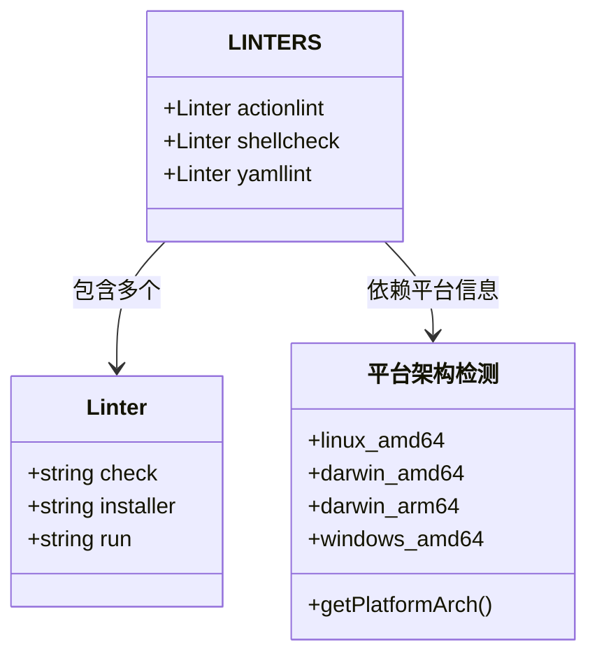

# scripts/lint.js

## 概述

`lint.js` 是 Gemini CLI 项目的**统一代码质量检查入口脚本**。它负责自动安装、配置和运行多种 linter 工具，对项目代码进行全方位的静态分析和格式检查。该脚本支持 Linux、macOS 和 Windows 三大平台，能够根据命令行参数选择性地运行特定的 linter，也可以不传参数一次性运行所有检查。

脚本集成了以下检查工具：
- **ESLint** - JavaScript/TypeScript 代码规范检查
- **actionlint** - GitHub Actions 工作流文件检查
- **shellcheck** - Shell 脚本检查
- **yamllint** - YAML 文件格式检查
- **Prettier** - 代码格式化检查
- **敏感关键词检查** - 检测代码中不当的版本关键词
- **TSConfig 检查** - 验证 tsconfig.json 配置规范
- **GitHub Actions 引脚固定检查** - 确保 Actions 引用使用 SHA 而非标签

## 架构图

## 核心组件

### 常量

| 常量名 | 值 | 说明 |
|---|---|---|
| `ACTIONLINT_VERSION` | `'1.7.7'` | actionlint 工具版本 |
| `SHELLCHECK_VERSION` | `'0.11.0'` | shellcheck 工具版本 |
| `YAMLLINT_VERSION` | `'1.35.1'` | yamllint 工具版本 |
| `TEMP_DIR` | `process.env.GEMINI_LINT_TEMP_DIR \|\| join(tmpdir(), 'gemini-cli-linters')` | linter 工具的临时安装目录 |
| `PYTHON_VENV_PATH` | `join(TEMP_DIR, 'python_venv')` | Python 虚拟环境路径（用于 yamllint） |
| `LINTERS` | 对象 | 包含 actionlint、shellcheck、yamllint 三个工具的检测命令、安装命令和运行命令 |

### 内部函数

#### `getPlatformArch() -> { actionlint: string, shellcheck: string }`
根据 `process.platform` 和 `process.arch` 返回当前平台的架构标识符，用于拼接正确的下载 URL。支持四种组合：
- `linux/x64` -> `{ actionlint: 'linux_amd64', shellcheck: 'linux.x86_64' }`
- `darwin/x64` -> `{ actionlint: 'darwin_amd64', shellcheck: 'darwin.x86_64' }`
- `darwin/arm64` -> `{ actionlint: 'darwin_arm64', shellcheck: 'darwin.aarch64' }`
- `win32/x64` -> `{ actionlint: 'windows_amd64' }`（shellcheck 在 Windows 上使用 zip 格式）

#### `runCommand(command: string, stdio?: string) -> boolean`
封装 `execSync` 执行 shell 命令的通用函数。功能：
- 构造包含工具安装目录的 `PATH` 环境变量，确保已安装的工具可被找到
- PATH 中包含：`node_modules/.bin`、`actionlint 目录`、`shellcheck 目录`、`Python venv bin 目录`
- 适配 Windows 的 `Path` vs `PATH` 差异
- 返回 `true` 表示成功，`false` 表示失败（捕获异常）

#### `stripJSONComments(json: string) -> string`
使用正则表达式移除 JSON 文件中的注释（`//` 单行注释和 `/* */` 多行注释），返回纯净的 JSON 字符串。用于解析 `tsconfig.json`。

#### `main()`
脚本入口函数，解析 `process.argv` 中的命令行参数，按参数调用对应的 linter。若无参数则依次运行全部检查。

### 导出函数

#### `setupLinters() -> void`
安装所有外部 linter 工具。流程：
1. 若未设置 `GEMINI_LINT_TEMP_DIR` 环境变量，先清空临时目录
2. 创建临时目录
3. 遍历 `LINTERS` 对象，对每个 linter 先执行 `check` 命令检测是否已安装
4. 未安装的工具执行 `installer` 命令进行安装
5. 安装失败则退出进程（exit code 1）

#### `runESLint() -> void`
执行 `npm run lint` 运行 ESLint。失败则退出进程。

#### `runActionlint() -> void`
执行 actionlint 检查 GitHub Actions 工作流文件。配置了以下忽略规则：
- `SC2002` - 无用的 cat 使用
- `SC2016` - 单引号中的变量不展开
- `SC2129` - 重定向合并建议
- 未知的 label 名称

#### `runShellcheck() -> void`
执行 shellcheck 检查所有 shell 脚本。流程：
1. 通过 `git ls-files` 获取仓库中所有文件
2. 用 `file --mime-type` 筛选 shell 脚本
3. 运行 shellcheck，启用所有检查规则，排除 SC2002、SC2129、SC2310
4. 输出格式为 GCC 兼容格式，将 note/style 级别转换为 warning

#### `runYamllint() -> void`
执行 yamllint 检查所有 `.yaml`/`.yml` 文件，输出格式为 GitHub 兼容格式。

#### `runPrettier() -> void`
执行 `prettier --check .` 检查代码格式。失败时提示用户运行 `npm run format`。

#### `runSensitiveKeywordLinter() -> void`
检查 Git 变更文件中是否包含敏感关键词。逻辑：
1. 获取相对于基准分支（`GITHUB_BASE_REF` 或 `main`）的变更文件列表
2. 回退策略：若获取失败则对比 `HEAD~1`
3. 使用正则 `/gemini-\d+(\.\d+)?/g` 匹配敏感模式
4. 允许列表中的关键词不会触发告警（如 `gemini-3.1`、`gemini-2.5` 等）
5. 以 GitHub Actions 注解格式输出警告，包含文件名、行号、列号

#### `runTSConfigLinter() -> void`
检查 `packages/` 目录下所有 `tsconfig.json` 文件的 `exclude` 字段。规则：
- `exclude` 必须是数组
- 只允许包含 `"node_modules"` 和 `"dist"` 两个值
- 自动处理带注释的 tsconfig 文件（通过 `stripJSONComments`）

#### `runGithubActionsPinningLinter() -> void`
检查 GitHub Actions 工作流文件中的 action 引用是否使用 40 位 SHA 哈希固定。规则：
- 扫描 `.github/workflows/` 和 `.github/actions/` 下的 YAML 文件
- 检测 `uses:` 行中的 action 引用
- 跳过本地 action（`./` 开头）、docker action（`docker://` 开头）和标注了 `# github-actions-pinning:ignore` 的行
- 非 SHA 引用（如 `@v1`）会报错
- 提示使用 `ratchet` 工具自动修复

### 命令行参数

| 参数 | 触发的函数 |
|---|---|
| `--setup` | `setupLinters()` |
| `--eslint` | `runESLint()` |
| `--actionlint` | `runActionlint()` |
| `--shellcheck` | `runShellcheck()` |
| `--yamllint` | `runYamllint()` |
| `--prettier` | `runPrettier()` |
| `--sensitive-keywords` | `runSensitiveKeywordLinter()` |
| `--tsconfig` | `runTSConfigLinter()` |
| `--check-github-actions-pinning` | `runGithubActionsPinningLinter()` |
| （无参数） | 依次运行全部检查 |

## 依赖关系

### 内部依赖
无内部模块依赖。该脚本是一个独立的工具脚本。

### 外部依赖

| 模块 | 来源 | 用途 |
|---|---|---|
| `node:child_process` | Node.js 内置 | `execSync` 执行 shell 命令 |
| `node:fs` | Node.js 内置 | 文件系统操作（创建/删除目录、读取文件、检测文件存在） |
| `node:os` | Node.js 内置 | `tmpdir()` 获取系统临时目录 |
| `node:path` | Node.js 内置 | `join` 路径拼接 |

### 运行时外部工具依赖

| 工具 | 版本 | 安装方式 |
|---|---|---|
| actionlint | 1.7.7 | 从 GitHub Release 自动下载 |
| shellcheck | 0.11.0 | 从 GitHub Release 自动下载 |
| yamllint | 1.35.1 | 通过 Python venv + pip 自动安装 |
| ESLint | 项目配置版本 | 通过 `npm run lint` 调用，需项目已安装 |
| Prettier | 项目配置版本 | 通过 `prettier` 命令调用，需项目已安装 |

## 关键实现细节

1. **跨平台支持**：脚本通过 `getPlatformArch()` 检测运行平台和 CPU 架构，为 actionlint 和 shellcheck 生成正确的下载 URL。Windows 平台使用 PowerShell 命令和 zip 格式，Unix 平台使用 curl + tar。

2. **工具自动安装**：`setupLinters()` 采用"检测优先"策略 -- 先用 `command -v`（Unix）或 `where`（Windows）检测工具是否可用，仅在不可用时才进行安装。安装的工具存放在临时目录中，不污染全局环境。

3. **PATH 注入机制**：`runCommand()` 在执行每个命令前，将临时安装目录注入 `PATH` 环境变量的最前面，确保临时安装的工具优先被找到。同时兼容 Windows 下 `Path` 和 `PATH` 的大小写差异。

4. **Python 虚拟环境隔离**：yamllint 通过 Python 虚拟环境安装，避免与系统 Python 包产生冲突。虚拟环境位于 `TEMP_DIR/python_venv`。

5. **敏感关键词检查的回退策略**：`runSensitiveKeywordLinter` 先尝试对比 `origin/{baseRef}`，失败后回退到 `HEAD~1`，确保在不同 CI 环境和本地开发中都能正常工作。

6. **tsconfig 注释处理**：`stripJSONComments()` 使用精巧的正则表达式去除 JSON 注释，能正确处理字符串中包含 `//` 或 `/*` 的情况（不会误删字符串内的内容）。

7. **GitHub Actions SHA 固定检查**：强制要求所有第三方 Action 使用 40 位 commit SHA 引用而非版本标签，这是一种安全最佳实践，可防止供应链攻击。提供了 `# github-actions-pinning:ignore` 注释作为豁免机制。

8. **环境变量支持**：
   - `GEMINI_LINT_TEMP_DIR`：自定义临时目录路径，设置后不会在每次运行时清空目录（可加速 CI 缓存）
   - `GITHUB_BASE_REF`：CI 环境中的基准分支名称，用于敏感关键词检查
