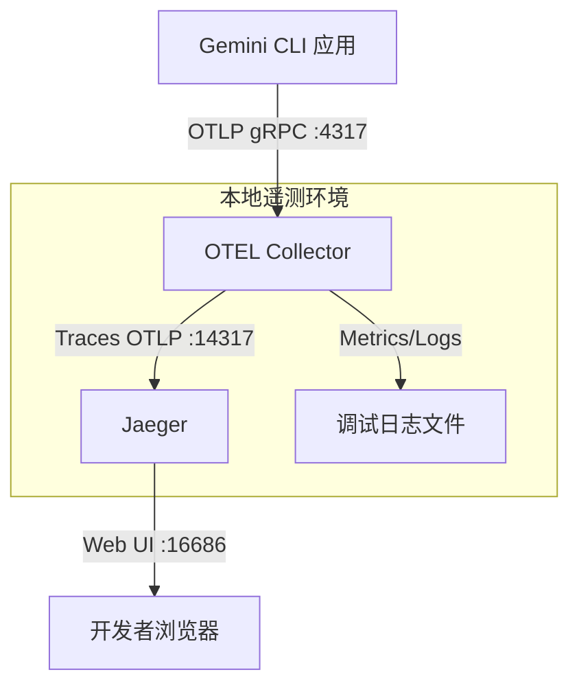
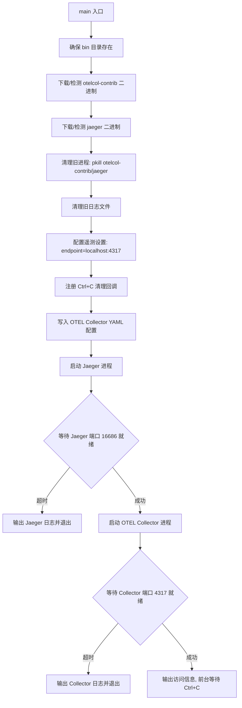
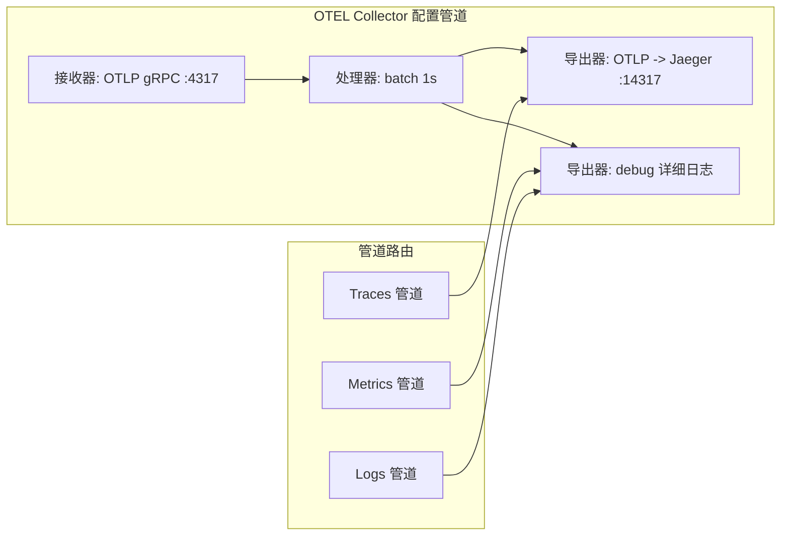

# scripts/local_telemetry.js

## 概述

`local_telemetry.js` 是 Gemini CLI 项目的**本地遥测环境启动脚本**。它负责在开发者本地机器上搭建一套完整的 OpenTelemetry 可观测性环境，包括 OTEL Collector（遥测数据收集器）和 Jaeger（分布式追踪可视化系统）。开发者运行此脚本后，可以在本地实时查看 CLI 工具产生的链路追踪（traces）、指标（metrics）和日志（logs）数据，便于调试和性能分析。

脚本的核心工作流程：
1. 自动下载并安装 `otelcol-contrib` 和 `jaeger` 二进制文件
2. 清理已有的旧进程和日志
3. 配置并启动 Jaeger 服务（监听 14317 端口接收 OTLP 数据，16686 端口提供 Web UI）
4. 配置并启动 OTEL Collector（监听 4317 端口接收 CLI 发来的数据，转发 traces 到 Jaeger，metrics/logs 输出到调试日志）
5. 修改遥测配置指向本地 Collector
6. 前台运行，Ctrl+C 退出时自动清理

## 架构图

## 核心组件

### 常量

| 常量名 | 值 | 说明 |
|---|---|---|
| `OTEL_CONFIG_FILE` | `join(OTEL_DIR, 'collector-local.yaml')` | OTEL Collector 配置文件路径 |
| `OTEL_LOG_FILE` | `join(OTEL_DIR, 'collector.log')` | OTEL Collector 日志文件路径 |
| `JAEGER_LOG_FILE` | `join(OTEL_DIR, 'jaeger.log')` | Jaeger 日志文件路径 |
| `JAEGER_PORT` | `16686` | Jaeger Web UI 端口 |
| `OTEL_CONFIG_CONTENT` | YAML 字符串 | OTEL Collector 的完整配置内容 |

### OTEL Collector 配置详情

配置文件定义了以下管道：

**接收器 (Receivers):**
- `otlp` - 通过 gRPC 协议在 `localhost:4317` 接收遥测数据

**处理器 (Processors):**
- `batch` - 批量处理，超时 1 秒

**导出器 (Exporters):**
- `otlp` - 将数据通过 OTLP 协议转发到 `localhost:14317`（Jaeger），TLS 禁用
- `debug` - 详细模式输出到日志

**管道 (Pipelines):**
- `traces` 管道：otlp 接收 -> batch 处理 -> otlp 导出（到 Jaeger）
- `metrics` 管道：otlp 接收 -> batch 处理 -> debug 导出
- `logs` 管道：otlp 接收 -> batch 处理 -> debug 导出

**服务遥测 (Service Telemetry):**
- 日志级别：debug
- 指标级别：none（不采集 Collector 自身的指标）

### 函数

#### `main() -> Promise<void>`

脚本的唯一核心函数，异步执行完整的本地遥测环境搭建流程：

1. **二进制文件准备**
   - 调用 `ensureBinary()` 确保 `otelcol-contrib` 和 `jaeger` 可用
   - 若不存在则自动从 GitHub Releases 下载
   - `otelcol-contrib` 来自 `open-telemetry/opentelemetry-collector-releases` 仓库
   - `jaeger` 来自 `jaegertracing/jaeger` 仓库
   - 下载失败时输出错误并退出

2. **清理阶段**
   - 使用 `pkill -f` 终止可能存在的旧 `otelcol-contrib` 和 `jaeger` 进程
   - 删除旧的日志文件（`collector.log` 和 `jaeger.log`）
   - 清理过程的错误被静默忽略（进程不存在不报错）

3. **遥测配置修改**
   - 调用 `manageTelemetrySettings(true, 'http://localhost:4317', 'local')` 将 CLI 的遥测 endpoint 指向本地 Collector
   - 保存原始设置以便退出时恢复

4. **清理回调注册**
   - 调用 `registerCleanup()` 注册进程退出时的清理逻辑
   - 清理内容包括：终止子进程、关闭日志文件描述符、恢复遥测设置

5. **启动 Jaeger**
   - 写入 OTEL 配置文件
   - 以子进程方式启动 Jaeger，配置 OTLP gRPC 接收端口为 14317
   - 日志输出重定向到 `jaeger.log`
   - 使用 `waitForPort(16686)` 等待服务就绪
   - 启动失败则 SIGKILL 终止进程并输出日志内容

6. **启动 OTEL Collector**
   - 以子进程方式启动 `otelcol-contrib`，加载配置文件
   - 日志输出重定向到 `collector.log`
   - 使用 `waitForPort(4317)` 等待服务就绪
   - 启动失败则 SIGKILL 终止进程并输出日志内容

7. **运行状态输出**
   - 输出 Jaeger Web UI 访问地址
   - 输出日志文件路径及 tail 命令
   - 前台保持运行，等待用户 Ctrl+C 退出

## 依赖关系

### 内部依赖

| 模块 | 路径 | 导入内容 | 用途 |
|---|---|---|---|
| `telemetry_utils.js` | `./telemetry_utils.js` | `BIN_DIR` | 二进制文件存储目录 |
| | | `OTEL_DIR` | OpenTelemetry 相关文件存储目录 |
| | | `ensureBinary()` | 检测/下载二进制文件 |
| | | `fileExists()` | 文件存在性检查 |
| | | `manageTelemetrySettings()` | 管理遥测配置（endpoint、沙箱模式等） |
| | | `registerCleanup()` | 注册进程退出清理回调 |
| | | `waitForPort()` | 等待指定端口可用 |

### 外部依赖

| 模块 | 来源 | 用途 |
|---|---|---|
| `node:path` | Node.js 内置 | 路径操作 |
| `node:fs` | Node.js 内置 | 文件系统操作（创建目录、写入配置、读取日志、删除文件） |
| `node:child_process` | Node.js 内置 | `spawn` 启动子进程，`execSync` 终止旧进程 |
| `node:url` | Node.js 内置 | `fileURLToPath` 获取当前文件路径 |

### 运行时外部工具依赖

| 工具 | 来源 | 用途 |
|---|---|---|
| `otelcol-contrib` | `open-telemetry/opentelemetry-collector-releases` GitHub Releases | OpenTelemetry Collector，接收、处理、转发遥测数据 |
| `jaeger` | `jaegertracing/jaeger` GitHub Releases | 分布式追踪后端，提供存储和 Web UI |

## 关键实现细节

1. **二进制文件自动管理**：通过 `ensureBinary()` 函数实现按需下载。二进制文件存储在项目的 `.gemini/otel/bin` 目录下，不修改用户系统环境。下载 URL 通过回调函数动态构建，格式为 `{name}_{version}_{platform}_{arch}.{ext}`。

2. **进程生命周期管理**：使用 `spawn()` 以子进程方式启动服务，标准输出和错误输出均重定向到日志文件（通过文件描述符 `fd`）。通过 `registerCleanup()` 注册 SIGINT/SIGTERM 处理器，确保退出时子进程被终止、文件描述符被关闭、遥测设置被恢复。

3. **端口等待机制**：启动每个服务后，使用 `waitForPort()` 轮询检测端口是否可用，确保服务完全就绪后才继续下一步。这避免了启动顺序依赖导致的连接失败问题。

4. **两层 OTLP 转发架构**：
   - CLI 发送数据到 OTEL Collector 的 4317 端口
   - Collector 将 traces 转发到 Jaeger 的 14317 端口（而非默认的 4317，避免端口冲突）
   - Metrics 和 logs 不经过 Jaeger，而是直接输出到 debug 日志
   - 这种架构允许 Collector 做数据处理（batch），同时隔离了不同类型的遥测数据

5. **遥测设置自动切换**：脚本启动时通过 `manageTelemetrySettings()` 将 CLI 的遥测 endpoint 修改为 `http://localhost:4317`，退出时自动恢复原始设置。保存的 `originalSandboxSetting` 确保用户的原有配置不会丢失。

6. **错误处理策略**：对于"清理旧进程"阶段的错误采取宽松策略（静默忽略），因为旧进程可能本来就不存在；对于"启动新服务"阶段的错误采取严格策略（SIGKILL 终止并输出日志后退出），确保不会留下僵尸进程。
