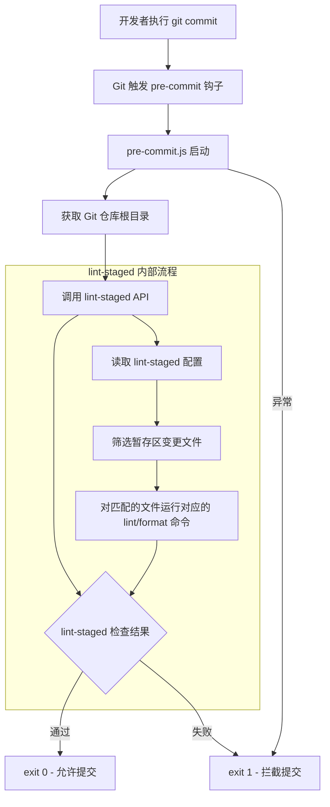
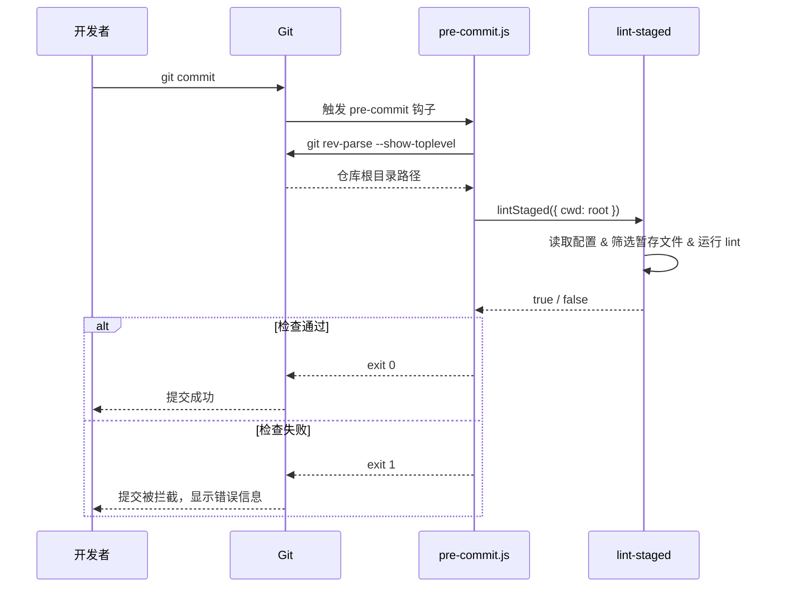

# scripts/pre-commit.js

## 概述

`pre-commit.js` 是 Gemini CLI 项目的 **Git pre-commit 钩子脚本**。它在开发者执行 `git commit` 时自动触发，通过 `lint-staged` 库对**暂存区中的文件**运行代码格式化和 lint 检查，确保只有符合项目编码规范的代码才能被提交。

该脚本非常简洁，核心逻辑仅包含：
1. 获取 Git 仓库根目录
2. 调用 `lint-staged` API 对暂存文件执行检查
3. 根据检查结果返回退出码（0 = 通过，1 = 失败/拦截提交）

## 架构图





## 核心组件

### 执行流程

该脚本没有定义独立的函数或类，而是以顶层 `try/catch` 块作为整体执行逻辑：

#### 步骤 1：获取仓库根目录
```javascript
const root = execSync('git rev-parse --show-toplevel').toString().trim();
```
- 使用 `git rev-parse --show-toplevel` 获取当前 Git 仓库的绝对根目录路径
- 这确保无论从仓库的哪个子目录执行提交，lint-staged 都能正确定位配置文件和项目文件

#### 步骤 2：运行 lint-staged
```javascript
const passed = await lintStaged({ cwd: root });
```
- 直接调用 `lint-staged` 的 JavaScript API（而非 CLI）
- 传入 `cwd: root` 参数确保以仓库根目录为工作目录
- 返回布尔值：`true` 表示所有检查通过，`false` 表示存在失败

#### 步骤 3：退出
```javascript
process.exit(passed ? 0 : 1);
```
- 退出码 `0`：所有检查通过，Git 继续执行提交
- 退出码 `1`：检查失败或发生异常，Git 中止提交

### 错误处理
- 外层 `try/catch` 捕获所有未预期的异常（如 `git rev-parse` 失败、`lint-staged` 内部错误等）
- 任何异常均以 `exit(1)` 退出，拦截提交操作
- `catch` 块不打印错误信息（`lint-staged` 自身会输出详细的错误信息）

## 依赖关系

### 内部依赖
无。该脚本不依赖项目中的其他模块。

但它间接依赖项目根目录中的 **lint-staged 配置**（通常位于 `package.json` 的 `lint-staged` 字段或独立的 `.lintstagedrc` 配置文件），该配置定义了对不同类型文件运行哪些 lint/format 命令。

### 外部依赖

| 模块 | 来源 | 用途 |
|---|---|---|
| `node:child_process` | Node.js 内置 | `execSync` 执行 `git rev-parse` 获取仓库根目录 |
| `lint-staged` | npm 第三方包 | 核心功能 -- 对 Git 暂存区的文件运行 lint 检查 |

## 关键实现细节

1. **API 调用而非 CLI 调用**：脚本直接 `import lintStaged from 'lint-staged'` 并调用其 API，而非通过 `execSync('npx lint-staged')` 调用 CLI。API 调用方式更高效（避免启动新的 Node.js 进程），也更容易获取结构化的返回值。

2. **顶层 await**：脚本使用了 ES Module 的顶层 `await` 特性（`await lintStaged(...)`），无需包裹在 async 函数中。这要求 Node.js 以 ESM 模式运行该脚本。

3. **仓库根目录定位**：通过 `git rev-parse --show-toplevel` 动态获取仓库根路径，而非硬编码或使用相对路径。这保证了在 monorepo 的任何子目录中执行提交都能正确工作。

4. **最小化脚本**：整个脚本仅 22 行，职责单一明确。lint 规则的定义不在此脚本中，而是由 lint-staged 的配置文件控制。这种关注点分离使得修改 lint 规则不需要修改钩子脚本本身。

5. **静默失败策略**：`catch` 块不输出任何错误信息，因为 `lint-staged` 库在运行失败时会自行输出详细的诊断信息（包括哪个文件在哪个检查中失败、具体的错误输出等）。避免重复输出错误信息。
