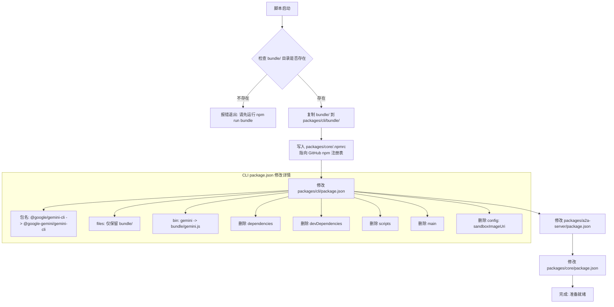
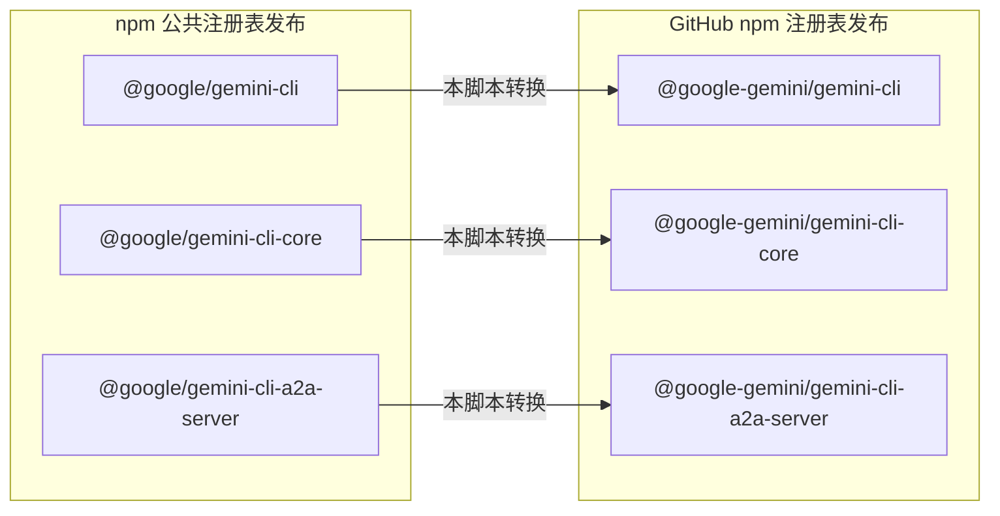

# scripts/prepare-github-release.js

## 概述

`prepare-github-release.js` 是 Gemini CLI 项目的 **GitHub Packages 发布准备脚本**。它负责将项目从面向 npm 公共注册表的结构转换为面向 GitHub npm 注册表（`npm.pkg.github.com`）的发布结构。

该脚本执行以下关键操作：
1. 将预构建的 `bundle/` 目录复制到 `packages/cli/` 下
2. 修改 `.npmrc` 配置，将 `@google-gemini` scope 指向 GitHub npm 注册表
3. 修改多个 `package.json` 的包名和发布配置，将 `@google/` 前缀替换为 `@google-gemini/` 前缀
4. 精简 CLI 包的 `package.json`（移除依赖、脚本等字段），使其成为一个纯 bundle 分发包

这是一个一次性的构建管道步骤，通常在 CI/CD 的 GitHub Release 工作流中调用。

## 架构图





## 核心组件

### 函数

#### `updatePackageJson(packagePath: string, updateFn: (pkg: object) => void) -> void`

通用的 `package.json` 修改函数。

**参数：**
- `packagePath` - 相对于项目根目录的 `package.json` 路径（如 `'packages/cli/package.json'`）
- `updateFn` - 接收已解析的 package.json 对象的回调函数，在回调中直接修改对象属性

**行为：**
1. 将相对路径解析为绝对路径
2. 读取并解析 JSON 文件
3. 调用 `updateFn` 修改对象
4. 将修改后的对象序列化写回文件（2 空格缩进）

### 执行流程

#### 1. 复制 bundle 目录
```
源: {rootDir}/bundle/
目标: {rootDir}/packages/cli/bundle/
```
- 若源目录不存在，报错并退出（exit code 1），提示先运行 `npm run bundle`
- 若目标目录已存在，先递归删除再复制
- 使用 `fs.cpSync()` 递归复制

#### 2. 写入 `.npmrc` 配置
```
目标: {rootDir}/packages/core/.npmrc
内容: @google-gemini:registry=https://npm.pkg.github.com/
```
- 覆盖 core 包的 `.npmrc`，将 `@google-gemini` scope 的包指向 GitHub npm 注册表
- 这确保 `npm publish` 时 core 包被发布到 GitHub Packages 而非 npmjs.com

#### 3. 修改 `packages/cli/package.json`

| 字段 | 修改前 | 修改后 |
|---|---|---|
| `name` | `@google/gemini-cli` | `@google-gemini/gemini-cli` |
| `files` | （原始值） | `['bundle/']` |
| `bin` | （原始值） | `{ gemini: 'bundle/gemini.js' }` |
| `dependencies` | （原始值） | **删除** |
| `devDependencies` | （原始值） | **删除** |
| `scripts` | （原始值） | **删除** |
| `main` | （原始值） | **删除** |
| `config` | `{ sandboxImageUri: ... }` | **删除** |

这些修改将 CLI 包转变为一个**纯 bundle 分发包**：
- 没有依赖（所有依赖已打入 bundle）
- 仅包含 `bundle/` 目录
- 入口点直接指向打包后的文件

#### 4. 修改 `packages/a2a-server/package.json`

| 字段 | 修改前 | 修改后 |
|---|---|---|
| `name` | `@google/gemini-cli-a2a-server` | `@google-gemini/gemini-cli-a2a-server` |

#### 5. 修改 `packages/core/package.json`

| 字段 | 修改前 | 修改后 |
|---|---|---|
| `name` | `@google/gemini-cli-core` | `@google-gemini/gemini-cli-core` |

## 依赖关系

### 内部依赖
无。该脚本不导入项目中的其他模块。

### 外部依赖

| 模块 | 来源 | 用途 |
|---|---|---|
| `node:fs` | Node.js 内置 | 文件系统操作（读写 JSON、复制/删除目录、检测文件存在） |
| `node:path` | Node.js 内置 | 路径解析（`path.resolve`） |

### 前置条件

| 条件 | 说明 |
|---|---|
| `npm run bundle` 已执行 | 项目根目录必须存在 `bundle/` 目录，内含预打包的 CLI 产物 |
| 以项目根目录为 cwd 运行 | 脚本使用 `process.cwd()` 作为根目录基准 |

## 关键实现细节

1. **双注册表发布策略**：Gemini CLI 同时发布到两个 npm 注册表 -- npm 公共注册表（`@google/` scope）和 GitHub Packages（`@google-gemini/` scope）。本脚本负责准备 GitHub Packages 版本的发布物料。两个版本的包名前缀不同（`@google/` vs `@google-gemini/`），是因为 GitHub Packages 要求包的 scope 与 GitHub 组织名匹配。

2. **Bundle 分发模式**：GitHub 版本的 CLI 包采用 bundle 分发模式 -- 所有依赖（包括 `@google-gemini/gemini-cli-core`）已被打包进 `bundle/gemini.js`，因此 `package.json` 中删除了 `dependencies` 和 `devDependencies`。这简化了安装流程，用户安装时无需下载依赖树。

3. **config 字段删除**：`delete pkg.config` 删除了 `sandboxImageUri` 配置。这是因为 GitHub Release 版本可能使用不同的沙箱镜像配置，或者该配置仅在开发/npm 发布时有意义。

4. **就地修改策略**：脚本直接修改 `packages/` 目录下的文件，而非创建副本。这意味着此脚本执行后仓库状态会被改变，通常在 CI 构建环境中运行（该环境是一次性的），不应在本地开发环境中直接运行。

5. **幂等性**：`bundle/` 目录复制前先执行 `rmSync`（强制递归删除），`.npmrc` 使用 `writeFileSync`（覆盖写），确保重复运行产生相同结果。
