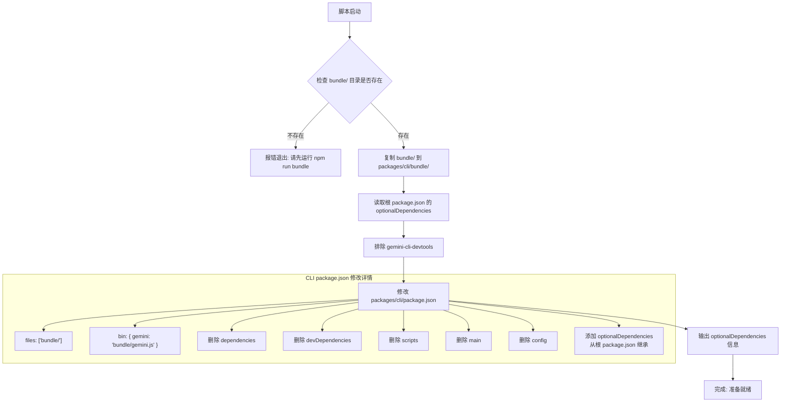
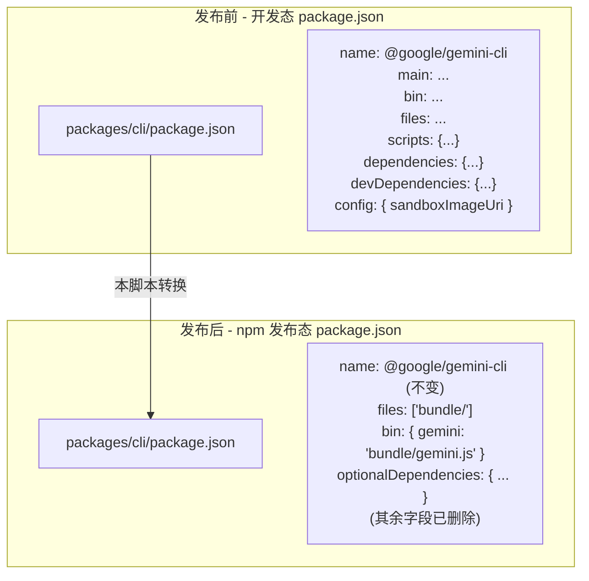
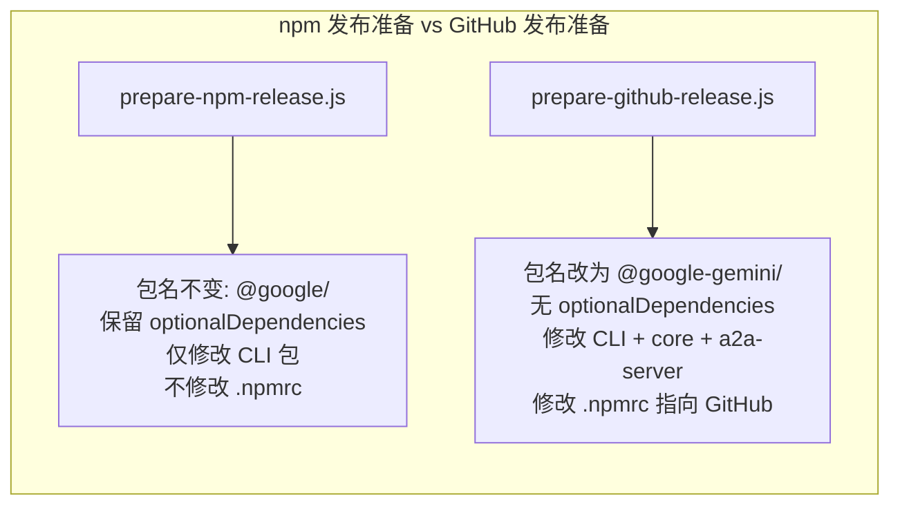

# scripts/prepare-npm-release.js

## 概述

`prepare-npm-release.js` 是 Gemini CLI 项目的 **npm 公共注册表发布准备脚本**。它负责将项目从开发态的 monorepo 结构转换为面向 npm 公共注册表（`npmjs.com`）的发布结构。与 `prepare-github-release.js` 类似，但目标注册表和配置策略有所不同。

该脚本执行以下关键操作：
1. 将预构建的 `bundle/` 目录复制到 `packages/cli/` 下
2. 从根 `package.json` 继承 `optionalDependencies`（排除开发专用包）
3. 修改 CLI 包的 `package.json`，使其成为一个纯 bundle 分发包，同时保留可选依赖

与 GitHub Release 版本的核心区别在于：
- **不修改包名**（保持 `@google/gemini-cli`）
- **不修改 `.npmrc`**（使用默认的 npm 公共注册表）
- **保留 `optionalDependencies`**（用于平台特定的原生模块支持）
- **不涉及 core 和 a2a-server 包**

## 架构图







## 核心组件

### 函数

#### `readJson(filePath: string) -> object`
读取并解析 JSON 文件。
- **参数**：`filePath` - 相对于项目根目录的文件路径
- **返回**：解析后的 JavaScript 对象

#### `writeJson(filePath: string, data: object) -> void`
将对象序列化并写入 JSON 文件。
- **参数**：
  - `filePath` - 相对于项目根目录的文件路径
  - `data` - 要序列化的对象
- **行为**：以 2 空格缩进的格式写入文件

### 执行流程

#### 1. 复制 bundle 目录
```
源: {rootDir}/bundle/
目标: {rootDir}/packages/cli/bundle/
```
- 与 `prepare-github-release.js` 完全相同的逻辑
- 源目录不存在则报错退出
- 目标目录存在则先删除再复制

#### 2. 继承 optionalDependencies
```javascript
const rootPkg = readJson('package.json');
const optionalDependencies = { ...(rootPkg.optionalDependencies || {}) };
delete optionalDependencies['gemini-cli-devtools'];
```
- 从项目根 `package.json` 读取 `optionalDependencies` 字段
- 展开复制（浅拷贝），避免修改原对象
- 删除 `gemini-cli-devtools` -- 这是一个开发工具包，不应包含在发布产物中
- 若根 `package.json` 没有 `optionalDependencies`，则使用空对象

#### 3. 修改 `packages/cli/package.json`

| 字段 | 操作 | 修改后的值 |
|---|---|---|
| `name` | **不修改** | `@google/gemini-cli`（保持原值） |
| `files` | 覆盖 | `['bundle/']` |
| `bin` | 覆盖 | `{ gemini: 'bundle/gemini.js' }` |
| `dependencies` | **删除** | - |
| `devDependencies` | **删除** | - |
| `scripts` | **删除** | - |
| `main` | **删除** | - |
| `config` | **删除** | - |
| `optionalDependencies` | 新增/覆盖 | 从根 package.json 继承（排除 devtools） |

#### 4. 输出信息
- 输出最终的 `optionalDependencies` 内容（JSON 格式，便于 CI 日志审查）
- 输出成功消息

## 依赖关系

### 内部依赖
无。该脚本不导入项目中的其他模块。

但它依赖以下项目文件作为输入：
- `package.json`（根）- 读取 `optionalDependencies`
- `packages/cli/package.json` - 读取后修改并写回

### 外部依赖

| 模块 | 来源 | 用途 |
|---|---|---|
| `node:fs` | Node.js 内置 | 文件系统操作（读写 JSON、复制/删除目录、检测文件存在） |
| `node:path` | Node.js 内置 | 路径解析（`path.resolve`） |

### 前置条件

| 条件 | 说明 |
|---|---|
| `npm run bundle` 已执行 | 项目根目录必须存在 `bundle/` 目录，内含预打包的 CLI 产物 |
| 以项目根目录为 cwd 运行 | 脚本使用 `process.cwd()` 作为根目录基准 |

## 关键实现细节

1. **optionalDependencies 的作用**：npm 版本的 CLI 包保留了 `optionalDependencies`，这些通常是平台特定的原生模块（如 `fsevents` 用于 macOS 的文件监听）。`optionalDependencies` 的特性是安装失败不会导致整体安装失败，因此可以安全地列出跨平台可能不存在的包。

2. **排除 gemini-cli-devtools**：`gemini-cli-devtools` 是一个开发调试工具包，仅在开发时使用。通过 `delete optionalDependencies['gemini-cli-devtools']` 确保它不会出现在发布版本中，减小安装体积并避免暴露调试工具。

3. **与 GitHub Release 脚本的对比**：
   - npm 版本**保持原包名** `@google/gemini-cli`，因为 npm 公共注册表不限制 scope 名称
   - npm 版本**保留 optionalDependencies**，GitHub 版本不保留
   - npm 版本**仅修改 CLI 包**，GitHub 版本还修改 core 和 a2a-server 包的名称
   - npm 版本**不修改 .npmrc**，GitHub 版本需要将注册表指向 `npm.pkg.github.com`

4. **Bundle 分发模式**：与 GitHub Release 相同，npm 版本也采用 bundle 分发模式。核心依赖（如 `@google/gemini-cli-core`）已被打入 `bundle/gemini.js`，因此 `dependencies` 被删除。唯一保留的依赖入口是 `optionalDependencies`。

5. **就地修改策略**：脚本直接修改 `packages/cli/package.json`，不创建副本。与 GitHub Release 脚本一样，应在 CI 构建环境中运行，不建议在本地开发环境中直接执行。

6. **幂等性**：`bundle/` 目录复制前先 `rmSync`，JSON 文件使用 `writeFileSync` 覆盖写，确保重复运行产生相同结果。

7. **日志输出**：脚本在关键步骤输出日志信息，特别是输出最终的 `optionalDependencies` 内容，便于在 CI/CD 管道日志中审查发布配置是否正确。
