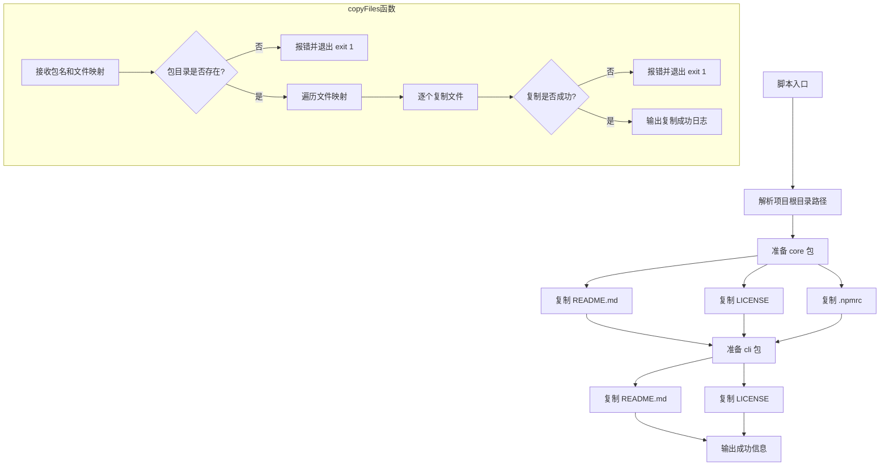

# prepare-package.js

## 概述

`scripts/prepare-package.js` 是一个包发布准备脚本，负责在 npm 发布之前将项目根目录下的公共文件（如 `README.md`、`LICENSE`、`.npmrc`）复制到各个子包（`packages/core`、`packages/cli`）目录中。该脚本确保每个子包在发布时都包含必要的元数据文件，是 monorepo 发布流程中的关键环节。

## 架构图

## 核心组件

### 常量

| 常量名 | 类型 | 说明 |
|--------|------|------|
| `__filename` | `string` | 当前脚本文件的绝对路径（ES Module 兼容写法） |
| `__dirname` | `string` | 当前脚本所在目录的绝对路径 |
| `rootDir` | `string` | 项目根目录路径，由 `__dirname` 向上一级解析得到 |

### 函数

#### `copyFiles(packageName, filesToCopy)`

| 参数 | 类型 | 说明 |
|------|------|------|
| `packageName` | `string` | 子包名称，如 `'core'` 或 `'cli'`，对应 `packages/` 下的目录名 |
| `filesToCopy` | `Record<string, string>` | 文件映射对象，键为源文件相对根目录路径，值为目标文件相对子包目录路径 |

**职责：**
- 验证目标子包目录是否存在，不存在则报错退出（`process.exit(1)`）
- 遍历 `filesToCopy` 映射，使用 `fs.copyFileSync` 同步复制每个文件
- 复制失败时报错并退出（`process.exit(1)`）

### 脚本执行流程

1. **准备 `core` 包**：复制 `README.md`、`LICENSE`、`.npmrc` 到 `packages/core/`
2. **准备 `cli` 包**：复制 `README.md`、`LICENSE` 到 `packages/cli/`
3. 输出 `Successfully prepared all packages.`

## 依赖关系

### 内部依赖

无。该脚本不依赖项目中的其他模块，仅操作项目根目录和 `packages/` 下的文件。

### 外部依赖

| 模块 | 来源 | 用途 |
|------|------|------|
| `node:fs` | Node.js 内置 | 文件系统操作（`existsSync`、`copyFileSync`） |
| `node:path` | Node.js 内置 | 路径解析与拼接（`resolve`、`dirname`） |
| `node:url` | Node.js 内置 | 将 `import.meta.url` 转换为文件路径（`fileURLToPath`） |

## 关键实现细节

1. **ES Module 兼容性**：由于 ES Module 中没有 `__dirname` 和 `__filename` 全局变量，脚本通过 `fileURLToPath(import.meta.url)` 和 `path.dirname()` 手动构建这两个变量，确保路径解析在 ESM 环境下正常工作。

2. **同步文件操作**：脚本全程使用同步 API（`fs.existsSync`、`fs.copyFileSync`），确保文件操作按严格顺序执行，适合构建脚本场景。

3. **错误处理策略**：采用"快速失败"（fail-fast）策略——任何文件复制失败或目录不存在都会立即以退出码 1 终止进程，防止后续步骤在不完整状态下执行。

4. **差异化配置**：`core` 包额外复制了 `.npmrc` 文件，而 `cli` 包没有，说明 `core` 包在发布时可能需要特殊的 npm 注册表配置。

5. **文件映射设计**：`filesToCopy` 参数使用 `{ 源路径: 目标路径 }` 的映射结构，支持源文件名与目标文件名不同的场景（虽然当前所有映射中源和目标文件名相同）。
