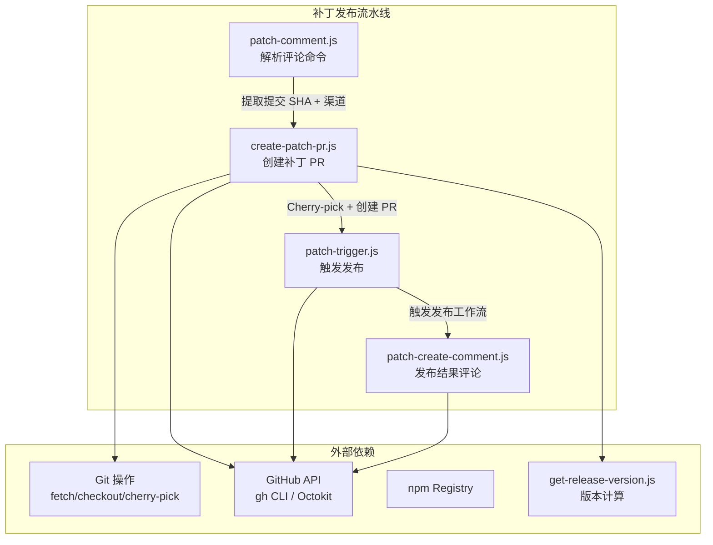
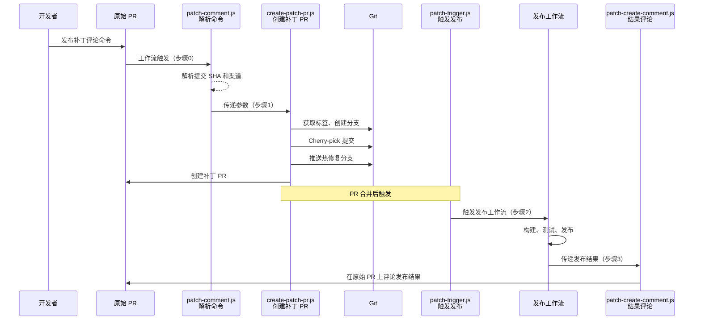

# scripts/releasing/

## 概述

该目录包含 Gemini CLI 项目 **补丁发布（Patch Release）** 流程的自动化脚本，共 4 个 Node.js 文件。这些脚本与 `.github/workflows/release-patch-*.yml` 工作流配合，实现了从 PR 评论触发到最终发布补丁版本的完整自动化链路。

## 目录结构

```
scripts/releasing/
├── patch-comment.js          # 步骤0：解析 Issue/PR 评论中的补丁发布命令
├── create-patch-pr.js        # 步骤1：Cherry-pick 提交并创建补丁 PR
├── patch-trigger.js          # 步骤2：触发补丁发布工作流
└── patch-create-comment.js   # 步骤3：在原始 PR 上发布发布结果评论
```

## 架构图



## 核心组件

### 1. create-patch-pr.js -- 创建补丁 PR（步骤1）

补丁发布流程中最核心的脚本，负责：

- **获取最新发布信息**：调用 `scripts/get-release-version.js` 计算下一个补丁版本号
- **创建发布分支**：从最新标签创建 `release/<tag>-pr-<number>` 分支（如不存在）
- **创建热修复分支**：创建 `hotfix/<tag>/<nextVersion>/<channel>/cherry-pick-<sha>/pr-<number>` 分支
- **Cherry-pick 提交**：将指定提交应用到热修复分支，自动处理冲突
- **创建 PR**：从热修复分支向发布分支创建 PR，冲突时在 PR 中标注并提供解决指导

关键参数：
- `--commit`：要 cherry-pick 的提交 SHA
- `--pullRequestNumber`：原始 PR 编号
- `--channel`：目标渠道（stable / preview）
- `--dry-run`：模拟运行模式

### 2. patch-create-comment.js（原名 patch-comment.js）-- 发布结果评论（步骤3）

在原始 PR 上发布格式化的发布结果评论：

- **成功**：包含版本号、npm 标签、GitHub Release 链接等
- **竞态失败**：检测到并发发布时的自动取消通知
- **失败**：包含故障排查链接和后续步骤建议

支持 `--test` 模式用于验证评论生成逻辑而不调用 API。

### 3. patch-comment.js -- 评论命令解析（步骤0）

解析 PR/Issue 评论中的补丁发布指令，提取：
- 目标提交 SHA
- 发布渠道（stable / preview）
- 其他配置参数

### 4. patch-trigger.js -- 触发发布（步骤2）

在补丁 PR 合并后，触发实际的发布工作流（`release-patch-3-release.yml`）。

## 依赖关系

| 脚本 | npm 依赖 | 项目内依赖 | 外部工具 |
|------|---------|-----------|---------|
| create-patch-pr.js | yargs | scripts/get-release-version.js | git, gh CLI |
| patch-create-comment.js | yargs, @octokit/rest | 无 | 无 |
| patch-comment.js | yargs | 无 | 无 |
| patch-trigger.js | yargs | 无 | gh CLI |

## 数据流


