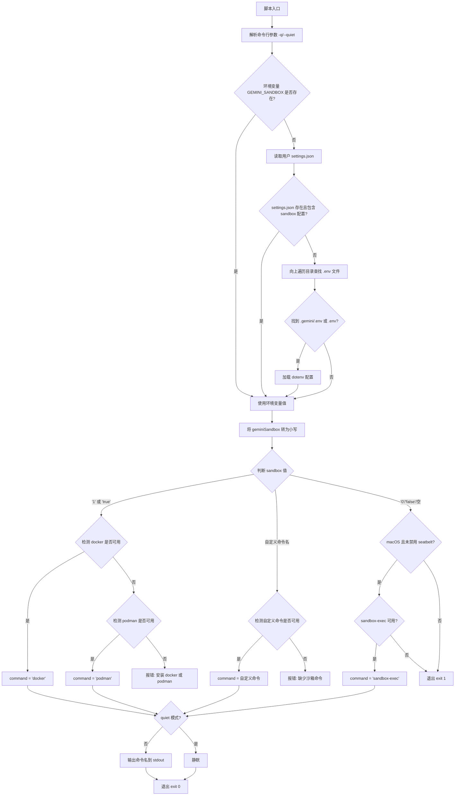

# sandbox_command.js

## 概述

`scripts/sandbox_command.js` 是一个沙箱命令探测脚本，负责确定当前环境中可用的沙箱容器化命令。它按照优先级查找配置和可用工具（`docker`、`podman`、`sandbox-exec` 或用户自定义命令），并将最终选定的沙箱命令输出到标准输出。该脚本是 Gemini CLI 安全执行环境的入口检测机制，确保用户命令能在受控的沙箱环境中运行。

## 架构图



## 核心组件

### 命令行参数

通过 `yargs` 解析命令行参数：

| 参数 | 别名 | 类型 | 默认值 | 说明 |
|------|------|------|--------|------|
| `-q` | `--quiet` | `boolean` | `false` | 静默模式，不输出探测到的命令名 |

### 函数

#### `homedir()`

```javascript
const homedir = () => process.env['GEMINI_CLI_HOME'] || os.homedir();
```

| 返回值 | 类型 | 说明 |
|--------|------|------|
| 主目录路径 | `string` | 优先使用 `GEMINI_CLI_HOME` 环境变量，回退到系统用户主目录 |

#### `commandExists(cmd)`

```javascript
const commandExists = (cmd) => { ... }
```

| 参数 | 类型 | 说明 |
|------|------|------|
| `cmd` | `string` | 要检测的命令名 |

| 返回值 | 类型 | 说明 |
|--------|------|------|
| 命令是否存在 | `boolean` | 在 PATH 中检测命令是否可用 |

**实现细节：**
- Unix/macOS 平台使用 `command -v` 检测
- Windows 平台使用 `where` 检测，若失败还会尝试 `where cmd.exe`

### 变量

| 变量名 | 类型 | 说明 |
|--------|------|------|
| `geminiSandbox` | `string \| undefined` | 沙箱命令配置值，来源优先级：环境变量 > settings.json > .env 文件 |
| `command` | `string` | 最终探测到的沙箱命令名称 |

## 依赖关系

### 内部依赖

| 模块 | 导入内容 | 用途 |
|------|----------|------|
| `@google/gemini-cli-core` | `GEMINI_DIR` | Gemini 配置目录名常量（如 `.gemini`） |

### 外部依赖

| 模块 | 来源 | 用途 |
|------|------|------|
| `node:child_process` | Node.js 内置 | 执行系统命令（`execSync`）检测命令是否存在 |
| `node:fs` | Node.js 内置 | 文件读取（`readFileSync`）和存在性检查（`existsSync`） |
| `node:path` | Node.js 内置 | 路径拼接（`join`）和目录提取（`dirname`） |
| `node:os` | Node.js 内置 | 获取平台信息（`platform`）和主目录（`homedir`） |
| `strip-json-comments` | npm 第三方包 | 解析带注释的 JSON 文件（`settings.json`） |
| `yargs` | npm 第三方包 | 命令行参数解析 |
| `yargs/helpers` | npm 第三方包 | 提供 `hideBin` 辅助函数，剥离 `process.argv` 前两个元素 |
| `dotenv` | npm 第三方包 | 从 `.env` 文件加载环境变量 |

## 关键实现细节

1. **三层配置查找机制**：沙箱命令的确定遵循严格的优先级：
   - **第一优先级**：`GEMINI_SANDBOX` 环境变量（直接设置）
   - **第二优先级**：用户全局配置文件 `~/.gemini/settings.json` 中的 `sandbox` 字段
   - **第三优先级**：从当前工作目录向上遍历，查找 `.gemini/.env` 或 `.env` 文件中的 `GEMINI_SANDBOX` 变量

2. **向上遍历 .env 查找**：从 `process.cwd()` 开始向父目录逐级查找，直到找到包含 `.gemini/.env` 或 `.env` 的目录，或到达文件系统根目录。`.gemini/.env` 优先于 `.env`。

3. **沙箱值的三种模式**：
   - **`'1'` 或 `'true'`**：自动检测模式，按 `docker` > `podman` 的优先级查找
   - **自定义命令名**（非 `'0'`/`'false'`/空）：直接使用用户指定的沙箱命令
   - **`'0'`/`'false'`/空**：在 macOS 上回退到 `sandbox-exec`（Apple 的 Seatbelt 沙箱），其他平台直接退出

4. **macOS Seatbelt 集成**：当未显式配置沙箱时，macOS 平台会自动使用系统自带的 `sandbox-exec` 命令（基于 Seatbelt 安全框架），除非 `SEATBELT_PROFILE` 环境变量被设为 `'none'`。

5. **跨平台命令检测**：`commandExists` 函数在 Windows 上使用 `where` 命令，Unix 上使用 `command -v`，并且在 Windows 上还会尝试带 `.exe` 后缀的命令名。

6. **JSON 注释支持**：使用 `strip-json-comments` 库解析 `settings.json`，允许用户在配置文件中添加注释。

7. **输出约定**：脚本通过 `console.log` 将最终的沙箱命令名输出到标准输出（stdout），供调用方（通常是 shell 脚本或父进程）捕获使用。使用 `-q` 参数可禁止输出。
