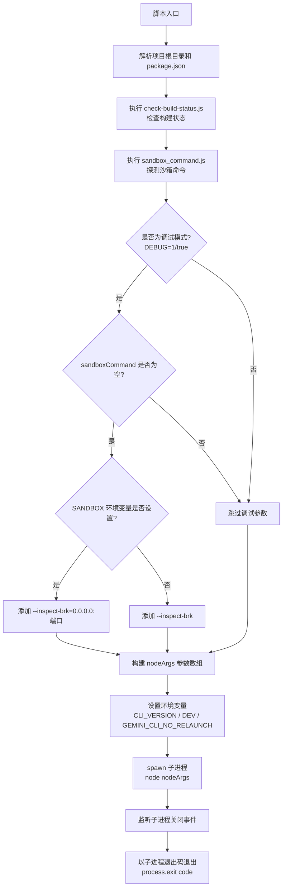
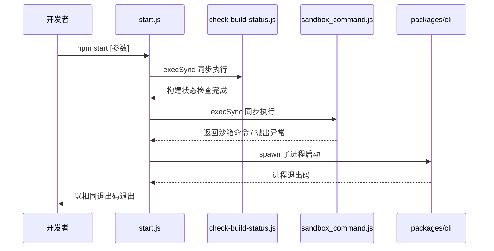

# start.js

## 概述

`scripts/start.js` 是 Gemini CLI 的开发模式启动脚本，负责在本地开发环境中引导启动整个 CLI 应用。它依次执行构建状态检查、沙箱命令探测、调试参数配置，最终以子进程方式启动 `packages/cli` 主程序，并将所有命令行参数透传给主程序。该脚本是开发者日常运行 `npm start` 时的实际入口。

## 架构图

## 核心组件

### 常量

| 常量名 | 类型 | 说明 |
|--------|------|------|
| `__dirname` | `string` | 当前脚本所在目录（ESM 兼容写法） |
| `root` | `string` | 项目根目录，`__dirname` 的父目录 |
| `pkg` | `object` | 项目根目录 `package.json` 的解析结果 |

### 变量

| 变量名 | 类型 | 说明 |
|--------|------|------|
| `nodeArgs` | `string[]` | 传递给 Node.js 的参数数组，初始包含 `--no-warnings=DEP0040` |
| `sandboxCommand` | `string \| undefined` | 从 `sandbox_command.js` 获取的沙箱命令名，探测失败则为 `undefined` |
| `isInDebugMode` | `boolean` | 是否处于调试模式（`DEBUG` 环境变量为 `'1'` 或 `'true'`） |
| `env` | `object` | 传递给子进程的环境变量对象 |
| `child` | `ChildProcess` | `spawn` 返回的子进程实例 |

### 环境变量注入

| 环境变量 | 值 | 说明 |
|----------|------|------|
| `CLI_VERSION` | `pkg.version` | 从 `package.json` 读取的版本号 |
| `DEV` | `'true'` | 标识当前为开发模式 |
| `GEMINI_CLI_NO_RELAUNCH` | `'true'`（仅调试模式） | 阻止 CLI 内部重新启动进程，确保调试器附着到正确的进程 |

### 涉及的环境变量

| 环境变量 | 说明 |
|----------|------|
| `DEBUG` | 设为 `'1'` 或 `'true'` 启用调试模式 |
| `DEBUG_PORT` | 调试端口号，默认 `9229` |
| `SANDBOX` | 沙箱环境标识，用于判断是否运行在沙箱容器内 |

## 依赖关系

### 内部依赖

| 模块/脚本 | 调用方式 | 用途 |
|-----------|----------|------|
| `scripts/check-build-status.js` | `execSync` 同步执行 | 检查构建状态，将警告写入文件供应用显示 |
| `scripts/sandbox_command.js` | `execSync` 同步执行 | 探测可用的沙箱命令 |
| `packages/cli` | `spawn` 子进程启动 | Gemini CLI 主程序入口 |
| `package.json`（根目录） | `readFileSync` 读取 | 获取项目版本号 |

### 外部依赖

| 模块 | 来源 | 用途 |
|------|------|------|
| `node:child_process` | Node.js 内置 | `spawn` 启动子进程、`execSync` 同步执行脚本 |
| `node:path` | Node.js 内置 | 路径操作（`dirname`、`join`） |
| `node:url` | Node.js 内置 | `fileURLToPath` 将 ESM URL 转为文件路径 |
| `node:fs` | Node.js 内置 | `readFileSync` 读取 `package.json` |

## 关键实现细节

1. **构建状态预检**：启动前先同步执行 `check-build-status.js`，使用 `stdio: 'inherit'` 使其输出直接显示在终端。这确保开发者在代码未构建或构建过期时能及时收到警告。

2. **沙箱探测的容错设计**：调用 `sandbox_command.js` 时使用 `try/catch` 包裹，探测失败（如没有安装 docker/podman）不会阻止启动，而是将 `sandboxCommand` 置为 `undefined`，gracefully 降级到非沙箱模式。

3. **Node.js 调试支持**：
   - 当 `DEBUG=1` 且无沙箱命令时，添加 `--inspect-brk` 参数启用 Node.js 调试器
   - 若检测到 `SANDBOX` 环境变量（表示在沙箱内运行），使用 `--inspect-brk=0.0.0.0:端口` 使调试端口在容器内可访问
   - 调试模式下设置 `GEMINI_CLI_NO_RELAUNCH=true`，防止 CLI 内部的进程重启机制干扰调试器断点

4. **参数透传**：`process.argv.slice(2)` 将用户传入的所有命令行参数直接转发给 `packages/cli` 主程序，保证开发模式与生产模式的参数行为一致。

5. **退出码传播**：通过监听子进程的 `close` 事件，将子进程的退出码原样传递给父进程（`process.exit(code)`），确保调用链（如 npm scripts、CI 系统）能正确感知执行结果。

6. **DEP0040 告警抑制**：`--no-warnings=DEP0040` 参数抑制 Node.js 关于 `punycode` 模块弃用的警告信息，保持终端输出的干净。

7. **开发标识注入**：通过 `DEV: 'true'` 环境变量让 CLI 主程序感知当前处于开发模式，可能用于启用额外的日志、跳过更新检查等开发特性。
