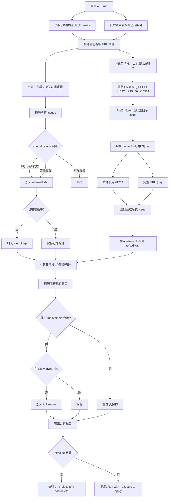
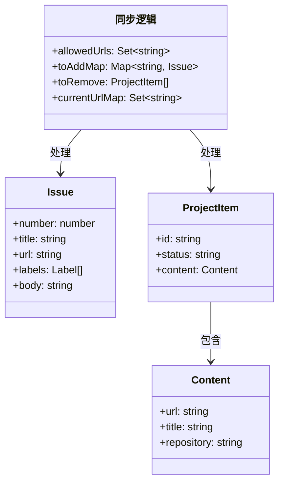

# sync_project_dry_run.js

## 概述

`scripts/sync_project_dry_run.js` 是一个 GitHub Projects 同步工具脚本，负责将 GitHub 仓库中的 Issues 与 GitHub Project Board 保持同步。它通过标签过滤和 Issue 层级关系递归遍历两种机制，自动分析哪些 Issue 应该被添加到项目看板、哪些应该被移除。默认以"预演"（dry-run）模式运行，仅展示分析结果；加上 `--execute` 参数后才会真正执行增删操作。

## 架构图





## 核心组件

### 常量

| 常量名 | 值 | 说明 |
|--------|------|------|
| `PROJECT_ID` | `36` | GitHub Project Board 的 ID |
| `ORG` | `'google-gemini'` | GitHub 组织名 |
| `REPO` | `'google-gemini/gemini-cli'` | 主仓库全名 |
| `MAINTAINERS_REPO` | `'google-gemini/maintainers-gemini-cli'` | 维护者私有仓库全名 |
| `PARENT_ISSUES` | `[15374, 15456, 15324]` | 需要递归遍历子 Issue 的父 Issue 编号列表 |
| `EXCLUDED_LABELS` | `['help wanted', 'status/need-triage', 'status/need-info', 'area/unknown']` | 应被排除出项目看板的标签列表 |
| `FORCE_INCLUDE_LABELS` | `['maintainer only']` | 强制包含的标签列表（优先级高于排除标签） |

### 函数

#### `runCommand(command)`

```javascript
function runCommand(command) { ... }
```

| 参数 | 类型 | 说明 |
|------|------|------|
| `command` | `string` | 要执行的 shell 命令 |

| 返回值 | 类型 | 说明 |
|--------|------|------|
| 命令输出 | `string \| null` | 成功返回 stdout 字符串，失败返回 `null` |

**实现细节：** 使用 `execSync` 同步执行，`maxBuffer` 设为 10MB 以容纳大量 Issue 数据。stdin 和 stderr 被忽略。

#### `getIssues(repo)`

```javascript
function getIssues(repo) { ... }
```

| 参数 | 类型 | 说明 |
|------|------|------|
| `repo` | `string` | 仓库全名（如 `'google-gemini/gemini-cli'`） |

| 返回值 | 类型 | 说明 |
|--------|------|------|
| Issue 列表 | `Issue[]` | 包含 `number`、`title`、`url`、`labels` 字段的 Issue 对象数组 |

**职责：** 通过 `gh issue list` 命令获取指定仓库中所有打开状态的 Issue（最多 3000 个）。

#### `getIssueBody(repo, number)`

```javascript
function getIssueBody(repo, number) { ... }
```

| 参数 | 类型 | 说明 |
|------|------|------|
| `repo` | `string` | 仓库全名 |
| `number` | `number` | Issue 编号 |

| 返回值 | 类型 | 说明 |
|--------|------|------|
| Issue 详情 | `object \| null` | 包含 `body`、`title`、`url`、`number` 字段的对象 |

**职责：** 通过 `gh issue view` 命令获取单个 Issue 的详细信息，主要用于读取 Issue Body 以提取子 Issue 引用。

#### `getProjectItems()`

```javascript
function getProjectItems() { ... }
```

| 返回值 | 类型 | 说明 |
|--------|------|------|
| 项目条目列表 | `ProjectItem[]` | 项目看板中所有条目（最多 3000 个） |

**职责：** 通过 `gh project item-list` 命令获取目标 GitHub Project 中的所有条目。

#### `shouldInclude(issue)`

```javascript
function shouldInclude(issue) { ... }
```

| 参数 | 类型 | 说明 |
|------|------|------|
| `issue` | `Issue` | 待判断的 Issue 对象 |

| 返回值 | 类型 | 说明 |
|--------|------|------|
| 是否包含 | `boolean` | 该 Issue 是否应该出现在项目看板中 |

**判断逻辑：**
1. 若 Issue 包含 `FORCE_INCLUDE_LABELS` 中的任一标签 --> 返回 `true`
2. 若 Issue 包含 `EXCLUDED_LABELS` 中的任一标签 --> 返回 `false`
3. 其他情况 --> 返回 `true`

#### `findChildren(repo, number, depth)`

```javascript
async function findChildren(repo, number, depth = 0) { ... }
```

| 参数 | 类型 | 默认值 | 说明 |
|------|------|--------|------|
| `repo` | `string` | - | 仓库全名 |
| `number` | `number` | - | Issue 编号 |
| `depth` | `number` | `0` | 当前递归深度 |

| 返回值 | 类型 | 说明 |
|--------|------|------|
| 后代 Issue 列表 | `object[]` | 包含 `body`、`title`、`url`、`number`、`repo` 的对象数组 |

**职责：** 递归解析 Issue Body 中的子 Issue 引用（本地 `#1234` 和完整 URL），最大递归深度为 3 层。使用 `visitedParents` 集合防止循环引用。

#### `run()`

```javascript
async function run() { ... }
```

**职责：** 主执行函数，编排整个同步分析流程，包括三个阶段（标签过滤、层级递归、移除分析）和可选的执行阶段。

## 依赖关系

### 内部依赖

无。该脚本不导入项目中的其他模块。

### 外部依赖

| 模块 | 来源 | 用途 |
|------|------|------|
| `node:child_process` | Node.js 内置 | `execSync` 同步执行 `gh` CLI 命令 |

### 外部工具依赖

| 工具 | 说明 |
|------|------|
| `gh`（GitHub CLI） | 必须已安装并已认证，脚本通过它与 GitHub API 交互 |

## 关键实现细节

1. **双重包含机制**：Issue 进入项目看板有两条路径——通过标签过滤（`shouldInclude`）和通过父子 Issue 层级关系（`findChildren`）。两者取并集（`allowedUrls`），任一路径允许即可保留。

2. **递归 Issue 解析**：`findChildren` 使用正则表达式从 Issue Body 中提取两种引用格式：
   - 本地引用：`#1234`（排除 `issue `、`issues/`、`pull/`、`#` 前缀的误匹配）
   - 完整 URL：`https://github.com/org/repo/issues/1234`
   - 递归深度限制为 3 层，并通过 `visitedParents` 集合避免循环引用

3. **维护者仓库保护**：移除逻辑中特别保护了 `maintainers-gemini-cli` 仓库的 Issue，不会从项目看板中移除，即使它们不在 `allowedUrls` 中。

4. **Dry-Run 安全模式**：默认不执行任何修改操作，仅输出分析报告（待添加/移除的条目数量和示例）。必须显式传入 `--execute` 参数才会真正调用 `gh project item-add` 和 `gh project item-delete` 执行变更。

5. **大缓冲区配置**：`runCommand` 将 `maxBuffer` 设为 10MB（`10 * 1024 * 1024`），因为 3000 个 Issue 的 JSON 数据可能非常大。

6. **进度指示**：递归遍历过程中通过 `process.stdout.write('.')` 输出进度点，让用户知道脚本仍在运行（因为递归获取大量 Issue 可能耗时较长）。

7. **容错设计**：所有 `gh` 命令调用都通过 `runCommand` 包裹，失败时返回 `null` 而非抛出异常，确保单个 Issue 获取失败不会中断整个同步流程。

8. **仓库作用域限制**：递归查找子 Issue 时，仅处理属于 `REPO` 或 `MAINTAINERS_REPO` 的 Issue，忽略指向其他仓库的引用，避免不相关的 Issue 进入项目看板。
