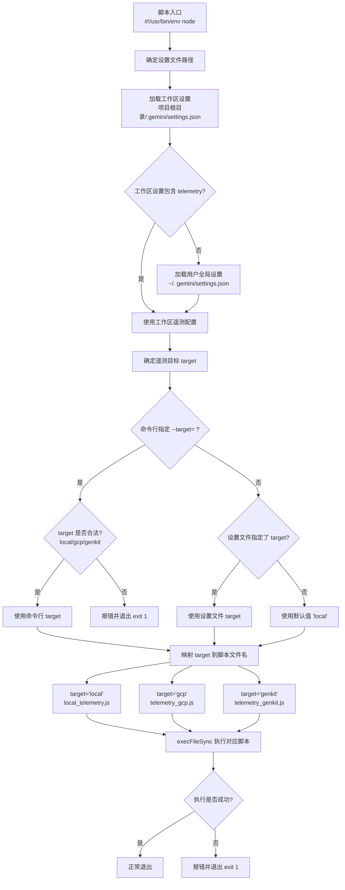
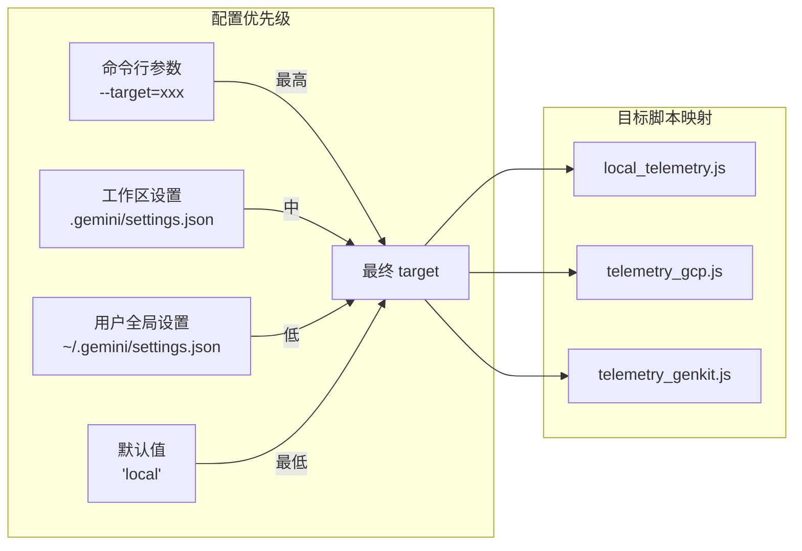

# telemetry.js

## 概述

`scripts/telemetry.js` 是 Gemini CLI 的遥测分发脚本（telemetry dispatcher），负责根据配置确定遥测目标平台，并启动对应的遥测子脚本。它从工作区设置文件、用户全局设置文件或命令行参数中读取遥测目标配置（`local`、`gcp`、`genkit`），然后以子进程方式执行对应的遥测脚本。该脚本是遥测系统的统一入口，可通过 `#!/usr/bin/env node` shebang 直接作为可执行文件运行。

## 架构图





## 核心组件

### 常量

| 常量名 | 类型 | 说明 |
|--------|------|------|
| `projectRoot` | `string` | 项目根目录，由 `import.meta.dirname` 向上一级获取 |
| `USER_SETTINGS_DIR` | `string` | 用户全局 Gemini 配置目录，如 `~/.gemini` |
| `USER_SETTINGS_PATH` | `string` | 用户全局设置文件路径，如 `~/.gemini/settings.json` |
| `WORKSPACE_SETTINGS_PATH` | `string` | 工作区设置文件路径，如 `<项目根目录>/.gemini/settings.json` |
| `allowedTargets` | `string[]` | 合法的遥测目标列表：`['local', 'gcp', 'genkit']` |
| `targetScripts` | `Record<string, string>` | 目标到脚本文件名的映射表 |

### 目标脚本映射表

| 目标名称 | 脚本文件 | 说明 |
|----------|----------|------|
| `local` | `scripts/local_telemetry.js` | 本地遥测（默认） |
| `gcp` | `scripts/telemetry_gcp.js` | Google Cloud Platform 遥测 |
| `genkit` | `scripts/telemetry_genkit.js` | Genkit 遥测 |

### 变量

| 变量名 | 类型 | 说明 |
|--------|------|------|
| `telemetrySettings` | `object \| undefined` | 从设置文件中读取的 `telemetry` 配置对象 |
| `target` | `string` | 最终确定的遥测目标，默认 `'local'` |

### 函数

#### `loadSettings(filePath)`

```javascript
function loadSettings(filePath) { ... }
```

| 参数 | 类型 | 说明 |
|------|------|------|
| `filePath` | `string` | 设置文件的绝对路径 |

| 返回值 | 类型 | 说明 |
|--------|------|------|
| 遥测设置 | `object \| undefined` | 设置文件中 `telemetry` 字段的值，文件不存在或解析失败返回 `undefined` |

**实现细节：**
- 先检查文件是否存在
- 使用正则表达式 `/\/\/[^\n]*/g` 移除单行注释（简易版 JSON 注释处理）
- 解析 JSON 后返回其中的 `telemetry` 字段
- 解析失败时输出警告但不终止进程

### 命令行参数

| 参数格式 | 说明 |
|----------|------|
| `--target=local` | 指定遥测目标为本地 |
| `--target=gcp` | 指定遥测目标为 GCP |
| `--target=genkit` | 指定遥测目标为 Genkit |

## 依赖关系

### 内部依赖

| 模块 | 导入内容 | 用途 |
|------|----------|------|
| `@google/gemini-cli-core` | `GEMINI_DIR` | Gemini 配置目录名常量（如 `.gemini`） |
| `scripts/local_telemetry.js` | 运行时执行 | 本地遥测脚本 |
| `scripts/telemetry_gcp.js` | 运行时执行 | GCP 遥测脚本 |
| `scripts/telemetry_genkit.js` | 运行时执行 | Genkit 遥测脚本 |

### 外部依赖

| 模块 | 来源 | 用途 |
|------|------|------|
| `node:child_process` | Node.js 内置 | `execFileSync` 同步执行遥测子脚本 |
| `node:path` | Node.js 内置 | `join` 路径拼接 |
| `node:fs` | Node.js 内置 | `existsSync` 检查文件存在、`readFileSync` 读取设置文件 |

## 关键实现细节

1. **四层配置优先级**：遥测目标的确定遵循严格的优先级链：
   - **最高优先级**：命令行参数 `--target=xxx`
   - **次优先级**：工作区设置文件 `<项目根目录>/.gemini/settings.json` 的 `telemetry.target`
   - **第三优先级**：用户全局设置文件 `~/.gemini/settings.json` 的 `telemetry.target`
   - **最低优先级**：默认值 `'local'`

2. **工作区设置优先于用户设置**：与 `sandbox_command.js` 不同，遥测配置优先读取工作区级别的设置文件，这允许不同项目配置不同的遥测目标。

3. **简易 JSON 注释处理**：`loadSettings` 使用正则 `/\/\/[^\n]*/g` 移除单行注释。注意这是一种简化处理，无法处理字符串内的 `//`（如 URL），但对于配置文件场景通常足够。与 `sandbox_command.js` 使用 `strip-json-comments` 库不同，此处采用了轻量级的自实现方案。

4. **严格的目标验证**：命令行传入的 `--target` 值必须在 `allowedTargets` 白名单中，不合法的值会导致脚本报错退出（`process.exit(1)`），防止执行不存在的遥测脚本。

5. **Shebang 声明**：文件首行 `#!/usr/bin/env node` 使该脚本可以直接作为可执行文件运行（`./scripts/telemetry.js`），无需显式调用 `node` 命令。

6. **跨平台主目录获取**：用户设置目录通过 `process.env.HOME || process.env.USERPROFILE || process.env.HOMEPATH` 获取，兼容 Unix（`HOME`）和 Windows（`USERPROFILE` / `HOMEPATH`）平台。

7. **环境变量透传**：执行遥测子脚本时通过 `{ ...process.env }` 完整复制当前环境变量，确保子脚本能访问所有必要的环境配置（如 API 密钥、项目 ID 等）。

8. **使用 `execFileSync` 而非 `execSync`**：使用 `execFileSync` 直接执行 `node` 命令，相比 `execSync` 不经过 shell 解释器，更安全（避免 shell 注入风险）且性能更好。

9. **使用 `import.meta.dirname`**：此脚本使用了 Node.js 21+ 引入的 `import.meta.dirname`（而非 `fileURLToPath(import.meta.url)` + `path.dirname()` 的组合），写法更简洁。
