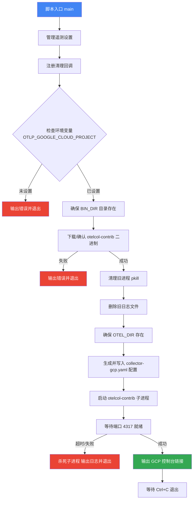
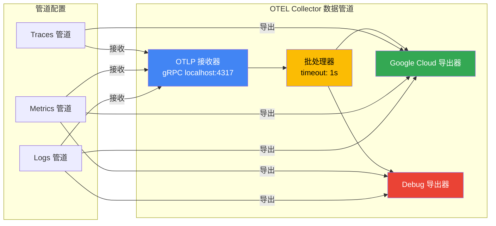

# telemetry_gcp.js

## 概述

`scripts/telemetry_gcp.js` 是 Gemini CLI 项目中用于启动本地 OpenTelemetry 遥测数据导出器的脚本，专门将遥测数据（Traces、Metrics、Logs）导出到 **Google Cloud Platform (GCP)**。该脚本负责：

1. 验证 GCP 项目 ID 环境变量
2. 下载/确保 `otelcol-contrib`（OpenTelemetry Collector Contrib）二进制文件存在
3. 清理旧的收集器进程和日志
4. 动态生成 OTEL Collector 的 YAML 配置文件
5. 启动 OTEL Collector 子进程并等待其就绪
6. 注册清理回调，确保退出时正确关闭子进程

## 架构图

## 核心组件

### 常量

| 常量名 | 值 | 说明 |
|---|---|---|
| `OTEL_CONFIG_FILE` | `path.join(OTEL_DIR, 'collector-gcp.yaml')` | OTEL Collector 配置文件路径 |
| `OTEL_LOG_FILE` | `path.join(OTEL_DIR, 'collector-gcp.log')` | OTEL Collector 日志文件路径 |

### 函数

#### `getOtelConfigContent(projectId)`

- **类型**: 箭头函数
- **参数**: `projectId: string` — GCP 项目 ID
- **返回值**: `string` — YAML 格式的 OTEL Collector 配置内容
- **职责**: 根据给定的 GCP 项目 ID 动态生成 OTEL Collector 的完整 YAML 配置，包含以下组件配置：
  - **receivers**: OTLP gRPC 接收器，监听 `localhost:4317`
  - **processors**: 批处理器（batch），超时 1 秒
  - **exporters**:
    - `googlecloud` 导出器：将数据发送到 GCP，指标前缀为 `custom.googleapis.com/gemini_cli`，日志名称为 `gemini_cli`
    - `debug` 导出器：详细级别的调试输出
  - **service pipelines**:
    - traces: `otlp → batch → googlecloud`
    - metrics: `otlp → batch → googlecloud + debug`
    - logs: `otlp → batch → googlecloud + debug`

#### `main()`

- **类型**: `async function`
- **参数**: 无
- **返回值**: `Promise<void>`
- **职责**: 脚本主入口函数，协调整个启动流程。详细步骤：
  1. 调用 `manageTelemetrySettings(true, 'http://localhost:4317', 'gcp')` 启用遥测设置并保存原始沙箱配置
  2. 调用 `registerCleanup()` 注册进程退出时的清理逻辑（关闭子进程、关闭文件描述符、恢复设置）
  3. 从环境变量 `OTLP_GOOGLE_CLOUD_PROJECT` 读取 GCP 项目 ID，缺失则报错退出
  4. 输出 GCP 认证提示信息（`gcloud auth` 或 `GOOGLE_APPLICATION_CREDENTIALS`）
  5. 确保 `BIN_DIR` 目录存在
  6. 调用 `ensureBinary()` 下载或确认 `otelcol-contrib` 二进制文件
  7. 使用 `pkill -f "otelcol-contrib"` 清理旧进程
  8. 删除旧日志文件
  9. 生成并写入 OTEL Collector 配置文件
  10. 通过 `spawn()` 启动 `otelcol-contrib` 子进程，stdout/stderr 重定向到日志文件
  11. 调用 `waitForPort(4317)` 等待收集器端口就绪
  12. 输出 GCP Console 链接（Logs、Metrics、Traces）

## 依赖关系

### 内部依赖

| 模块 | 导入项 | 用途 |
|---|---|---|
| `./telemetry_utils.js` | `OTEL_DIR` | OTEL 相关文件的基础目录路径 |
| `./telemetry_utils.js` | `BIN_DIR` | 二进制工具存放目录路径 |
| `./telemetry_utils.js` | `fileExists` | 检查文件/目录是否存在 |
| `./telemetry_utils.js` | `waitForPort` | 等待指定端口可用 |
| `./telemetry_utils.js` | `ensureBinary` | 下载并确保二进制工具可用 |
| `./telemetry_utils.js` | `manageTelemetrySettings` | 管理遥测相关的配置（启用/禁用、端点、后端类型） |
| `./telemetry_utils.js` | `registerCleanup` | 注册进程退出时的清理逻辑 |

### 外部依赖

| 模块 | 导入项 | 用途 |
|---|---|---|
| `node:path` | `path` (default) | 路径拼接 |
| `node:fs` | `* as fs` | 文件系统操作（读写配置、日志、创建目录） |
| `node:child_process` | `spawn` | 启动 OTEL Collector 子进程 |
| `node:child_process` | `execSync` | 同步执行 `pkill` 清理旧进程 |

### 外部运行时依赖

| 工具 | 来源 | 用途 |
|---|---|---|
| `otelcol-contrib` | `open-telemetry/opentelemetry-collector-releases` (GitHub) | OpenTelemetry Collector 的 Contrib 发行版，包含 `googlecloud` 导出器 |

## 关键实现细节

1. **动态配置生成**: 使用模板字符串动态生成 YAML 配置文件，将 GCP 项目 ID 注入到 `googlecloud` 导出器配置中。配置在每次启动时都会重新生成并写入磁盘。

2. **二进制文件命名约定**: `ensureBinary` 调用时传入的文件名模板为 `otelcol-contrib_${version}_${platform}_${arch}.${ext}`，用于拼接 GitHub Release 下载 URL。参数 `isJaeger` 设为 `false`，表明这不是 Jaeger 二进制。

3. **进程清理策略**:
   - 启动前使用 `pkill -f "otelcol-contrib"` 杀死所有同名旧进程（忽略报错，因为可能没有旧进程）
   - 通过 `registerCleanup()` 注册退出回调，传入两个惰性求值函数：一个返回需要关闭的子进程数组，另一个返回需要关闭的文件描述符数组

4. **端口等待机制**: 启动 OTEL Collector 后，通过 `waitForPort(4317)` 等待 gRPC 端口就绪。如果等待超时，会杀死子进程并输出日志文件内容以辅助排查问题。

5. **遥测设置管理**: `manageTelemetrySettings(true, 'http://localhost:4317', 'gcp')` 会：
   - 启用遥测功能
   - 设置 OTLP 端点为 `http://localhost:4317`
   - 标记后端为 `gcp` 类型
   - 返回原始的沙箱设置值，用于退出时恢复

6. **日志输出策略**: 子进程的 stdout 和 stderr 均重定向到同一个日志文件 `collector-gcp.log`，stdin 被忽略（`'ignore'`）。

7. **GCP 权限要求**: 脚本提示用户需要以下 IAM 角色：
   - Cloud Trace Agent（用于导出 Traces）
   - Monitoring Metric Writer（用于导出 Metrics）
   - Logs Writer（用于导出 Logs）

8. **Metrics 前缀**: 所有导出到 GCP 的自定义指标使用前缀 `custom.googleapis.com/gemini_cli`，确保在 GCP Monitoring 中与其他指标区分。
