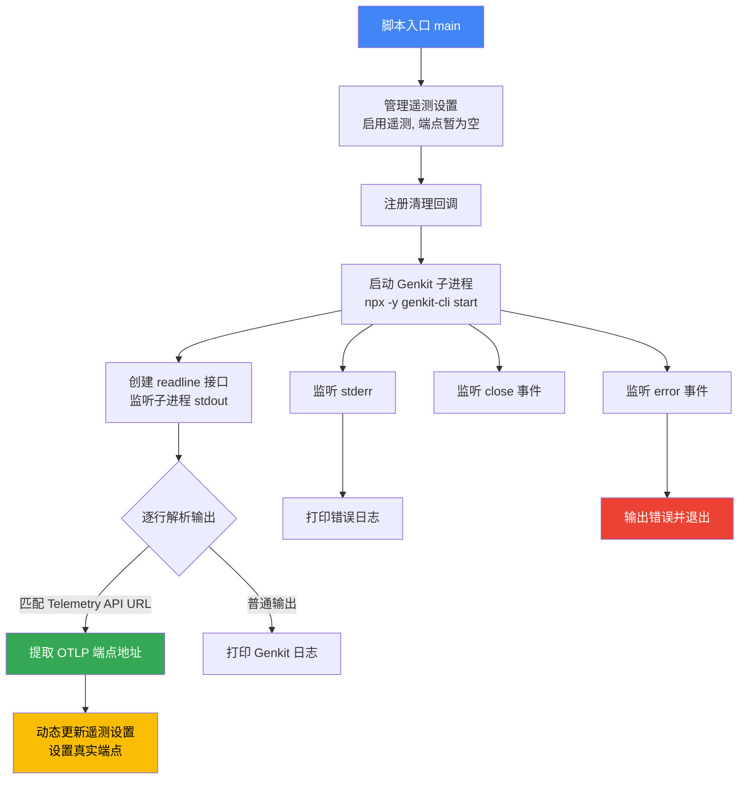
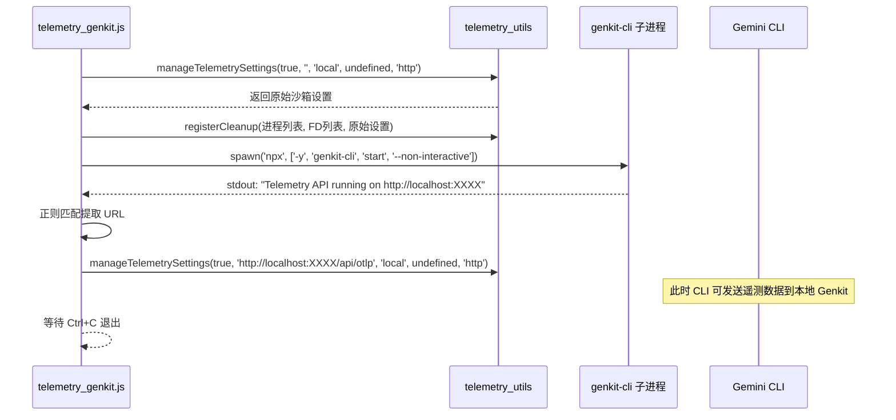

# telemetry_genkit.js

## 概述

`scripts/telemetry_genkit.js` 是 Gemini CLI 项目中用于启动 **Genkit** 遥测服务器的脚本。Genkit 是 Google 推出的 AI 应用开发框架，自带遥测 UI 界面。该脚本通过 `npx` 启动 `genkit-cli` 的遥测服务，然后从子进程的标准输出中动态解析出遥测 API 的地址，并自动配置 Gemini CLI 将 OTLP 遥测数据发送到该本地 Genkit 服务端点。

与 `telemetry_gcp.js` 不同，本脚本不需要手动下载二进制文件或配置 YAML，而是直接通过 `npx` 自动下载并启动 Genkit CLI 工具。

## 架构图

## 核心组件

### 常量

| 常量名 | 值 | 说明 |
|---|---|---|
| `GENKIT_START_COMMAND` | `'npx'` | Genkit 启动命令 |
| `GENKIT_START_ARGS` | `['-y', 'genkit-cli', 'start', '--non-interactive']` | Genkit 启动参数，`-y` 自动确认安装，`--non-interactive` 非交互模式 |

### 函数

#### `main()`

- **类型**: `async function`
- **参数**: 无
- **返回值**: `Promise<void>`
- **职责**: 脚本主入口函数，完整启动流程如下：
  1. 调用 `manageTelemetrySettings(true, '', 'local', undefined, 'http')` 初始化遥测设置
     - 启用遥测
     - 端点暂设为空字符串（后续动态填充）
     - 后端类型为 `'local'`
     - 协议为 `'http'`
  2. 调用 `registerCleanup()` 注册清理回调，传入 Genkit 子进程引用
  3. 使用 `spawn()` 启动 Genkit 子进程
     - stdin: `'ignore'`
     - stdout: `'pipe'`（管道，用于读取输出）
     - stderr: `'pipe'`（管道，用于读取错误）
  4. 创建 `readline` 接口逐行读取子进程 stdout
  5. 通过正则表达式 `/Telemetry API running on (http:\/\/[^\s]+)/` 匹配 Genkit 输出中的遥测 API 地址
  6. 一旦匹配成功，拼接 `/api/otlp` 后缀得到完整的 OTLP 端点 URL
  7. 再次调用 `manageTelemetrySettings()` 更新端点为真实地址
  8. 注册 stderr、close、error 事件处理器

## 依赖关系

### 内部依赖

| 模块 | 导入项 | 用途 |
|---|---|---|
| `./telemetry_utils.js` | `manageTelemetrySettings` | 管理遥测配置（启用/禁用、端点、后端类型、协议） |
| `./telemetry_utils.js` | `registerCleanup` | 注册进程退出时的清理逻辑 |

### 外部依赖

| 模块 | 导入项 | 用途 |
|---|---|---|
| `node:readline` | `createInterface` | 创建逐行读取接口，解析子进程 stdout |
| `node:child_process` | `spawn` | 启动 Genkit 子进程 |

### 外部运行时依赖

| 工具 | 来源 | 用途 |
|---|---|---|
| `genkit-cli` | npm (通过 `npx -y` 自动安装) | Google Genkit 的 CLI 工具，提供本地遥测服务器和 UI |

## 关键实现细节

1. **动态端点发现**: 这是本脚本最核心的设计——端点地址不是预先确定的，而是通过解析子进程 stdout 输出动态获取的。初始时端点设为空字符串 `''`，当 Genkit 进程输出包含 `Telemetry API running on http://...` 的日志行时，脚本通过正则提取 URL 并更新遥测设置。

2. **两阶段设置模式**: `manageTelemetrySettings` 被调用两次：
   - 第一次（启动前）：启用遥测但端点为空，预先配置好后端类型和协议
   - 第二次（检测到 URL 后）：更新为真实的 OTLP 端点地址（如 `http://localhost:4003/api/otlp`）

3. **OTLP 端点拼接**: Genkit 的遥测 API URL 后面需要追加 `/api/otlp` 路径才是完整的 OTLP 接收端点。例如如果 Genkit 报告 `http://localhost:4003`，则实际 OTLP 端点为 `http://localhost:4003/api/otlp`。

4. **HTTP 协议**: 与 GCP 脚本使用 gRPC (端口 4317) 不同，Genkit 使用 **HTTP 协议** 传输 OTLP 数据。这通过 `manageTelemetrySettings` 的最后一个参数 `'http'` 指定。

5. **非交互模式**: Genkit CLI 使用 `--non-interactive` 参数启动，确保不会阻塞等待用户输入，适合作为后台服务运行。

6. **自动安装**: `npx -y` 的 `-y` 标志确保在 `genkit-cli` 未安装时自动确认安装，无需用户手动干预。

7. **轻量化清理**: 与 `telemetry_gcp.js` 不同，本脚本不涉及文件描述符（FD 数组为空 `[]`），清理时只需关闭 Genkit 子进程。

8. **日志前缀**: 所有来自 Genkit 的 stdout 输出都以 `[Genkit]` 前缀打印，stderr 输出以 `[Genkit Error]` 前缀打印，便于区分日志来源。
