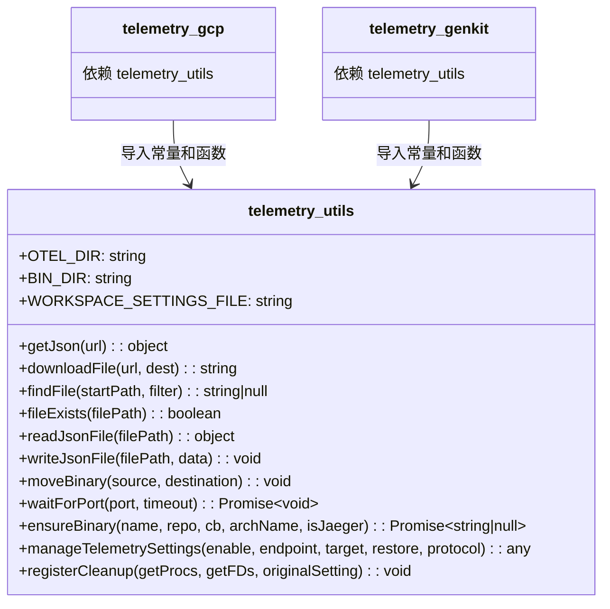
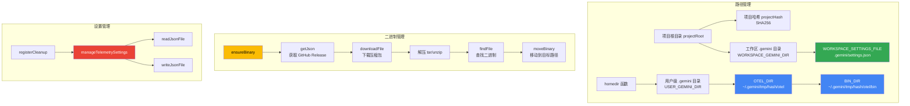
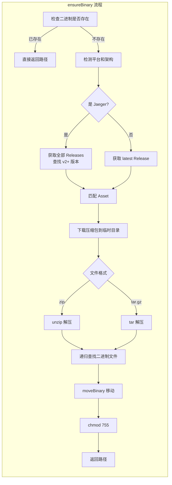

# telemetry_utils.js

## 概述

`scripts/telemetry_utils.js` 是 Gemini CLI 遥测系统的 **核心工具库**，为 `telemetry_gcp.js`、`telemetry_genkit.js` 及其他遥测脚本提供共享的基础设施。该模块负责：

1. **路径常量定义**: 定义 OTEL 目录、二进制目录、工作区设置文件等关键路径
2. **文件操作**: JSON 文件读写、文件存在性检查、文件搜索
3. **网络工具**: HTTP 下载（通过 curl）、端口等待
4. **二进制管理**: 从 GitHub Releases 自动下载、解压、安装二进制工具
5. **遥测设置管理**: 读写工作区 `settings.json` 中的遥测配置
6. **进程清理**: 注册信号处理器，确保退出时正确关闭子进程和恢复设置

该模块是整个遥测脚本体系的基石，所有遥测启动脚本都依赖于它。

## 架构图

## 核心组件

### 导出常量

| 常量名 | 值 | 说明 |
|---|---|---|
| `OTEL_DIR` | `path.join(USER_GEMINI_DIR, 'tmp', projectHash, 'otel')` | OTEL 相关文件存储目录，按项目根路径哈希隔离 |
| `BIN_DIR` | `path.join(OTEL_DIR, 'bin')` | 下载的二进制工具存放目录 |
| `WORKSPACE_SETTINGS_FILE` | `path.join(WORKSPACE_GEMINI_DIR, 'settings.json')` | 工作区级别的设置文件路径 |

### 内部常量

| 常量名 | 值 | 说明 |
|---|---|---|
| `__filename` | `fileURLToPath(import.meta.url)` | 当前文件的绝对路径（ESM 兼容） |
| `__dirname` | `path.dirname(__filename)` | 当前文件所在目录 |
| `projectRoot` | `path.resolve(__dirname, '..')` | 项目根目录（当前文件上一级） |
| `projectHash` | `crypto.createHash('sha256').update(projectRoot).digest('hex')` | 项目根路径的 SHA-256 哈希值，用于隔离不同项目的遥测文件 |
| `USER_GEMINI_DIR` | `path.join(homedir(), GEMINI_DIR)` | 用户级 `.gemini` 目录 |
| `WORKSPACE_GEMINI_DIR` | `path.join(projectRoot, GEMINI_DIR)` | 项目级 `.gemini` 目录 |

### 内部函数

#### `homedir()`

- **类型**: 箭头函数
- **参数**: 无
- **返回值**: `string` — 用户主目录路径
- **职责**: 获取用户主目录。优先使用环境变量 `GEMINI_CLI_HOME`，否则使用 `os.homedir()`。

### 导出函数

#### `getJson(url)`

- **参数**: `url: string` — 要请求的 JSON URL
- **返回值**: `object` — 解析后的 JSON 对象
- **职责**: 使用 `curl` 同步下载 JSON 数据并解析。过程：
  1. 在系统临时目录创建临时文件
  2. 使用 `spawnSync('curl', ...)` 将 URL 内容下载到临时文件
  3. 读取并解析 JSON
  4. 在 `finally` 块中删除临时文件
- **异常**: 下载失败或 JSON 解析失败时抛出异常

#### `downloadFile(url, dest)`

- **参数**:
  - `url: string` — 下载 URL
  - `dest: string` — 目标文件路径
- **返回值**: `string` — 目标文件路径
- **职责**: 使用 `curl -fL -sS` 同步下载文件到指定路径
- **异常**: 下载失败时抛出异常

#### `findFile(startPath, filter)`

- **参数**:
  - `startPath: string` — 搜索起始目录
  - `filter: (filename: string) => boolean` — 文件名过滤函数
- **返回值**: `string | null` — 匹配的文件绝对路径，未找到返回 `null`
- **职责**: 递归搜索目录树，返回第一个满足过滤条件的文件路径（深度优先遍历）

#### `fileExists(filePath)`

- **参数**: `filePath: string` — 文件路径
- **返回值**: `boolean` — 文件是否存在
- **职责**: 对 `fs.existsSync` 的简单封装

#### `readJsonFile(filePath)`

- **参数**: `filePath: string` — JSON 文件路径
- **返回值**: `object` — 解析后的 JSON 对象，文件不存在或解析失败返回 `{}`
- **职责**: 安全地读取并解析 JSON 文件，任何错误都不会抛出异常

#### `writeJsonFile(filePath, data)`

- **参数**:
  - `filePath: string` — 目标文件路径
  - `data: object` — 要写入的 JSON 对象
- **返回值**: `void`
- **职责**: 将 JSON 对象格式化后写入文件（缩进 2 空格）

#### `moveBinary(source, destination)`

- **参数**:
  - `source: string` — 源文件路径
  - `destination: string` — 目标文件路径
- **返回值**: `void`
- **职责**: 移动二进制文件。优先使用 `fs.renameSync`，若遇到 `EXDEV` 错误（跨设备/分区），则降级为"复制到临时文件 → 重命名 → 删除源文件"的策略
- **异常**: 非 `EXDEV` 错误会直接抛出

#### `waitForPort(port, timeout = 10000)`

- **参数**:
  - `port: number` — 等待的端口号
  - `timeout: number` — 超时时间（毫秒），默认 10000
- **返回值**: `Promise<void>`
- **职责**: 通过 TCP 连接轮询等待指定端口开放。每 500ms 尝试一次连接，超时后 reject
- **实现**: 创建 `net.Socket` 尝试连接 `localhost:port`，成功则 resolve，失败则判断是否超时

#### `ensureBinary(executableName, repo, assetNameCallback, binaryNameInArchive, isJaeger = false)`

- **参数**:
  - `executableName: string` — 可执行文件名称
  - `repo: string` — GitHub 仓库名称（如 `'open-telemetry/opentelemetry-collector-releases'`）
  - `assetNameCallback: (version, platform, arch, ext) => string` — 根据版本和平台生成 Asset 文件名的回调函数
  - `binaryNameInArchive: string` — 压缩包内的二进制文件名（可能与 `executableName` 不同）
  - `isJaeger: boolean` — 是否为 Jaeger 二进制（默认 `false`），影响版本发现逻辑
- **返回值**: `Promise<string | null>` — 二进制文件的绝对路径，失败返回 `null`
- **职责**: 确保指定的二进制工具已安装。如果不存在，则从 GitHub Releases 自动下载、解压、安装。完整流程：
  1. 检查 `BIN_DIR` 中是否已有该二进制
  2. 检测当前平台（`darwin`/`linux`/`windows`）和架构（`amd64`/`arm64`）
  3. 根据 `isJaeger` 标志选择不同的版本发现策略：
     - **Jaeger**: 获取全部 releases，过滤 v2+ 版本，按版本号排序，查找匹配 asset
     - **非 Jaeger**: 直接获取 latest release，使用 `assetNameCallback` 生成 asset 名称
  4. 下载压缩包到临时目录
  5. 根据文件格式使用 `unzip` 或 `tar` 解压
  6. 递归查找目标二进制文件
  7. 移动到 `BIN_DIR`
  8. 设置执行权限 `755`（非 Windows）
  9. 清理临时目录

#### `manageTelemetrySettings(enable, oTelEndpoint, target, originalSandboxSettingToRestore, otlpProtocol)`

- **参数**:
  - `enable: boolean` — 是否启用遥测
  - `oTelEndpoint: string` — OTLP 端点 URL，默认 `'http://localhost:4317'`
  - `target: string` — 遥测目标后端，默认 `'local'`
  - `originalSandboxSettingToRestore: any` — 禁用时要恢复的原始沙箱设置值
  - `otlpProtocol: string` — OTLP 传输协议，默认 `'grpc'`
- **返回值**: `any` — 调用时的当前沙箱设置值（`workspaceSettings.sandbox`）
- **职责**: 管理工作区 `settings.json` 中的遥测相关配置。具体行为：
  - **启用时** (`enable = true`)：
    - 设置 `telemetry.enabled = true`
    - 禁用沙箱模式 `sandbox = false`（遥测需要网络访问）
    - 设置 `telemetry.otlpEndpoint`
    - 设置 `telemetry.target`
    - 设置 `telemetry.otlpProtocol`
  - **禁用时** (`enable = false`)：
    - 删除 `telemetry.enabled`、`telemetry.otlpEndpoint`、`telemetry.target`、`telemetry.otlpProtocol`
    - 如果 `telemetry` 对象为空则删除整个字段
    - 如果提供了 `originalSandboxSettingToRestore`，恢复原始沙箱设置
  - 仅在设置发生实际变化时才写入文件

#### `registerCleanup(getProcesses, getLogFileDescriptors, originalSandboxSetting)`

- **参数**:
  - `getProcesses: () => ChildProcess[]` — 惰性获取需要清理的子进程列表的函数
  - `getLogFileDescriptors: () => number[]` — 惰性获取需要关闭的文件描述符列表的函数
  - `originalSandboxSetting: any` — 原始的沙箱设置值
- **返回值**: `void`
- **职责**: 注册进程退出时的清理逻辑，监听以下事件：
  - `exit`: 执行清理
  - `SIGINT` (Ctrl+C): 触发 `process.exit(0)`
  - `SIGTERM`: 触发 `process.exit(0)`
  - `uncaughtException`: 打印错误、执行清理、退出
- **清理动作**:
  1. 调用 `manageTelemetrySettings(false, ...)` 禁用遥测并恢复沙箱设置
  2. 向所有子进程发送 `SIGTERM` 信号
  3. 关闭所有日志文件描述符
  4. 使用 `cleanedUp` 标志防止重复清理

## 依赖关系

### 内部依赖

| 模块 | 导入项 | 用途 |
|---|---|---|
| `@google/gemini-cli-core` | `GEMINI_DIR` | 获取 `.gemini` 目录名常量 |

### 外部依赖

| 模块 | 导入项 | 用途 |
|---|---|---|
| `node:path` | `path` (default) | 路径拼接和解析 |
| `node:fs` | `fs` (default) | 文件系统操作（读写、删除、权限、目录） |
| `node:net` | `net` (default) | TCP Socket 连接，用于端口探测 |
| `node:os` | `os` (default) | 获取系统临时目录和用户主目录 |
| `node:child_process` | `spawnSync` | 同步执行 curl、tar、unzip 等命令 |
| `node:url` | `fileURLToPath` | 将 `import.meta.url` 转换为文件系统路径（ESM 兼容） |
| `node:crypto` | `crypto` (default) | SHA-256 哈希计算（项目路径哈希） |

### 外部运行时依赖

| 工具 | 用途 |
|---|---|
| `curl` | HTTP 下载（JSON 数据和二进制文件） |
| `tar` | 解压 `.tar.gz` 压缩包 |
| `unzip` | 解压 `.zip` 压缩包 |

## 关键实现细节

1. **项目级路径隔离**: 使用项目根目录的 SHA-256 哈希值作为 OTEL 文件的子目录名，确保不同项目之间的遥测文件互不干扰。哈希存储在 `~/.gemini/tmp/<hash>/otel/` 下。

2. **ESM 模块兼容**: 由于 Node.js ESM 模块不提供 `__filename` 和 `__dirname`，脚本通过 `fileURLToPath(import.meta.url)` 和 `path.dirname()` 手动模拟这两个变量。

3. **GEMINI_CLI_HOME 环境变量**: `homedir()` 函数支持通过 `GEMINI_CLI_HOME` 环境变量自定义主目录路径，这对于测试和 CI/CD 环境非常有用。

4. **跨设备文件移动**: `moveBinary` 函数处理了 `EXDEV` 错误（跨文件系统 rename 失败），采用"复制到临时文件 → 原子重命名 → 删除源文件"的三步策略，并在失败时清理中间临时文件。

5. **Jaeger v2+ 版本筛选**: `ensureBinary` 对 Jaeger 有特殊处理逻辑：
   - 获取仓库所有 releases（而非仅 latest）
   - 过滤掉预发布版本
   - 按语义版本号降序排序
   - 查找以 `jaeger-2.` 开头的 asset（确保是 v2+）
   - Windows ARM64 不支持 Jaeger，会直接返回 `null`

6. **设置的幂等性**: `manageTelemetrySettings` 在每次修改前都会检查当前值，仅在值实际变化时才写入文件。这避免了不必要的文件 I/O 和日志输出。

7. **沙箱设置保存/恢复机制**: 遥测功能需要禁用沙箱模式（因为需要网络访问），但脚本会：
   - 启用时：保存当前 `sandbox` 值并返回
   - 退出时：通过 `originalSandboxSettingToRestore` 参数恢复原始值
   这确保了遥测脚本不会永久改变用户的沙箱设置。

8. **惰性进程获取**: `registerCleanup` 的 `getProcesses` 和 `getLogFileDescriptors` 参数是函数而非直接的数组。这是因为子进程和文件描述符在注册清理回调时可能尚未创建，通过惰性求值确保清理时能获取到最新的引用。

9. **防重复清理**: `registerCleanup` 使用闭包中的 `cleanedUp` 布尔标志确保清理逻辑只执行一次。因为 `SIGINT` → `process.exit(0)` → `exit` 事件可能导致 `cleanup` 被调用多次。

10. **curl 使用策略**: 脚本选择使用系统级 `curl` 而非 Node.js 的 `http`/`https` 模块，通过 `spawnSync` 同步调用。这简化了 HTTPS 证书处理和重定向逻辑（`-L` 跟随重定向，`-f` 失败时返回非零退出码）。

11. **平台适配**:
    - `process.platform === 'win32'` 映射为 `'windows'`
    - `process.arch === 'x64'` 映射为 `'amd64'`
    - Windows 下查找带 `.exe` 后缀的二进制
    - 非 Windows 下设置 `755` 权限
