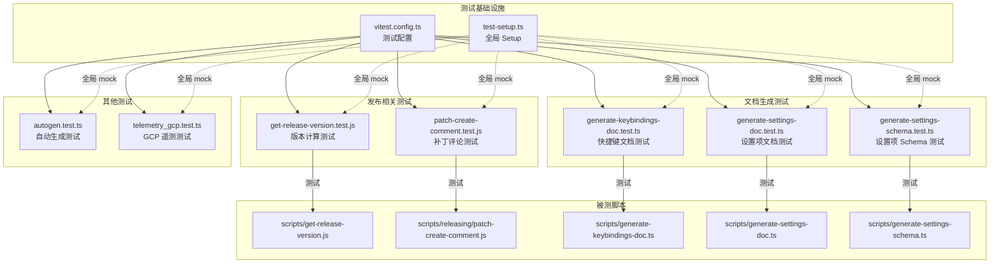
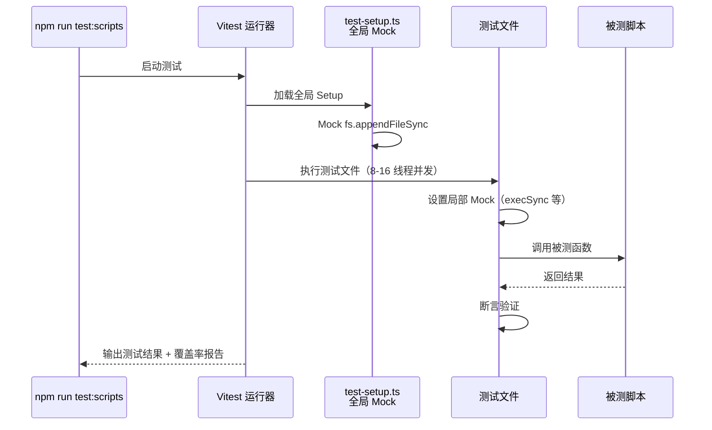

# scripts/tests/

## 概述

该目录包含 Gemini CLI 项目 **构建脚本和工具脚本** 的单元测试，使用 Vitest 测试框架。共有 7 个测试文件和 2 个配置/辅助文件，覆盖版本计算、文档生成、遥测上报、快捷键文档生成等核心脚本的测试。

## 目录结构

```
scripts/tests/
├── vitest.config.ts                      # Vitest 测试配置文件
├── test-setup.ts                         # 测试全局 setup（mock fs 模块）
│
├── get-release-version.test.js           # 版本计算脚本测试
├── patch-create-comment.test.js          # 补丁发布评论脚本测试
├── autogen.test.ts                       # 自动代码生成测试
├── generate-keybindings-doc.test.ts      # 快捷键文档生成测试
├── generate-settings-doc.test.ts         # 设置项文档生成测试
├── generate-settings-schema.test.ts      # 设置项 Schema 生成测试
└── telemetry_gcp.test.ts                 # GCP 遥测上报脚本测试
```

## 架构图



## 核心组件

### 1. vitest.config.ts -- 测试配置

关键配置项：
- **运行环境**：Node.js
- **测试文件匹配**：`scripts/tests/**/*.test.{js,ts}`
- **Setup 文件**：`scripts/tests/test-setup.ts`
- **覆盖率**：使用 V8 provider，输出 text + lcov 格式
- **线程池**：最小 8 线程，最大 16 线程（高并发执行）

### 2. get-release-version.test.js -- 版本计算测试

测试 `scripts/get-release-version.js` 中的 `getVersion()` 函数，覆盖场景：

**正常路径：**
- 从最新 preview 计算下一个 stable 版本（如 `0.7.0-preview.1` → `0.7.0`）
- 从最新 nightly 计算下一个 preview 版本（如 `0.8.0-nightly.*` → `0.8.0-preview.0`）
- 从 package.json 计算下一个 nightly 版本（含日期 + git hash）
- 计算 stable/preview 的补丁版本（如 `0.6.1` → `0.6.2`）

**高级场景：**
- 忽略已弃用版本，使用次高版本
- 版本冲突时自动递增补丁号
- preview 编号冲突时自动递增

测试通过 mock `execSync` 模拟 `npm view`、`git tag`、`gh release view` 等命令的输出。

### 3. test-setup.ts -- 全局测试 Setup

全局 mock `fs` 模块的 `appendFileSync` 方法，避免测试过程中写入 `GITHUB_OUTPUT` 等文件。

### 4. 文档生成测试

- **generate-keybindings-doc.test.ts**：测试快捷键文档自动生成
- **generate-settings-doc.test.ts**：测试设置项文档自动生成
- **generate-settings-schema.test.ts**：测试 JSON Schema 自动生成

### 5. telemetry_gcp.test.ts -- GCP 遥测测试

测试 GCP 遥测数据上报脚本的正确性。

## 依赖关系

| 文件 | 被测模块 | 关键 Mock |
|------|---------|----------|
| get-release-version.test.js | scripts/get-release-version.js | node:child_process (execSync), node:fs (readFileSync) |
| patch-create-comment.test.js | scripts/releasing/patch-create-comment.js | GitHub API |
| generate-settings-doc.test.ts | scripts/generate-settings-doc.ts | 文件系统 |
| generate-settings-schema.test.ts | scripts/generate-settings-schema.ts | 文件系统 |
| generate-keybindings-doc.test.ts | scripts/generate-keybindings-doc.ts | 文件系统 |
| telemetry_gcp.test.ts | 遥测脚本 | GCP API |
| autogen.test.ts | 自动生成脚本 | 文件系统 |

## 数据流


