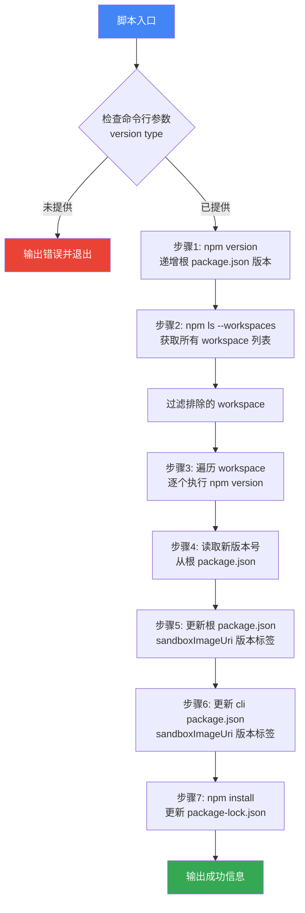
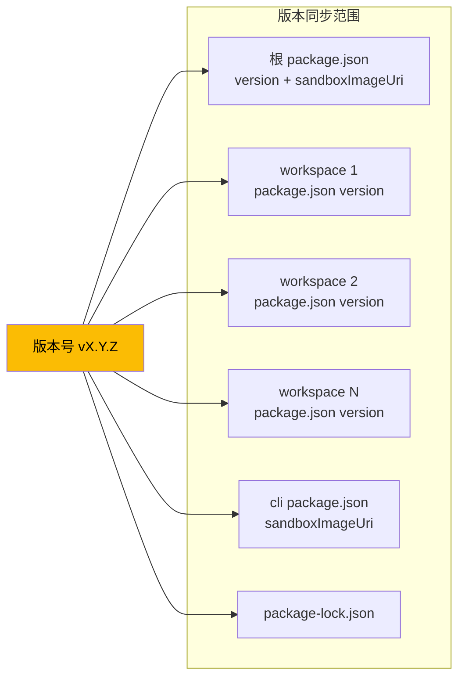
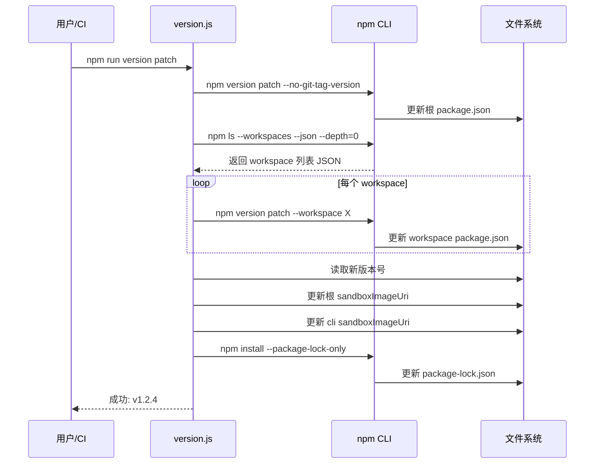

# version.js

## 概述

`scripts/version.js` 是 Gemini CLI 项目的 **版本管理脚本**，用于在 monorepo（多包仓库）中统一执行版本号递增操作。该脚本确保根 `package.json`、所有 workspace 子包的 `package.json`、沙箱 Docker 镜像 URI 以及 `package-lock.json` 的版本号在一次操作中保持同步，从而使所有版本变更可以在单个原子提交中完成。

支持的版本类型：`patch`（补丁）、`minor`（次版本）、`major`（主版本）、`prerelease`（预发布）。

## 架构图

## 核心组件

### 内部辅助函数

#### `run(command)`

- **参数**: `command: string` — 要执行的 shell 命令
- **返回值**: `void`
- **职责**: 同步执行 shell 命令并将 stdout/stderr 直接继承到当前进程（`stdio: 'inherit'`）。执行前会在控制台打印命令内容（带 `>` 前缀），方便调试追踪。

#### `readJson(filePath)`

- **参数**: `filePath: string` — JSON 文件路径
- **返回值**: `object` — 解析后的 JSON 对象
- **职责**: 读取并解析 JSON 文件。与 `telemetry_utils.js` 中的 `readJsonFile` 不同，此函数不做容错处理，解析失败会直接抛出异常。

#### `writeJson(filePath, data)`

- **参数**:
  - `filePath: string` — 目标文件路径
  - `data: object` — 要写入的 JSON 对象
- **返回值**: `void`
- **职责**: 将 JSON 对象格式化后写入文件（缩进 2 空格，末尾追加换行符 `\n`）

### 脚本主流程

脚本没有封装在函数中，而是作为顶层模块代码顺序执行：

1. **获取版本类型**: 从 `process.argv[2]` 读取命令行参数（`patch`/`minor`/`major`/`prerelease`）
2. **递增根版本**: 执行 `npm version <type> --no-git-tag-version --allow-same-version`
3. **获取 workspace 列表**: 执行 `npm ls --workspaces --json --depth=0`，解析输出获取所有 workspace 名称
4. **过滤 workspace**: 通过 `workspacesToExclude` 数组（当前为空）排除特定 workspace
5. **递增 workspace 版本**: 遍历所有 workspace，逐个执行 `npm version`
6. **读取新版本号**: 从根 `package.json` 读取更新后的 `version` 字段
7. **更新根 sandboxImageUri**: 使用正则 `/:.*$/` 替换 `config.sandboxImageUri` 中的版本标签
8. **更新 CLI sandboxImageUri**: 同理更新 `packages/cli/package.json` 中的 `sandboxImageUri`
9. **更新 lockfile**: 执行 `npm install --workspace packages/cli --workspace packages/core --package-lock-only`

### 常量/变量

| 名称 | 值 | 说明 |
|---|---|---|
| `versionType` | `process.argv[2]` | 用户指定的版本递增类型 |
| `workspacesToExclude` | `[]` | 需要排除的 workspace 名称列表（当前为空，预留扩展） |
| `rootPackageJsonPath` | `resolve(process.cwd(), 'package.json')` | 根 `package.json` 的绝对路径 |
| `cliPackageJsonPath` | `resolve(process.cwd(), 'packages/cli/package.json')` | CLI 子包 `package.json` 的绝对路径 |

## 依赖关系

### 内部依赖

无。该脚本是独立的版本管理工具，不依赖项目内其他模块。

### 外部依赖

| 模块 | 导入项 | 用途 |
|---|---|---|
| `node:child_process` | `execSync` | 同步执行 npm 命令 |
| `node:fs` | `readFileSync` | 读取 `package.json` 文件 |
| `node:fs` | `writeFileSync` | 写入更新后的 `package.json` 文件 |
| `node:path` | `resolve` | 解析文件绝对路径 |

### 外部运行时依赖

| 工具 | 用途 |
|---|---|
| `npm` | 执行版本递增、列出 workspace、更新 lockfile |

## 关键实现细节

1. **`--no-git-tag-version` 标志**: 所有 `npm version` 命令都使用此标志，阻止 npm 自动创建 git commit 和 tag。这样脚本可以在所有文件修改完成后，由用户或 CI 手动创建一个包含所有变更的原子提交。

2. **`--allow-same-version` 标志**: 允许在版本号未变化时不报错。这在某些 CI/CD 场景中（如重复运行同一版本）很有用。

3. **npm ls 错误容错处理**: `npm ls` 在依赖存在问题时可能返回非零退出码，但仍会输出有效的 JSON 数据。脚本通过 `try/catch` 捕获异常，并尝试从 `e.stdout` 中解析 JSON。这是一个重要的鲁棒性设计，避免因依赖警告导致版本管理流程中断。

4. **sandboxImageUri 版本同步**: 项目使用 Docker 沙箱镜像，镜像 URI 中包含版本标签（如 `gcr.io/xxx:1.2.3`）。脚本使用正则表达式 `/:.*$/` 匹配并替换冒号后的所有内容为新版本号，确保 Docker 镜像标签与包版本一致。此操作分别在根 `package.json` 和 CLI 子包 `package.json` 中执行。

5. **条件性更新**: 使用可选链 `?.` 检查 `config.sandboxImageUri` 是否存在，只有在字段存在时才进行更新。这使脚本在字段被移除或尚未添加时不会报错。

6. **package-lock.json 更新策略**: 使用 `--package-lock-only` 标志执行 `npm install`，仅更新 lockfile 中的版本号映射，而不实际安装依赖。这大大加快了执行速度。注意只指定了 `packages/cli` 和 `packages/core` 两个 workspace，而非全部。

7. **workspace 排除机制**: `workspacesToExclude` 数组当前为空，但预留了排除特定 workspace 的能力。如果未来某些 workspace 需要独立版本管理，可以将其名称添加到此数组中。

8. **无 shebang 行**: 与其他 `scripts/` 目录下的脚本不同，`version.js` 没有 `#!/usr/bin/env node` shebang 行，意味着它应该通过 `npm run version` 或 `node scripts/version.js` 调用，而非直接作为可执行文件运行。

9. **writeJson 追加换行符**: `writeJson` 函数在 JSON 字符串末尾追加 `\n`，遵循 POSIX 文件规范（文件以换行符结尾），也避免 git diff 中的 "No newline at end of file" 警告。
