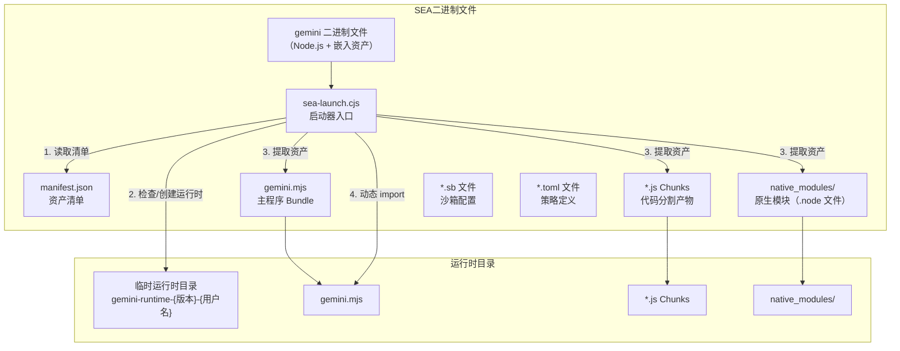
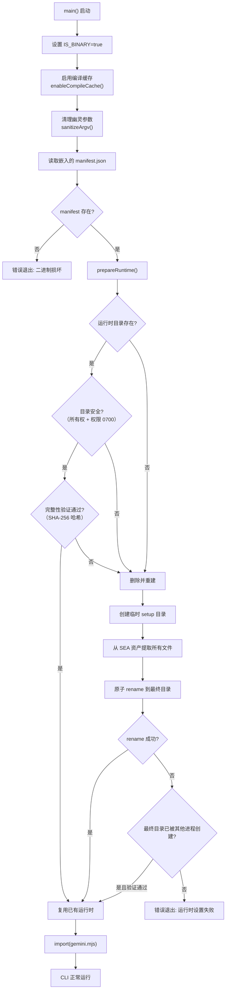
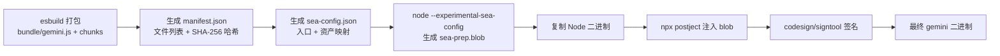

# sea/

## 概述

`sea/` 目录包含 Node.js **Single Executable Application (SEA)** 的启动器代码和对应测试。SEA 是 Node.js 的实验性特性，允许将 Node.js 应用打包为单个可执行二进制文件。`sea-launch.cjs` 是该二进制文件的入口点，负责从嵌入的资产中安全地提取运行时文件，验证完整性后动态加载主程序。

## 目录结构

```
sea/
├── sea-launch.cjs        # SEA 启动器（CommonJS 格式，二进制入口点）
└── sea-launch.test.js    # 启动器的单元测试
```

## 架构图



## 核心组件

### sea-launch.cjs

SEA 二进制的入口文件，使用 **CommonJS** 格式（Node SEA 要求入口必须为 CJS）。该文件实现了以下核心功能：

#### 导出函数

| 函数 | 说明 |
|------|------|
| `sanitizeArgv(argv, execPath, resolveFn)` | 清理 Node SEA 有时注入的"幽灵"参数（argv[2] 等于 argv[0] 的情况） |
| `getSafeName(name)` | 将字符串净化为安全的文件路径名（仅保留字母数字和 `.-`） |
| `verifyIntegrity(dir, manifest, fsMod, cryptoMod)` | 使用 SHA-256 验证运行时目录中所有文件的完整性 |
| `prepareRuntime(manifest, getAssetFn, deps)` | 准备运行时目录，必要时从嵌入资产中提取文件 |
| `main(getAssetFn)` | 主函数，串联整个启动流程 |

#### 启动流程详解



#### 安全特性

1. **目录所有权检查**: 验证运行时目录的 UID 与当前进程 UID 一致
2. **权限检查**: 确保目录权限为 0700（仅所有者可访问，Windows 跳过）
3. **完整性校验**: 对每个文件进行 SHA-256 哈希验证，与 manifest 中的记录比对
4. **原子性操作**: 先在临时目录提取，然后 `rename` 到最终位置，避免部分提取的损坏状态
5. **并发安全**: 如果 `rename` 失败（其他进程抢先创建），会检查已有目录的完整性

#### 运行时目录命名

```
{tempBase}/gemini-runtime-{version}-{username}
```

- Windows 上优先使用 `%LOCALAPPDATA%/Google/GeminiCLI/`
- 其他平台使用系统 tmpdir

### sea-launch.test.js

使用 Vitest 编写的全面测试套件，覆盖以下场景：
- `sanitizeArgv`: 幽灵参数的清理和正常参数的保留
- `getSafeName`: 特殊字符的净化
- `verifyIntegrity`: 正确哈希和篡改检测
- `prepareRuntime`: 新建、复用、并发、权限异常等各种场景
- `main`: 完整的启动流程测试

## 依赖关系

### 内部依赖

- **构建端**: `scripts/build_binary.js` 负责调用 `node --experimental-sea-config` 生成 SEA blob，其中 `sea-launch.cjs` 被指定为主入口
- **资产来源**: `bundle/` 目录下的所有打包产物通过 `node:sea` API 的 `getAsset()` 嵌入

### 外部依赖（Node.js 内置模块）

| 模块 | 用途 |
|------|------|
| `node:sea` | SEA 资产读取 API |
| `node:fs` | 文件系统操作 |
| `node:os` | 系统信息（tmpdir、userInfo） |
| `node:crypto` | SHA-256 完整性校验 |
| `node:path` | 路径处理 |
| `node:url` | pathToFileURL 转换 |
| `node:module` | enableCompileCache 编译缓存 |

## 数据流

### SEA 构建流程（在 build_binary.js 中）



### 运行时资产结构

```
manifest.json
├── main: "gemini.mjs"
├── mainHash: "sha256..."
├── version: "0.36.0"
└── files[]
    ├── { key: "chunk-XXX.js", path: "chunk-XXX.js", hash: "sha256..." }
    ├── { key: "files:node_modules/@lydell/...", path: "node_modules/...", hash: "sha256..." }
    ├── { key: "sandbox-macos-*.sb", path: "sandbox-macos-*.sb", hash: "sha256..." }
    └── { key: "policies:*.toml", path: "policies/*.toml", hash: "sha256..." }
```
