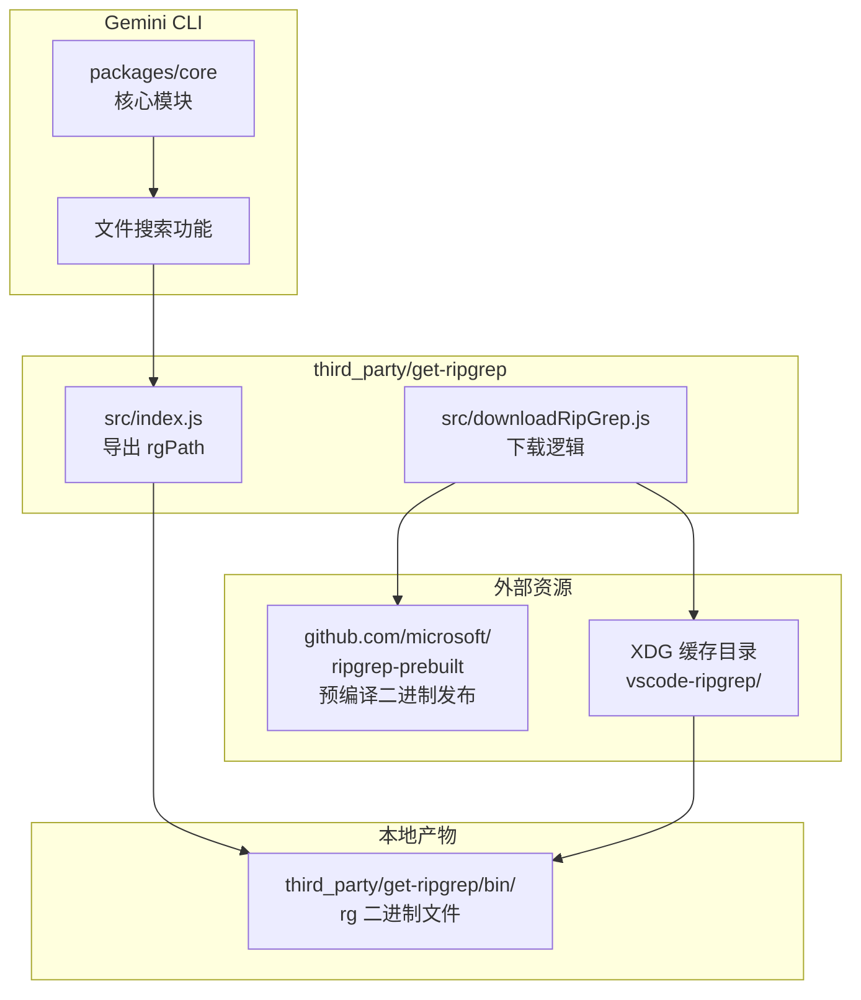
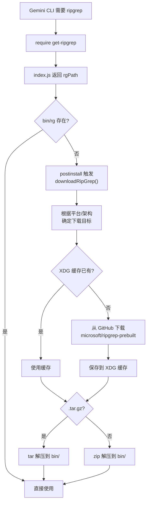

# third_party/

## 概述

`third_party/` 目录存放 Gemini CLI 项目使用的第三方依赖代码，这些代码不通过 npm registry 直接安装，而是以源码形式包含在项目中。目前仅包含一个子模块 `get-ripgrep`，用于下载和管理 ripgrep 搜索工具的预编译二进制文件。

## 目录结构

```
third_party/
└── get-ripgrep/               # ripgrep 二进制下载与管理模块
    ├── package.json           # 模块配置（@lvce-editor/ripgrep）
    ├── LICENSE                # MIT 许可证
    └── src/
        ├── index.js           # 模块入口，导出 rgPath
        └── downloadRipGrep.js # ripgrep 二进制下载逻辑
```

## 架构图



## 核心组件

### get-ripgrep 模块

该模块源自 [lvce-editor/ripgrep](https://github.com/lvce-editor/ripgrep) 项目，经过适配后集成到 Gemini CLI 中。它提供了跨平台的 ripgrep 二进制文件下载和路径获取能力。

**ripgrep** 是一个极速的正则表达式搜索工具，Gemini CLI 在代码库搜索功能中使用它来实现高性能文件内容检索。

#### 模块信息

| 字段 | 值 |
|------|-----|
| 包名 | `@lvce-editor/ripgrep` |
| 许可证 | MIT |
| 模块格式 | ESM |
| 原始仓库 | https://github.com/lvce-editor/ripgrep |
| ripgrep 版本 | v13.0.0-10（来自 microsoft/ripgrep-prebuilt） |

详细信息请参阅:
- [get-ripgrep/README.md](./get-ripgrep/README.md)
- [get-ripgrep/src/README.md](./get-ripgrep/src/README.md)

## 依赖关系

### 内部依赖

- `packages/core` 通过引用 `get-ripgrep` 模块获取 ripgrep 二进制路径，用于代码搜索功能

### 外部依赖

`get-ripgrep` 模块自身的依赖：

| 依赖包 | 用途 |
|--------|------|
| `got` | HTTP 下载客户端 |
| `extract-zip` | ZIP 解压（Windows 平台） |
| `execa` | 命令行执行（tar 解压） |
| `fs-extra` | 增强文件操作 |
| `tempy` | 临时文件管理 |
| `path-exists` | 路径存在检查 |
| `xdg-basedir` | XDG 缓存目录获取 |
| `@lvce-editor/verror` | 错误链封装 |

## 数据流

### ripgrep 二进制获取流程


