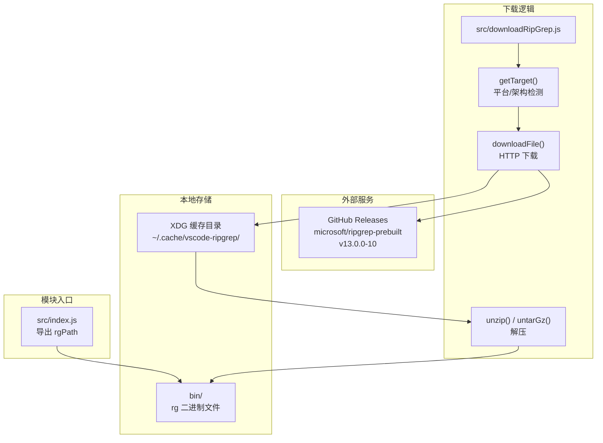
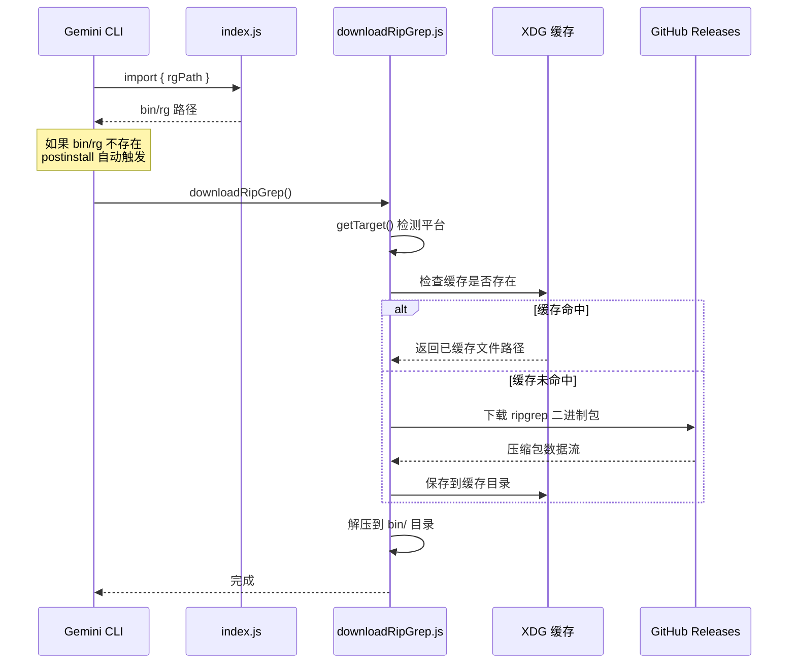

# third_party/get-ripgrep/

## 概述

`get-ripgrep` 是一个从 [lvce-editor/ripgrep](https://github.com/lvce-editor/ripgrep) 项目引入的第三方模块，负责下载和管理 [ripgrep](https://github.com/BurntSushi/ripgrep) 的预编译二进制文件。ripgrep 是一个高性能的递归文件内容搜索工具，Gemini CLI 利用它实现快速的代码库搜索能力。

该模块使用 MIT 许可证，二进制文件来源于 [microsoft/ripgrep-prebuilt](https://github.com/microsoft/ripgrep-prebuilt) 项目的 GitHub Releases。

## 目录结构

```
get-ripgrep/
├── package.json           # 包配置（@lvce-editor/ripgrep）
├── LICENSE                # MIT 许可证
├── src/
│   ├── index.js           # 模块入口，导出 ripgrep 二进制路径
│   └── downloadRipGrep.js # 下载逻辑实现
└── bin/                   # ripgrep 二进制存放目录（下载后生成，不在版本控制中）
    └── rg (或 rg.exe)     # ripgrep 可执行文件
```

## 架构图



## 核心组件

### package.json

| 字段 | 值 |
|------|-----|
| `name` | `@lvce-editor/ripgrep` |
| `version` | `0.0.0-dev` |
| `main` | `src/index.js` |
| `type` | `module`（ESM） |
| `license` | MIT |
| `postinstall` | `node ./src/postinstall.js`（安装后自动下载 ripgrep） |

### src/index.js

模块的主入口文件，功能极简：
- 根据当前操作系统平台拼接 ripgrep 二进制的路径
- Windows 上为 `bin/rg.exe`，其他平台为 `bin/rg`
- 导出 `rgPath` 变量供外部使用

### src/downloadRipGrep.js

ripgrep 二进制下载的完整实现，包含以下关键函数：

#### `getTarget()`

根据操作系统和 CPU 架构确定下载目标：

| 平台 | 架构 | 下载目标 |
|------|------|----------|
| macOS | arm64 | `aarch64-apple-darwin.tar.gz` |
| macOS | x64 | `x86_64-apple-darwin.tar.gz` |
| Windows | x64 | `x86_64-pc-windows-msvc.zip` |
| Windows | arm | `aarch64-pc-windows-msvc.zip` |
| Linux | x64 | `x86_64-unknown-linux-musl.tar.gz` |
| Linux | arm64 | `aarch64-unknown-linux-gnu.tar.gz` |
| Linux | arm/armv7l | `arm-unknown-linux-gnueabihf.tar.gz` |
| Linux | ppc64 | `powerpc64le-unknown-linux-gnu.tar.gz` |
| Linux | s390x | `s390x-unknown-linux-gnu.tar.gz` |

#### `downloadFile(url, outFile)`

使用 `got` 库流式下载文件到临时目录，然后通过 `fs-extra` 的 `move` 移动到目标位置。

#### `downloadRipGrep(binPath)`

完整的下载流程：
1. 调用 `getTarget()` 确定下载目标
2. 构造 GitHub Release 下载 URL
3. 检查 XDG 缓存目录是否已有下载文件
4. 如无缓存则从 GitHub 下载
5. 根据文件后缀选择解压方式：
   - `.tar.gz` -> `tar xvf` 命令解压
   - `.zip` -> `extract-zip` 库解压
6. 解压到 `bin/` 目录

#### 下载源

```
https://github.com/microsoft/ripgrep-prebuilt/releases/download/v13.0.0-10/ripgrep-v13.0.0-10-{target}
```

#### 缓存机制

下载的压缩包会缓存在 XDG 标准缓存目录（通常为 `~/.cache/vscode-ripgrep/`），避免重复下载。缓存文件名包含版本号和平台信息，确保不同版本不会冲突。

## 依赖关系

### 运行时依赖

| 依赖包 | 版本 | 用途 |
|--------|------|------|
| `got` | ^14.4.5 | HTTP 流式下载 |
| `extract-zip` | ^2.0.1 | ZIP 文件解压 |
| `execa` | ^9.5.2 | 执行 `tar` 命令 |
| `fs-extra` | ^11.3.0 | 增强的文件操作（mkdir, move, createWriteStream） |
| `tempy` | ^3.1.0 | 创建临时文件 |
| `path-exists` | ^5.0.0 | 路径存在检查 |
| `xdg-basedir` | ^5.1.0 | XDG 缓存目录路径 |
| `@lvce-editor/verror` | ^1.6.0 | 错误链封装 |

### 开发依赖

| 依赖包 | 版本 | 用途 |
|--------|------|------|
| `jest` | ^29.7.0 | 测试框架 |
| `typescript` | ^5.7.3 | 类型定义 |
| `prettier` | ^3.4.2 | 代码格式化 |

## 数据流

### 下载与缓存流程


