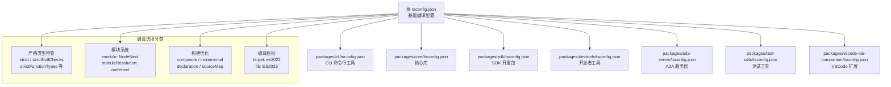

# tsconfig.json（项目根目录）

## 概述

`tsconfig.json` 是 Gemini CLI 项目**根级别的 TypeScript 编译器配置文件**。作为一个 monorepo 项目，此文件定义了所有子包共享的基础编译选项。各子包（`packages/*`）的 `tsconfig.json` 通过 `extends` 继承此配置，并可在此基础上进行覆盖和扩展。

该配置文件体现了项目对**严格类型安全**、**现代 ECMAScript 标准**和**增量编译性能**的高度重视。

**源文件路径**: `tsconfig.json`（项目根目录）

## 架构图（Mermaid）

## 核心组件

### 编译选项总览

根 `tsconfig.json` 仅包含 `compilerOptions` 字段，不包含 `files`、`include`、`exclude` 或 `references` 字段。这是因为它的定位是**被继承的基础配置**，具体的文件包含规则由各子包自行定义。

以下按功能类别详细分析每个选项。

---

### 一、严格类型检查选项

| 选项 | 值 | 说明 |
|------|-----|------|
| `strict` | `true` | 启用所有严格类型检查标志的总开关 |
| `noImplicitAny` | `true` | 禁止隐式的 `any` 类型，要求所有变量和参数都有明确类型 |
| `noImplicitOverride` | `true` | 要求子类重写父类方法时必须使用 `override` 关键字 |
| `noImplicitReturns` | `true` | 确保函数的所有代码路径都有返回值 |
| `noImplicitThis` | `true` | 禁止 `this` 表达式隐式推断为 `any` 类型 |
| `noPropertyAccessFromIndexSignature` | `true` | 使用索引签名定义的属性必须通过方括号访问（`obj['key']`），不能用点号（`obj.key`） |
| `noUnusedLocals` | `true` | 禁止声明未使用的局部变量 |
| `strictBindCallApply` | `true` | 严格检查 `bind`、`call`、`apply` 方法的参数类型 |
| `strictFunctionTypes` | `true` | 启用函数参数的逆变检查（更严格的函数类型兼容性） |
| `strictNullChecks` | `true` | 严格区分 `null`/`undefined` 和其他类型 |
| `strictPropertyInitialization` | `true` | 确保类的非可选属性在构造函数中被初始化 |

> **注意**：虽然 `strict: true` 已经启用了 `strictNullChecks`、`strictFunctionTypes` 等选项，但此配置仍然显式列出了这些选项。这是一种**防御性配置**策略——即使 TypeScript 未来版本改变了 `strict` 的行为，这些显式选项也能确保行为不变。同时也提高了配置的可读性和可审计性。

---

### 二、模块系统配置

| 选项 | 值 | 说明 |
|------|-----|------|
| `module` | `"NodeNext"` | 使用 Node.js 原生的模块系统（自动根据 `package.json` 的 `type` 字段决定使用 ESM 或 CJS） |
| `moduleResolution` | `"nodenext"` | 使用 Node.js 的模块解析算法，支持 `exports` 字段和条件导出 |
| `esModuleInterop` | `true` | 允许 CommonJS 模块以默认导入方式使用（生成 `__importDefault` 辅助函数） |
| `allowSyntheticDefaultImports` | `true` | 允许从没有默认导出的模块中进行默认导入（仅类型层面） |
| `verbatimModuleSyntax` | `true` | 要求使用 `import type` 语法导入仅用于类型的内容，确保模块语法与运行时行为一致 |
| `resolveJsonModule` | `true` | 允许导入 `.json` 文件并自动推断其类型 |

> **`module: NodeNext` + `moduleResolution: nodenext`** 是当前 Node.js 项目的推荐配置。它让 TypeScript 完全遵循 Node.js 的模块解析规则，包括要求 ESM 导入时必须带文件扩展名（`.js`），以及正确处理 `package.json` 中的 `exports` 映射。

> **`verbatimModuleSyntax: true`** 是一个较新的选项，它取代了旧的 `importsNotUsedAsValues` 和 `preserveValueImports`。启用后，`import type { Foo }` 在编译时会被完全擦除，而 `import { Foo }` 会被保留为运行时导入。这消除了因类型导入被保留为副作用导入而引起的问题。

---

### 三、构建与输出配置

| 选项 | 值 | 说明 |
|------|-----|------|
| `composite` | `true` | 启用项目引用（Project References）支持，允许 monorepo 中的包之间建立依赖关系 |
| `incremental` | `true` | 启用增量编译，生成 `.tsbuildinfo` 文件缓存编译状态 |
| `declaration` | `true` | 为每个 `.ts` 文件生成对应的 `.d.ts` 类型声明文件 |
| `sourceMap` | `true` | 生成 `.js.map` 源映射文件，便于调试时映射到原始 TypeScript 源码 |

> **`composite: true`** 是 TypeScript 项目引用的前提条件。在 monorepo 中，它允许 `tsc --build` 命令按照包之间的依赖拓扑顺序进行编译，并缓存中间结果。配合 `incremental: true`，只有发生变化的包才会被重新编译，极大提升了大型项目的构建速度。

> **`declaration: true`** 在 `composite` 模式下是必须的。它生成的 `.d.ts` 文件被下游依赖包用于类型检查，无需每次都从源码重新推断类型。

---

### 四、编译目标配置

| 选项 | 值 | 说明 |
|------|-----|------|
| `target` | `"es2022"` | 编译输出的 ECMAScript 版本目标 |
| `lib` | `["ES2023"]` | 内置类型库，定义了可用的全局 API 类型 |
| `types` | `["node", "vitest/globals"]` | 全局类型声明包 |
| `jsx` | `"react-jsx"` | JSX 转换模式，使用 React 17+ 的自动 JSX 运行时 |

> **`target: es2022`** 意味着 TypeScript 不会降级编译以下 ES2022 特性：
> - 类字段（class fields）
> - 私有方法和字段（`#private`）
> - `at()` 方法
> - `Error.cause`
> - 顶层 `await`（top-level await）
>
> 这要求运行环境至少是 Node.js 18+。

> **`lib: ["ES2023"]`** 比 `target` 高一个版本，提供了 ES2023 的类型声明（如 `Array.prototype.findLast`、`Array.prototype.findLastIndex` 等），但不影响代码降级编译行为。这意味着代码可以使用 ES2023 的 API（前提是运行环境支持），但语法层面只使用到 ES2022。

> **`types: ["node", "vitest/globals"]`** 表示全局可用 Node.js 内置模块的类型声明（如 `process`、`Buffer`）和 Vitest 测试框架的全局 API（如 `describe`、`it`、`expect`），无需显式导入即可使用。

> **`jsx: "react-jsx"`** 采用 React 17 引入的新 JSX 转换，无需在每个 JSX 文件中手动 `import React`。这暗示项目中存在 JSX/TSX 文件（可能在 `packages/vscode-ide-companion` 等 UI 相关的包中）。

---

### 五、其他配置

| 选项 | 值 | 说明 |
|------|-----|------|
| `forceConsistentCasingInFileNames` | `true` | 强制文件导入路径的大小写与文件系统一致，防止在大小写不敏感的系统（如 macOS、Windows）上出现问题 |
| `skipLibCheck` | `true` | 跳过 `.d.ts` 声明文件的类型检查，加速编译速度 |

> **`forceConsistentCasingInFileNames: true`** 是跨平台项目的重要配置。在 macOS 和 Windows 上，文件系统默认不区分大小写，`import './MyFile'` 和 `import './myfile'` 都能找到同一个文件。但在 Linux 上会导致找不到模块的错误。此选项确保在任何平台上都强制大小写一致。

> **`skipLibCheck: true`** 跳过对 `node_modules` 中 `.d.ts` 文件的检查。在大型项目中，第三方库的类型声明可能存在冲突或错误，此选项避免这些问题阻塞编译，同时显著减少编译时间。

## 依赖关系

### 内部依赖

此文件作为**被依赖方**，被以下子包的 `tsconfig.json` 继承（通过 `extends` 字段）：

| 子包 | tsconfig 路径 |
|------|--------------|
| `@google/gemini-cli` (CLI) | `packages/cli/tsconfig.json` |
| `@google/gemini-cli-core` (核心库) | `packages/core/tsconfig.json` |
| `@google/gemini-cli-sdk` (SDK) | `packages/sdk/tsconfig.json` |
| `@google/gemini-cli-devtools` (开发者工具) | `packages/devtools/tsconfig.json` |
| `@google/gemini-cli-a2a-server` (A2A 服务器) | `packages/a2a-server/tsconfig.json` |
| `@google/gemini-cli-test-utils` (测试工具) | `packages/test-utils/tsconfig.json` |
| `vscode-ide-companion` (VSCode 扩展) | `packages/vscode-ide-companion/tsconfig.json` |

### 外部依赖

| 依赖项 | 说明 |
|--------|------|
| `@types/node` | 提供 `types: ["node"]` 所需的 Node.js 类型声明 |
| `vitest` | 提供 `types: ["vitest/globals"]` 所需的测试框架全局类型 |
| TypeScript 5.x+ | `verbatimModuleSyntax`、`noImplicitOverride` 等选项要求 TypeScript 5.0 以上版本 |

## 关键实现细节

### 1. 严格度最大化策略

该配置启用了 TypeScript 提供的**几乎所有**严格检查选项。这是一种"默认安全"的设计哲学：
- 通过 `strict: true` 启用全局严格模式
- 额外显式开启 `noImplicitOverride`、`noUnusedLocals`、`noPropertyAccessFromIndexSignature` 等不被 `strict` 涵盖的选项
- 子包如果需要放宽某些限制，可以在自己的 `tsconfig.json` 中覆盖

### 2. target 与 lib 的版本差异

`target: "es2022"` 低于 `lib: ["ES2023"]` 是一个有意为之的选择：
- `target` 控制**语法降级**：输出代码不会使用超出 ES2022 的语法特性
- `lib` 控制**可用 API 类型**：代码中可以使用 ES2023 新增的运行时 API
- 这意味着项目假定运行环境（Node.js 18+）已经原生支持 ES2023 的 API，但为了更广泛的兼容性，语法层面限制在 ES2022

### 3. Monorepo 项目引用支持

`composite: true` + `incremental: true` + `declaration: true` 这三个选项组合是 TypeScript monorepo 项目引用的标准配置：
- `composite` 让每个包成为独立的编译单元
- `incremental` 缓存编译状态
- `declaration` 生成类型声明供下游包使用
- 各子包通过 `references` 字段声明包间依赖关系

### 4. 模块系统的现代化选择

`module: "NodeNext"` + `verbatimModuleSyntax: true` 的组合代表了当前 Node.js TypeScript 项目的最佳实践：
- 完全遵循 Node.js 原生的 ESM/CJS 双模块系统
- 类型导入必须使用 `import type` 语法，避免产生不必要的运行时副作用
- 导入路径必须包含 `.js` 扩展名（在 ESM 模式下），与 Node.js 的解析行为一致

### 5. JSX 支持

`jsx: "react-jsx"` 的存在暗示项目中有使用 JSX 语法的包。在 Gemini CLI 的上下文中，这很可能是用于 VSCode 扩展（`packages/vscode-ide-companion`）的 UI 组件，或者使用了 Ink 等终端 UI 框架。将此选项放在根配置中意味着所有子包都可以使用 JSX，无需单独配置。
